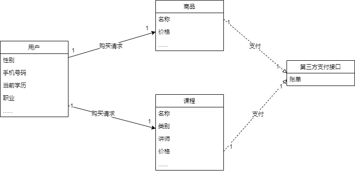
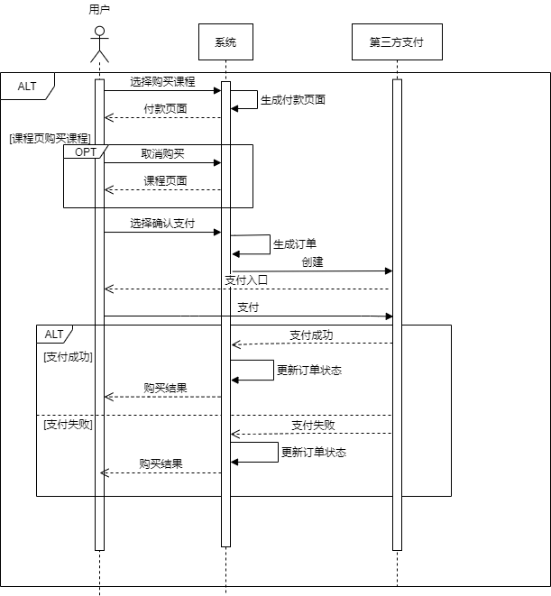
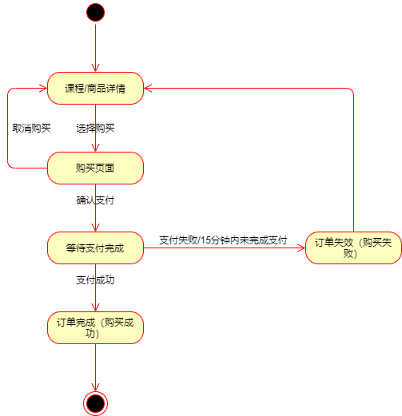
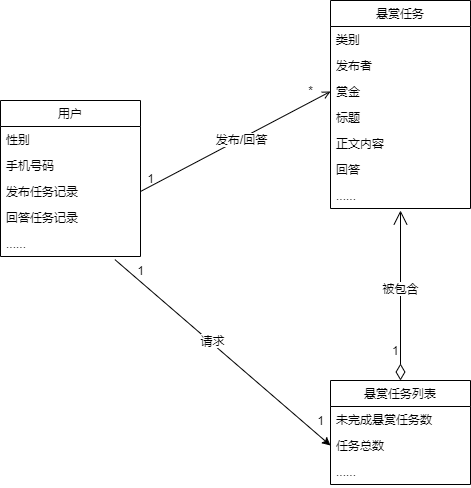
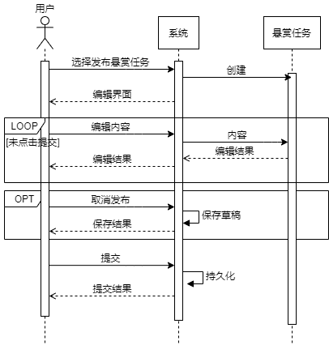
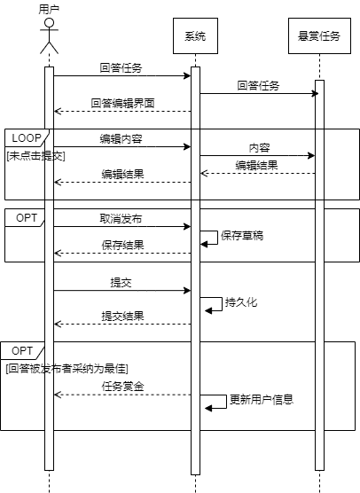
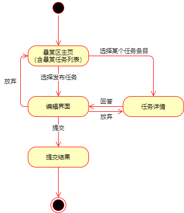
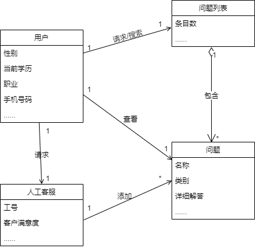
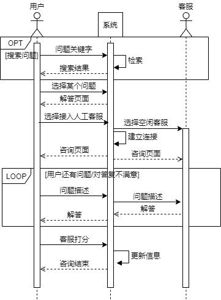
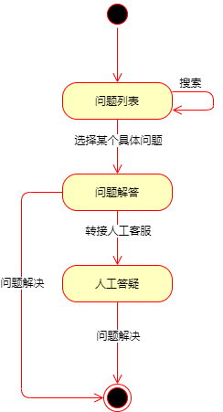

## 词云-需求规格说明文档

#### 3.2 功能需求

##### 3.2.5 购买课程

**特征描述：** 用户在经过浏览课程介绍或试用课程后觉得值得购买，可以购买该门课程。

**刺激/响应序列：** 

刺激：用户登录后进入某一具体课程页面，点击购买课程

响应：系统展示付款页面，包括费用详情、付款方式、可用优惠券等信息

刺激：用户点击取消购买并再次确认

响应：系统跳回课程页面

刺激：用户点击支付

响应：系统生成订单并调用第三方支付接口（支付宝、微信、银联），等待用户支付。

刺激：用户完成支付

响应：系统返回购买成功页面

刺激：用户15分钟内未完成支付

响应：系统取消订单，并显示订单已失效

**相关功能需求：** 

| 功能                      | 描述                                                         |
| ------------------------- | ------------------------------------------------------------ |
| User.Signin               | 用户登录                                                     |
| Buy.Courses.PaymentPage   | 用户进入购买页面，系统展示费用详情、付款方式、可用优惠券等信息 |
| Buy.Courses.PurchaseOrder | 用户点击支付，系统生成订单并调用第三方接口，跳转到对应支付页面，等待页面支付 |
| Buy.Course.Persist        | 系统记录订单以及订单状态的更新并持久化到数据库               |

##### 3.2.6 购买商品

**特征描述：** 用户浏览某件商品详情后感觉不错，可以购买该件商品。

**刺激/响应序列：** 

刺激：用户登录后进入某一具体商品页面，点击购买该商品

响应：系统展示付款页面，包括费用详情（含配送费）、付款方式、可用优惠券、收货地址（收货人、联系电话、所在地区）等信息

刺激：用户点击取消购买并再次确认

响应：系统跳回商品页面

刺激：用户选择收货地址后，点击支付

响应：系统生成订单并调用第三方支付接口（支付宝、微信、银联），等待用户支付。

刺激：用户完成支付

响应：系统返回购买成功页面，发货后交由第三方物流公司提供物流运输服务

刺激：用户15分钟内未完成支付

响应：系统取消订单，并显示订单已失效

**相关功能需求：** 

| 功能                          | 描述                                                         |
| ----------------------------- | ------------------------------------------------------------ |
| User.Signin                   | 用户登录                                                     |
| Buy.Goods.PaymentPage         | 用户进入购买页面，系统展示费用详情含（配送费）、付款方式、可用优惠券、收货地址等信息 |
| Buy.Goods.PurchaseOrder       | 用户点击支付，系统生成订单并调用第三方接口，跳转到对应支付页面，等待页面支付 |
| Buy.Course.Persist            | 系统记录订单、订单状态的更新、商品库存的更新                 |
| User.ViewLogisticsInformation | 用户可以查看已购买商品的实时物流信息                         |

##### 3.2.7 发布悬赏任务

**特征描述：** 用户可以在平台悬赏区发布悬赏任务，如求助资源，请求翻译文献、批改托福作文，帮忙论文降重、文章润色等，提供一定赏金作为报酬。

**刺激/响应序列：** 

刺激：用户登录后进入悬赏区页面，选择发布悬赏任务

响应：系统显示编辑界面，包括任务类型、标题、正文、附件等说明任务要求，以及赏金的选择指明任务报酬。

刺激：用户选择放弃编辑

响应：系统退出编辑界面，保存当前内容至草稿

刺激：用户选择任务类型

响应：系统显示选择结果

刺激：用户编辑文字内容

响应：系统实时显示更新编辑结果

刺激：用户选择上传附件

响应：系统显示上传成功

刺激：用户编辑完毕，选择发布

响应：系统提交任务并显示结果

**相关功能需求：** 

| 功能                                           | 描述                                                         |
| ---------------------------------------------- | ------------------------------------------------------------ |
| User.Signin                                    | 用户登录                                                     |
| RewardCommunity.PublishTask.Edit.Attachment    | 系统允许用户上传附件                                         |
| RewardCommunity.PublishTask.Edit.Content.Input | 系统允许用户输入文字内容                                     |
| RewardCommunity.PublishTask.Edit.Bounty        | 系统需要用户为悬赏任务选择赏金                               |
| RewardCommunity.PublishTask.Edit.Cancel&Save   | 系统允许用户放弃编辑； 系统保存用户当前未发布的任务内容至草稿箱 |
| RewardCommunity.PublishTask.Edit.Submit        | 系统允许用户提交悬赏任务                                     |
| RewardCommunity.PublishTask.Edit.Show          | 系统实时显示任务编辑界面                                     |
| RewardCommunity.PublishTask.Submit.Result      | 系统显示任务提交结果                                         |
| RewardCommunity.PublishTask.Accept&End         | 发布者采纳某位回答者的答案为最佳，平台将之前设置的赏金转交给该回答者，任务完结，除该二人外其他人不可见 |

##### 3.2.8 完成悬赏任务

**特征描述：** 用户可以在平台悬赏区完成他人发布的悬赏任务，获得赏金奖励，可按一定比例提现。

**刺激/响应序列：** 

刺激：用户登录后进入悬赏区某一具体任务页面，选择回答

响应：系统进入编辑页面，包括内容、附件等域

刺激：用户选择放弃编辑

响应：系统退出编辑界面，保存当前内容至草稿

刺激：用户选择上传附件

响应：系统显示上传成功

刺激：用户编辑完毕，选择回答

响应：系统提交回答并显示结果

**相关功能需求：** 

| 功能                                     | 描述                                                         |
| ---------------------------------------- | ------------------------------------------------------------ |
| User.Signin                              | 用户登录                                                     |
| RewardCommunity.Reply.Edit.Attachment    | 系统允许用户上传附件                                         |
| RewardCommunity.Reply.Edit.Content.Input | 系统允许用户输入文字内容                                     |
| RewardCommunity.Reply.ReceiveReward      | 发布者选择用户的回答为最佳，获得赏金                         |
| RewardCommunity.Reply.Edit.Cancel&Save   | 系统允许用户放弃编辑； 系统保存用户当前未发布的回答内容至草稿箱 |
| RewardCommunity.Reply.Edit.Submit        | 系统允许用户提交任务回答                                     |
| RewardCommunity.Reply.Edit.Show          | 系统实时显示回答编辑界面                                     |
| RewardCommunity.Reply.Submit.Result      | 系统显示回答提交结果                                         |

### 4 分析模型

#### 4.4 购买课程/商品

**概念类图** 

下图描述了购买课程/商品过程各类的关系：

该图由用户、商品、课程、第三方支付接口四个类共同组成。重要属性已给出，支付功能转交第三方支付平台（微信、银联、支付宝等）完成。

**顺序图** 

下图描述了购买课程/商品过程的详细顺序（以课程为例）：

该图展示了用户购买课程的过程。购买商品与之类似，只是多了一步库存的检查和相应更新以及用户在付款页面对收货地址的选择。平台根据第三方支付接口返回的结果判断此次购买结果，并做相应的持久化记录/更新。

**状态图** 

下图描述了购买课程/商品过程中的状态以及流转情况：

该图展示了用户购买课程/商品过程中出现的状态以及这些状态的转换情况。需要注意的是要从第三方支付接口获得支付是否成功的消息。

#### 4.5 发布/回答悬赏任务

**概念类图** 

下图描述了发布/回答悬赏任务相关的类实体的属性及其交互：

该图由用户、悬赏任务、悬赏任务列表3个类共同组成，用户可以浏览列表或单个任务，并可以进行发布、回答。

**顺序图** 

下图描述了发布悬赏任务过程中实体间的交互顺序：

该图展示了用户发布悬赏任务的过程。其中编辑内容部分用户需要选择任务类别、赏金和期限（必须），赏金会由平台保管，任务完成后赏金会转交给采纳的回答者，或期限到后仍未完成返还给用户。

下图描述了回答悬赏任务过程中实体间的交互顺序：

该图展示了用户回答悬赏任务的过程。当用户的回答被发布者采纳为最佳时，用户获得先前发布者设置的赏金，系统更新用户相应信息（持有金币、采纳回答数等）。

**状态图** 

下图描述了发布/回答悬赏任务过程中的状态及流转情况：

该图展示了用户发布/回答悬赏任务过程中出现的状态以及这些状态的转换情况。用户编辑结束选择提交后，状态转为提交，进而流程结束。

#### 4.6 咨询

**概念类图** 

下图描述了客服咨询过程中类间的关系：

该图由用户、人工客服、问题列表、问题4个类组成。当用户对现有问题的答复（Q&A式）不满意时可以转接人工客服来进行解答。

**顺序图** 

下图描述了客服咨询过程中各实体间的交互过程序列：

该图展示了客服咨询的过程。用户先选择或搜索已有解答的Q&A式问题，若对解答不满意，可以转接人工客服进行沟通。沟通方式为对话问答式，直到解决了用户目前问题/对答复满意为止。咨询完成后需要存储咨询记录，更新客服评分等。

**状态图** 

下图描述了客服咨询过程中的状态及流转情况：

该图展示了客服咨询过程中出现的状态以及这些状态之间的转换情况，比较简单，以用户问题的解决为结束。

