# 商业模式设计
## 组员信息

|  姓名  |   学号    |
| :----: | :-------: |
| 浦隽轩 | 181250115 |
| 陶志豪 | 181250130 |
| 黄成东 | 181840090 |
| 李沛洋 | 181840123 |

## 度量数值

3个移情图；4个构思候选创意；34个画布总要点数量；17个关联关系；12篇调研报告和新闻报道（7篇、5篇）；4个故事（3个客户视角，1个公司视角）；3个客户场景（要点不少于6个）

## 移情图

### **阅读爱好者**
  * 作为一个读书平台，我们提供的电子书和实体书资源可以为众多阅读学习者提供一个优质的阅读渠道。一方面，阅读爱好者可以通过读书获得愉快的体验，喜欢这本书也能直接通过我们的电商平台进行购买收藏。另一方面平台中丰富类型的书籍和优质的APP使用体验，可以为阅读爱好者提供读书的正反馈，在读书中不断提升自己。而平台大量的二创资源也可以让读者得到更进一步的满足感。
  * 下图是刚结婚生子的程序员小张的移情图，他想要争取转行到最近热门的算法岗位，而算法的学习成为了他当下急需解决的问题。
  * 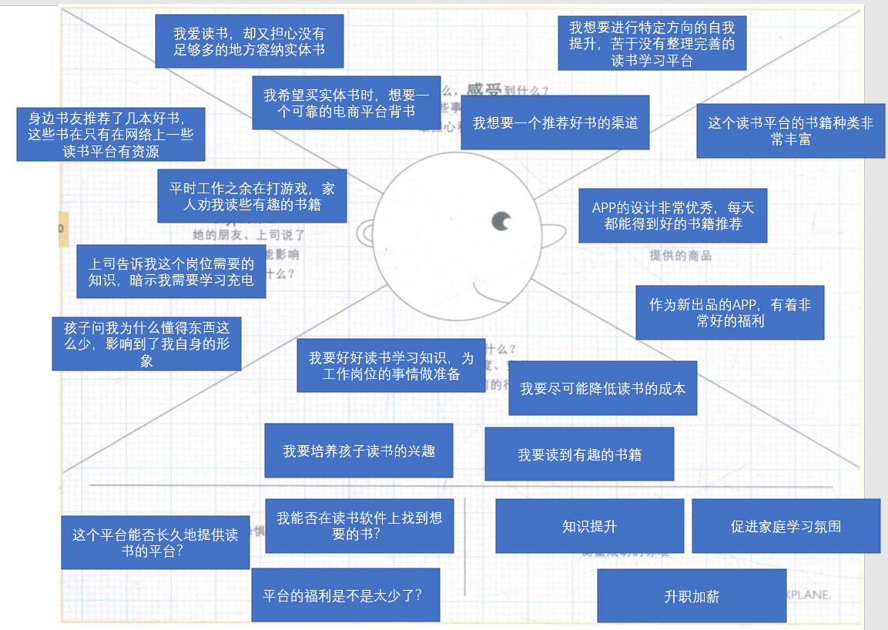

### **乐于社交和分享的人群**

  * 社交爱好者可以通过我们的软件进行基于书籍的交友，我们的软件搭建了读书社区平台，可以在读书之余进行讨论和批评，也可以在读书的同时进行划句评论。我们希望通过我们的软件能激发用户价值观的碰撞，开阔用户的社交圈、视野。在私人化的读书活动中，展开交互性强的讨论。让每个用户的阅读不再孤单。
  * 下图是热衷于上网冲浪的阅读爱好者小李的移情图，他最近读完了好几本关于异世界的轻小说。几部小说中针对同一个题材的不同展开方式让他有了很强的讨论和表达欲望。
  * 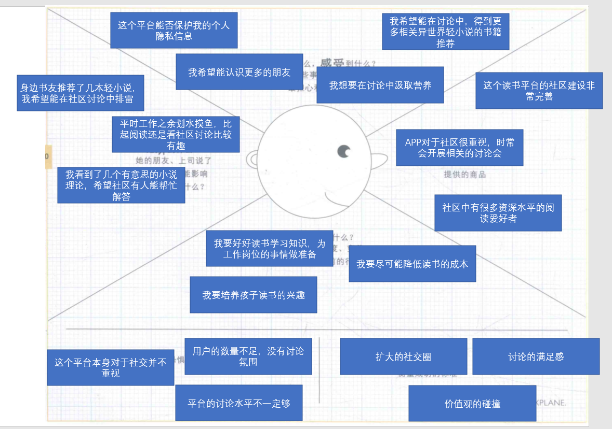

### **能产出的创作者**
  * 本产品作为一个集书籍资源和社交于一体的软件，能够为那些乐于产出的创作者提供更为广阔的展示平台，让更多的喜欢读书的人看到自己的文字，以此来吸引更多的粉丝，拥有更高的人气。同时平台也为所有创作者提供了互相交流的机会，从而让创作者能够在与其他创作者的交流当中获取灵感。对于有实力和人气的创作者，平台可以与其进行签约，实现平台和创作者的双赢。
  * 下图是创作者小谢的移情图，她在女频小说上投入了大量精力和时间来进行创作。但是由于缺乏合适的平台，没有讨论相应题材的氛围。因此近些月来微博粉丝数几乎不见增长，人气也变得不温不火，如何快速提升粉丝数量和自身热度是她非常渴望得到解决的问题。
  * 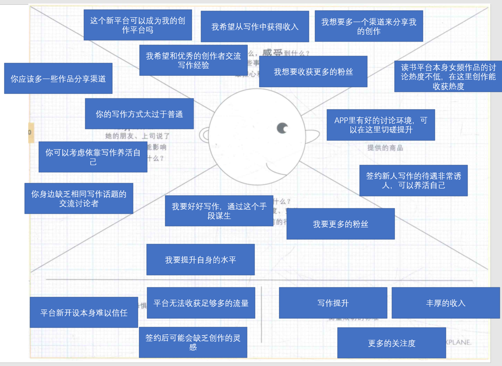

## 构思

### 从供给驱动的角度出发
  * 如果我们不推出单独的软件产品，而是尽可能拓宽合作，去做技术和其他公司产品的结合会怎么样？
  * 这种价值主张的创新会导致整个商业模式画布的剧变，曾经的竞争者转而成为了我们的客户，我们不再和他们去争夺市场，而是直接从他们手中获取书籍资源的使用费，这也会成为我们主要的收入来源；进而我们的客户关系可能会趋近于更细化的面向各大读书平台的服务关系，每个读书平台都可能成为潜在的大客户。我们的关键业务也因此转变聚焦到书籍资源之上，核心团队确定了以软件研发人员和渠道洽谈人员为主体的团队模式。

### 从财务驱动的角度出发 
  * 如果我们放弃广告费和使用费的收入，专心去做会员费和许可使用费的收益最大化会怎么样？
  * 这种收入来源的变革分别有各自的原因，一是广告市场在谷歌、百度等巨头的压榨下，已经基本饱和，广告难有高额利润可寻，广告本身也成为用户反感的痛点；二是免费商业模式的迷人之处就在于免费的商品会吸引数量庞大的客户。因此，我们计划制作一款“纯粹”的软件产品。无广告植入和免费的功能使用无疑会带来广阔的客户群体。自然，这种免费不是无限制的免费，我们会在每日阅读时长和功能选择上提供限制，即让偶尔使用我们产品的客户可以维系得住，因为他们随时可能变成经常使用的活跃客户；主要的收入则从活跃客户里获取，我们会对会员进行服务进行精致化打造——无限使用时间，实体书购买打折等等。这种财务驱动的创新并不会对我们的整体画布有巨大的改变，但在客户细分这个要素上，这种方式会使得越来越多的边缘客户和潜在客户愿意了解我们，并向我们付费。这里面体现的思路是——做“免费且纯粹好用”的软件是可以吸引海量客户的，而当基数达到一定程度，其中选择支付费用获得更好服务的人也会随之越来越多。

### 从多点驱动的角度出发
  * 如果将社交社区集成到阅读平台里会怎样？
  * 这样做的好处首先会促进用户之间的交流频率，注意到例如起点很多知名写手都有自己的催更吐槽群，这证明了单一的书籍阅览已经无法满足受众日益增长的需求，读者渴望与作者以及志同道合的粉丝产生良性互动，并且这种互动在现有的模式下是可行的。另一方面，将社交社区与读书平台进行集成，有助于提升我们产品的知名度。在前期，可以通过请知名作家入驻的方式，向作家粉丝传递我们的价值主张，将这些粉丝转化为我们的潜在用户，从而提升软件的知名度。而阅读的同时提升社交讨论的热度，这对维持社区本身的活跃度是有利的。

### 从客户驱动的角度出发 
  * 如果平台没有客户想要的书籍作品，我们根据用户需求引入会怎么样？
  * 对于平台内缺少的书籍作品，用户可以提出引进需求，每隔 1-2 周平台进行一次统计，对需求量最大的前几名予以引入。从客户关系角度出发，能够按用户的需求引入书籍，无疑会让我们留住更多的老客户，同时我们也会新增“按用户需求供给书籍”的价值主张。这种新颖的服务也有助于我们价值主张的传递，能够扩大我们的知名度。问题在于会加剧成本结构中版权费的资金消耗，但是相应的书籍资源的会员费用收入来源也会得到强化。我们的核心资源，重要合作，关键业务都不会受到影响。

### 总结
  * 以上四个构思是我们在之前作业的基础上分别从供给驱动，多点驱动，客户驱动，财务驱动等角度出发所设计的创新点，通过小组讨论，我们对上述内容整体进行筛选，得到最终的商业模式构思如下：
  * 从多点驱动角度出发
  * 如果将社交社区集成到阅读平台里会怎样？
  * 社交社区和阅读资源分割开，成为两个独立的系统，这是大部分读书平台常见的架构。一方面，对于一个新的软件平台而言，这样的分离本身不利于工作的开展和产品的打磨；另一方面，社交和 UGC 本身就存在着千丝万缕的关联——人人皆可创作讨论，阅读同样可以不那么孤单。因此，我们本次最核心的创新点就在于社区和阅读平台的整合。
   * 从这个价值主张出发，我们的客户主体依旧是对阅读、讨论、以及创作感兴趣的人群，他们之中即有用户也有作者，但由于合成后的产品联系性更强，我们的平台管理由两个变为一个，更利于我们专注做好精细的维护工作。
   * 同时我们小组对其它几种驱动的构思也做了整合。收入来源根据之前财务驱动的构思，我们将以会员费收入为主，对广告费压缩，同时会考虑转让书籍资源技术给其它阅读平台获取许可费。

## 可视化
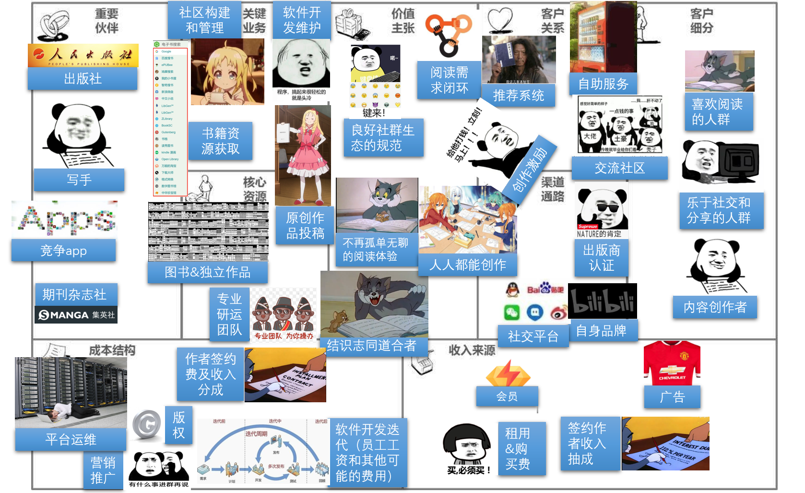

上图是我们画布整体概况，接下来将从价值主张出发讲解的以及较次可视化的改。

### 价值主张
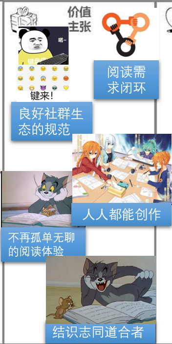

在价值主张方面，我们主要主张
  * 打造阅读需求的闭环
        满足用户从选书到买书再到读书和评书的一个完整的需求链条。在这里，透过友邻的标记、所创建的书单、阅读笔记分享或者读后书评or平台编辑的周期精选推荐or设置个人偏好等后的“猜你喜欢”推荐，以及进一步地分类和条件筛选，用户能够很轻松地找到适合自己口味的书籍。
  * 创造良好社群生态的规范
        我们认为，良好的社区生态可以提供和谐的互动氛围，让用户从分享与被分享的正反馈过程中获得愉悦与价值。同时，通过对社区内容发布的大力支持，用户产出的想法或新奇观点通过点赞、评论、关注、转发和收藏能够得到他人的认同与尊重，达成深层次的精神需求。
  * 不再孤单无聊的阅读体验
        我们加入了共读功能，用户可以选择几位好友创建或者直接加入共读小组开启阅读目标和计划，定期更新自己的阅读进度和感想。在紧迫感和群体的推动互勉下，不但更容易坚持下来，还能对书有一个多向度更深刻的理解。为了让阅读过程变得更加生动有趣，我们考虑加入成就和徽章系统，展示用户阅读历程；另外，用户在阅读电子书时可以针对某一页具体部分通过弹幕或者贴条发表吐槽或者看法。有助于缓解读者们平时阅读可能经常会遇到在途中感到枯燥搁置，或者缺乏监督与激励没有动力读下去的问题。
  * 人人都能创作
        我们着力挖掘民间优秀的内容创作者，鼓励并接受个人投稿，评审质量通过后可发布在为独立作者专门开设的一个原创作品板块，作者后续可获得相应收入分成。
  * 以书文会友，结识志同道合者
        我们相信文字背后的热爱、力量和真知灼见的价值。虽然平台受众相对多元，但无论是阳春白雪还是下里巴人，都能够“以书会友”，虽未曾谋面但见字如面，各抒所见引起共鸣，收获纯粹真诚的关系。（修改了主张名，以更契合“会友”的主张内容）。

### 关键业务
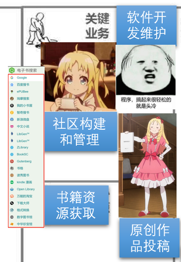

我们的关键业务整体不变。社区是让产品拥有持续生命力的源泉所在，因此我们需要进行社区构建。我们需要通过软件开发及维护来保证产品的可靠与先进。作为一个阅读的平台，书籍版权的获取自然也是我们的关键业务之一，同时，支持原创产品投稿，让原创优质产品的不断产生，是让我们产品走向可持续发展的重要业务。

### 核心资源

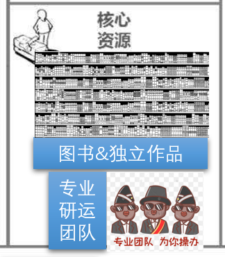

我们的核心资源包括丰富的图书及独立作品以及专业的研发运营团队。
 - 图书资源依赖于与众多出版社、主流电子期刊的合作获取的正版电子图书和电子杂志；
 - 独立作品依赖于签约的民间高质量的内容创作者的原创作品。
 - 研发团队主要负责产品的开发、测试、部署、版本迭代、运行维护。

### 重要伙伴
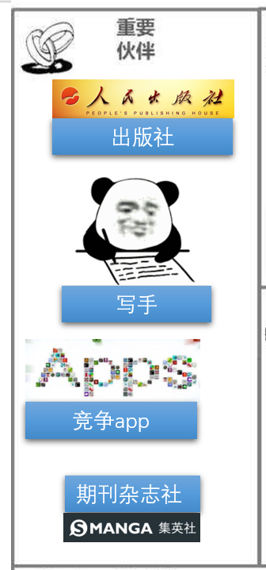

我们的重要伙伴包括出版社、期刊杂志、撰稿人和它其阅读类app竞争者。
 - 出版社可以为我们提供是正版书籍，也可以为本产品的优秀写手（比如小说的同人文、同人外传作者）用户提供刊载其产出的内容的平台。
 - 期刊杂志同样可以给本产品的优秀写手（比如书评作者）用户提供平台来刊载其产出的内容。
 - 与我们签约的撰稿人可以不断给本产品带来优质内容，起到很好的吸引其他用户或非本app的用户来阅读、讨论的作用。
 - 与竞争公司进行探讨合作有助于在解决一些共同存在的问题的技术点上实现部分的资源互惠共享。
（较上次相比，该部分删去了与销售团队的合作。）

### 客户细分
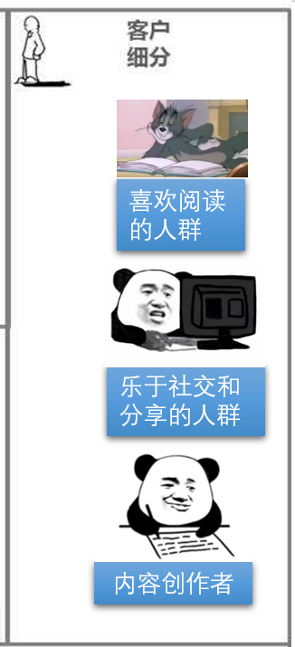

本产品的客户包括读书喜好不同的各类人群。
 - 乐于读书的人群通过有着巨大的阅读量，可以在论坛进行广泛的讨论推荐，或者给作者反馈，活跃产品氛围。
 - 创作者能够给产品带来源源不断的优质内容，同时能够在论坛与读书人群进行交流，形成正向反馈，促进产品的生命力。
 - （新增）乐于社交的人群相比乐于读书的人群有着更大的社交圈和网上冲浪范围，他们可以在更多的平台上进行作品讨论，提升作品或产品的热度，吸引更多客户。

### 客户关系
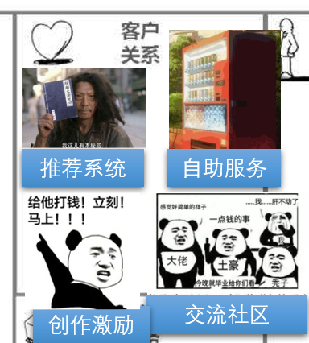

客户关系分为交流社区、（新增）创作激励、自动化服务以及推荐系统（对上一版本的“每日精选服务”进行了拆分）。
 - 讨论社区就是用户积极留言并进行互动，反馈产品使用的问题、心得或者建议的社区，我们也会定期总结社区留言并对其所反馈的问题进行解释说明。
 - 推荐系统会根据广大用户的总体喜好以及用户个体的偏好对每位用户进行个性化的每日更新的精品书籍，精品文章的推荐。
 - 自动化服务是做一些帮助我们新用户熟悉的软件引导工作，以及当产品有了迭代后对新老用户进行新特性的解释与引导，以及常见问题的自动化解答的服务。
 - 创作激励是我们依据文章质量和数量对创作者的提供的虚拟或现实中的奖励机制，是希望用户多多进行优质文章创作，丰富平台资源。

### 渠道通路
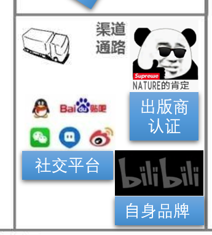

我们的渠道包括社交平台和合作的出版商，以及源于自身品牌的推广渠道。
 - 合作方的渠道有利于我们产品的推广传播，让我们产品有更大的影响力。
 - 借助目前众多的社交平台的传播速度，同样可以给我们产品有更大的知名度。
 - 我们也会提供自运营网站，以供用户进行资源下载。
 (删除了销售渠道，新增了社交平台渠道和自身品牌的渠道)

### 成本结构
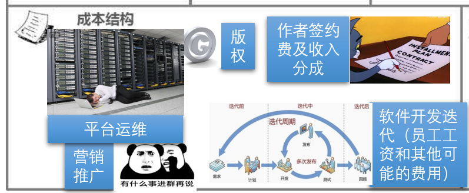

我们的成本结构主要在于：
 - 版权。为提供丰富的阅读资源，通过相应渠道购买足量电子书的版权是必要的一环。
 - 平台维护。软件发布后需要进行长期的平台运营和维护。无论是服务器资源还是运营维护所需的人力资源，都需要一定成本。
 - 营销推广。在软件起步阶段，需要通过不同的平台进行广告植入，或者通过发放福利邀请用户免费体验所产生的费用。
 - 软件开发。软件开发过程需要聘请专业研发团队，以及其他员工工资年薪。
 - 作者签约。用户内容产出的过程中，可挑选其中优秀的产品，签约相关创作者。

### 收入来源
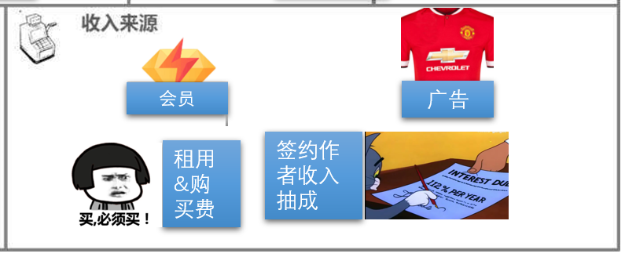

我们的收入来源包括：
 - VIP服务。VIP服务可以给用户提供包括可以阅读APP中的全部书籍资源在内的多项专属特权服务。
 - 租用&购买费用。部分无法免费的书籍可以以租用的形式提供限时阅读。用户也可以选择全本购买的服务方式获得永久阅读所购买书籍的权利。
 - 在线广告。我们会在不影响用户体验的前提下投放一些广告。
 - 签约作者收入抽成。对于签约的作者，我们会抽取其文章获得的收入的一部分。
 （较上版本将“实体书收入”替换为了“签约作者收入抽成”）

## 模型构建

#### 关联关系

1. 核心资源中的专业研运团队 与 关键业务中的软件的开发维护
   - 软件开发及平台维护是一项复杂的、系统性的技术工作，需要专业人员组成专业团队来参与。
2. 核心资源中的专业研运团队 与 成本结构中的软件开发迭代（员工薪资）
   - 专业的研运团队（优秀人力资源）是我们产品成功的重要基石之一，需要支付相应的工资。
3. 重要伙伴中的出版社、期刊杂志社 与 核心资源中丰富的图书资源
   - 通过与出版社、期刊杂志等版权方合作，获取相应的电子书资源[和实体书贩卖渠道]。
4. 核心资源中丰富的图书资源及独立作品 与 关键业务中支持原创作品的投稿、书籍资源获取
   - 通过持续地挖掘平台用户优秀的原创作品以及新书好书，不断充实我们的资源库。
5. 重要伙伴中的独立撰稿人 与 核心资源中丰富的独立作品
   - 与部分有人气的专业写手（撰稿人）达成合作，为我们提供高质量的专栏作品。
6. 重要伙伴中的其他阅读类APP竞争者 与 核心资源中的专业研运团队
   - 为我们的团队提供向其他阅读类app竞争者（如微信读书、豆瓣读书、掌阅等）合作的机会，借鉴开发经验，学习他们的交互设计、功能设计等，提升团队水平，完善我们的产品。
7. 客户细分中的创作者 与 价值主张中的人人都能创作
   - 通过签约、参加征文活动等方式，鼓励让有志于创作的阅读爱好者以创作者身份进行写作，优质作品评审质量通过上架平台后还可获得相应收入分成。
8. 收入来源中的广告费 与 关键业务中的社区构建与管理
   - 可以在平台社区中植入广告，获取一定收入。
9. 核心资源中的专业研运团队 与 价值主张中的打造阅读需求的闭环
   - 要满足用户选书-买书-读书-评书的完整需求链条，需要团队作出充足的考虑和度量。
10. 客户细分中的喜好阅读的人群 与 价值主张中的不再孤单无聊的阅读体验
    - 通过共读小组、成就徽章系统、弹幕贴条等功能使读者的阅读体验更加有趣。
11. 客户关系中的推荐系统 与 关键业务中的软件的开发维护
    - 平台的内容推荐算法和个性化服务需要不断进行开发和完善。
12. 客户关系中的交流社区 与 关键业务中的社区的构建和管理
    - 交流社区需要良好的规范运营，同时也要根据用户的反馈、社区氛围不断进行管理和优化。
13. 收入来源中的会员费 与 价值主张中的平台功能
    - 会员用户相比普通用户可享受更优质的阅读服务，更丰富的可读内容。
14. 渠道通路中的社交平台推广 与 成本结构中的营销推广
    - 在平台初创期，要向大流量的社交平台投放广告进行推广宣传，提升用户基数和名气。
15. 核心资源中的专业运营团队 与 渠道通路中的自身品牌
    - 通过好的平台运营打响我们产品的品牌，提升产品口碑和知名度。
16. 客户关系中的创作激励 与 成本结构中的平台运维
    - 我们会经常举办征文比赛等创作激励活动，是平台运维的一部分支出。
17. 客户细分中的乐于社交和分享的人群 与 价值主张中的良好社区生态的规范
    - 我们平台成熟活跃的文化和社区氛围能让这一部分人群收获对于社区的归属感和情感认同。

#### 调研报告与新闻报道

##### 调研

> 1. 社会化阅读概念
> 社会化阅读是一种以内容为核心， 以社交关系为纽带， 注重分享、交流和互动的移动阅读新模式。目前大量阅读平台和软件都设置了“分享” 按钮，用户可以将阅读的内容分享至微博、开心网、人人网等社会化媒体。但社会化阅读不仅仅是阅读的一键分享。“内容的产生经过社会化筛选， 在内容的阅读过程中， 可以与作者或同样喜好的用户进行互动， 阅读结束后， 可以与阅读同一内容的大众进行交往联系， 甚至形成议题融合的社会化”。分享、交流和互动贯穿于社会化阅读的全过程。而在这些互动交流中， 产生了大量新的有价值的内容， 如评论、摘录、笔记、关联或交叉信息等。在社会化阅读应用里， 通过阅读平台与社交网站的紧密关联， 用户不但可以将自己喜欢的内容通过社会化媒体分享出去并在原阅读平台得以同步体现， 用户的媒体使用行为包括阅读行为还被作为向其智能推送个性化内容的依据。
>
> 2. 产生的背景
>     （1） 读者信息获取和分享需求的驱动传统的信息获取大多以传统媒体为主。由于个人精力有限， 读者只能关注少数的媒体， 阅读内容的来源也比较单一，读者与传播者之间、读者与读者之间缺乏互动。随着互联网络的快速发展， 读者通过门户网站、搜索引擎主动查找信息并发表评论，信息来源多样化， 交互性增强。但读者的大量时间也浪费在了不相关的海量信息上， 其对信息准确性的需求满足受到影响。RSS （Really Simple Syndication）阅读的出现使这一状况得到改善， 它采用信息源聚合式的方式， 将来自期刊、杂志等信息源的内容聚合到一起， 人们可根据自己的喜好订阅不同信息源的内容进行阅读， 大大提高了阅读效率。但由于RSS 本身也只是一个简单的信息订阅工具， 没有任何个性化筛选， 同样会出现信息过载的问题。Google News 等新闻聚合类网站则通过人工或自动化的算法， 将各类信息进行分类， 并根据热度和时间等进行统一的呈现， 供不同的读者选择阅读。但是，它们选取的是迎合大众人群的新闻， 无法满足每个读者个性化的需求。
>     （2） 社交网络的日渐成熟和移动阅读的蓬勃发展以Facebook 和Twitter 为代表的社会化媒体在世界范围内扩展， 2012 年我国微博用户规模已达到3.09 亿。社会化媒体改变了人们获取和分享信息的方式， 其内容由亲朋好友或有共同关注点的陌生人分享或推荐， 更贴近读者的兴趣， 与读者的相关度更高。智能手机、平板电脑的普及和移动互联技术的进步则推动了信息获取的移动化， 即Anytime、Anywhere。在社交网络日渐成熟和移动阅读蓬勃发展的背景下， 以2010 年创立的Flipboard 为代表的社会化阅读应用为阅读带来了新思路。它将用户感兴趣的新闻、照片以及社交网络上的新鲜事聚合在一起， 并自动生成内容， 以杂志的形式呈现给读者，此外还能通过转发、评论等行为进行社交互动。Flipboard 首创的这种social magazine 形式， 被称为阅读的“革命”， 曾当选苹果“年度iPad 应用”。它综合了兴趣与社交， 既兼顾用户对内容的个性化需求， 又满足用户交流分享的意愿。社会化阅读由此被引爆。
> 
> ——《移动阅读新模式：基于兴趣与社交的社会化阅读》，
>       《新媒体观察》2013年第4期，毕秋敏 曾志勇 李明

> 2018年，我国数字阅读继续保持快速发展势头。调研数据表明，2018年我国数字阅读用户已达4.3亿，人均数字阅读量为12.4本，人均单次阅读时长已达71.3分钟。
>用户规模：数字阅读各类用户规模还在持续攀升。2018年，我国大众阅读用户规模、专业阅读用户规模分别达到4.3亿和1417.9万。
> 具象：大众数字阅读用户成长路线图。数字阅读用户中，不同用户偏爱的内容、题材在随年龄增长呈现不同的选择。而丰富多样的数字阅读内容较好地满足了不同年龄段、不同层次用户的需求。
>付费意愿：用户付费意愿持续大幅度提升。我国数字阅读用户的电子书付费意愿2018年已达到66.4%，同时，各年龄段用户的实际付费金额高于他们的付费意愿。也就是说，在付费之前用户不大情愿，但一旦找到一本好书，被内容吸引以后，付费意愿就会超出原来的预期。
> 内容提供者：规模稳步增长，培训的跟进带动了精品内容的创作。2018年，数字内容创作者数量保持增长，总量高达862万。尤其值得一提的是，过去一年，作者培训班如雨后春笋般涌现，为数字阅读内容的供给提供了有力的支援。
>创新：坚持创新引领，挖掘产业的内生动力。伴随产业发展的不断深化，媒体融合创新和技术管理创新成为2018年产业发展的新亮点，短视频书摘、书评等场景化、社交化，线上线下纸电融合，AR、区块链等智能化应用技术为数字阅读的管理提供了更加高效的技术手段，为数字阅读提供了有效保障。
> 
>——张毅君《2018年度中国数字阅读白皮书》

> 随着科学技术的不断发展，虚拟网络空间中的在场感亦成为一种可能，人们可以通过各种移动设备，就某一话题或者兴趣参与讨论与交流，从而构建了共同的虚拟空间。彭兰曾经指出，随着移动互联网的出现和发展，人们可以文字或其他形式交流与互动，形成一种虚拟的在场感。在微信读书这一虚拟的阅读场景中，参与阅读的用户的登入账号即微信号，微信APP可以直接将微信列表中的好友进行匹配，用户可以通过点赞、评论、分享这些行为进行交流互动。每个用户看书的时长会形成一个排行榜，用户可以查看该排行榜，了解自身的排行名次，用户也可以查看好友收藏的书单目录以及正在阅览的书籍。此外，微信读书还针对同本书推出当天共同阅读的界面，即用户可查看当天与其一起阅读这本书的读者，还可通过关注成为读书好友。在微信读书里，社交互动满足了用户身体在场的要求，实现了在虚拟空间中互动双方的真实存在。虽然这种互动不是在同一时间实时的在场互动，但这种互动构成了一种共同的虚拟空间，虚拟的在场感随之产生，参与阅读的用户能够感受到与他人一起阅读，这为用户带来一种共时性的阅读体验。
>
> 在微信读书中，用户可以在浏览其他人所分享的阅读感悟了解对方的观点，可以通过点赞或者转发、评论等方式表达自己的观点，达到情感共鸣。好友间相互加关注是互动仪式的一种表现，在对相关观念的表达和交流中，用户将自己喜爱或者感兴趣的好友设置为关注对象，达到更加亲近的关系状态，使得双方的黏合度得以提升，用户之间的情感成为双方互动的动因。点赞、评论、转发等形式是用户之间的一种互动形式，是一种对阅读空间的分享形式。这种互动仪式将阅读用户联系在一起，互动、分享等因素加入阅读中，成为移动阅读的新元素和新特色。
>
> ——马丽《移动阅读新形式探析——以微信读书为例》

> 2019年，我国数字阅读行业市场规模达到222.32亿元人民币，环比比增长28.37%，营收主要受到用户平台付费、版权收入和广告收入拉动。行业持续稳步发展。行业厂商排序上，主要厂商掌阅科技和阅文集团仍保持头部TOP2地位。免费阅读行业厂商快速发展，七猫免费阅读APP增长速度极快，MAU目前已突破3000万。目前，行业主要发力方向为：（1）版权运营扩圈化（2）”内容+音视频”形式联动拓展用户使用场景（3）免费阅读模式拉取行业外新用户。未来，行业有两大主要潜力：（1）发力下沉：与短视频的联动和免费阅读模式，挖掘下沉市场潜力（2）5G+相关技术：5G和配套技术的应用，开发新的场景。疫情下，行业有效利用线上流量上涨和用户粘性提升机遇，为行业赋能。
>
> ——易观分析《中国移动阅读市场年度综合分析2020》 

> **移动阅读行业商业模式：付费阅读为基石，多种商业模式并驾齐驱**
>
> 付费阅读：最主要收入来源，付费方式有按篇、按本、包月、包年等。各大平台通过为用 户提供精品化、多样化、个性化的内容和服务，提升用户的付费阅读意愿。
>
> 广告收入：广告主在阅读平台投放广告所支付的广告费用。一般来说，流量大的平台广告收入会更多。
>
> 硬件销售：一些数字阅读企业开始出售专业 的阅读硬件，不断为用户提供更好的阅读体验，从而提升用户对于阅读平台的忠诚度。
>
> 图书出版发行：传统的出版社出版作者的作品，作者和出版社合 作，或者网络文学网站与出版社合作，网站、作者、出版社，三位一体的营销模式。阅读平台拥有大量的版权资源，通过整合出版读物及网络小说进行纸质出版发售，获取一定收入。 
>
> 用户打赏：用户通过对具体作品或者作者等进行打赏，来表现自己喜好的一种方式。使用打赏方式的用户通常黏性较高。
>
> 版权增值：第二大收入来源。除了出售电子版权之外，各平台致力打造文学IP为核心，游戏、影视、文学、动漫相互联动的IP运营方式，深入挖掘IP价值。
>
> **内容运营趋势：内容推荐从人工到智能，为用户量身定制书单**
>
> 在现今的碎片化阅读时代，如何吸引住读者的注意力，满足读者差异化需求，更好地将用户留存下来也成为了市场竞争的 主要部分。在此趋势下，一些移动阅读APP也开始运用技术对读者的阅读行为及兴趣偏好进行分析，为读者提供更精准及个性化的内容推荐。这其中，既有传统巨头如阅文的QQ阅读将编辑推荐和智能推荐并存，也有必看小说等后起平台以智能推荐作为主打。
>
> 根据调研数据，有53.1%的移动阅读用户会通过阅读平台的智能推荐来选择自己想要阅读的小说。 而在对平台智能推荐的体验方面，移动阅读用户总体都给了较高的满意度打分，移动阅读平台智能推荐的小说在推荐的小说质量与推荐的小说与用户的兴趣符合度上用户满意度较高，推荐小说的新颖度满意度略低一筹。
>
> ——艾瑞咨询《2019年中国移动阅读发展趋势研究报告》

> （1）互联网数字阅读已成为人们数字化生活的重要组成部分
>
> 随着全民阅读的推进，互联网数字阅读用户规模快速提升，用户阅读习惯逐步形成并衍生出多样化的阅读需求，互联网数字阅读已成为用户精神文化生活的重要组成部分。数字阅读企业需要加大对数字阅读平台的投入并引入更多优秀作品，通过发挥科技与文化相融合的优势推进互联网用户阅读习惯的进一步养成，通过为互联网用户提供更多优秀作品丰富国民精神文化生活。
>
> （2）政策扶持鼓励行业发展
>
> 党的十九大报告中指出“要坚定文化自信，推动社会主义文化繁荣兴盛”，在文艺工作座谈会上指出“实现中华民族伟大复兴需要中华文化繁荣兴盛”。近年来，国家频繁出台支持文化产业发展的政策，以鼓励和促进文化产业发展。
>
> （3）培育作者奠定行业发展基础
>
> 作者作为数字内容的生产者，其数量规模及创作能力对行业发展具有重要意义。2015年至2019年我国作者人数从480万人增长至929万人，作者数量持续增长。此外，行业内数字阅读企业和各文学团体也通过多种形式培育、鼓励、支持原创作者。
>
> （4）技术升级为行业发展助力
>
> 移动通信技术的高速发展为数字阅读行业奠定了坚实的技术支撑。近年来，移动通信技术快速从2G、3G、4G更新至5G网络，同时无线网络实现了大面积覆盖，移动通信技术的快速发展为数字阅读行业的发展奠定了坚实基础。随着显示屏技术的发展，折叠屏等相关技术的普及，为用户数字阅读提供更为便捷的阅读方式。
>
> （5）泛娱乐生态赋予行业更多发展空间
>
> 网络文学平台的增量衍生主要依靠优质IP的运营，开发形式包括影视、动漫、听书等衍生品。影视剧改编方面，网络文学IP最初主要被改编成电视剧或电影，目前进一步延伸到网络剧、网络大电影等。网络文学IP现已成为影视剧本的最大来源。
>
> （6）新业态的普及丰富行业内容载体
>
> 随着移动互联网的不断发展，微信、微博等新媒体以及抖音、快手等短视频应用的渗透率不断提高，其作为新形式的内容载体已逐渐为用户所接受。新内容载体的出现，为数字阅读企业的推广尤其是精准营销推广提供了有效的渠道。
>
> ——中商产业研究院《中国数字阅读行业市场前景及投资机会研究报告》

> 4.1 反思
>
> 4.1.1 社交增强，阅读削弱
> 		为了激发用户的竞争心理，“移动阅读”App 开发了多种社交互动功能，久而久之，用户使用App 的重心有所偏移——时常出现为了任务、为了打卡而阅读的情况，读者也因此不能沉下心来思考书籍本身的内容，甚至只做任务不阅读。在私下社群中，偶有最活跃的用户阅读时长为0 的现象。种种迹象表明，以“阅读+社交”为主的社会化阅读模式虽然可以激发用户的阅读与社交欲望，但却容易造成顾此失彼的现象。换言之，在一定程度上，书籍内容不再是用户关注的重点，阅读变成了社交生活的调剂品。
> 		当用户的使用重心偏向社交，其对阅读的关注就会明显削弱。在原本就被碎片化、浅显化、泛娱乐化等现象充斥着的移动阅读时代，“阅读+社交”为主的社会化阅读模式会加重这种现象，使阅读的属性被社交模糊。
> 
> 4.1.2 跟风阅读，丧失个性
> 		在与好友的频繁互动中，用户可以发现很多自己未曾接触过的书籍，并在跟风、好奇心理的驱使下，将看似感兴趣实则并不了解的书加入书架。同时，为了显示自己跟得上主流的脚步，许多用户不考虑自己的阅读兴趣，将畅销榜图书加入书架。这种被动的跟风阅读并不能是真正意义上的阅读，这种方式不仅使阅读行为变成缺乏思考的浏览，其本身也违背了阅读活动个性化的特点。
> 		进一步说，用户在阅读方面的跟风、从众心理会致使用户丧失自主选书的能力，随波逐流。长此以往，用户会失去阅读的兴趣，自己的阅读习惯被他人、被流行趋势左右，阅读行为更是流于形式、浮于表面，这不仅不利于个人阅读习惯的培养，也会导致用户丧失个性，这是社会化阅读模式下值得我们反思的地方。
> 
> 4.1.3 虚假呈现中的自我迷失
> 		欧文·戈夫曼认为，社会是个大舞台，每一个人都在其上进行着“表演”。[13]社会化阅读模式为用户提供了展示自己的舞台，他们可以通过整理自己的书架，或者发表有深度、有内涵的书评来塑造自己的形象，但是很多时候，用户并没有得到自我提升。这源于用户一味追求自我形象的良好呈现，进而在虚拟空间中迷失自我，分不清呈现出来的究竟是不是自己，逐渐盲目自大，找不准自己的定位。随着社会化阅读模式的发展，阅读开始从后台走向前台。用户开始注重个人前台的外表与举止，过分关注自己是否塑造了一个理想化形象，而忽略了阅读的本质。用户沉溺于虚假的自我展示还可能会导致错误的自我认同，让其在现实生活中也产生错觉。真假交错使用户难以获得归属感，容易被自己设定的虚假呈现所局限，忘记了阅读的初衷。
>
> ——陈莹 李嘉宁《青年群体阅读活动的社会化转向分析——以“微信读书”App 为例》，《科技与出版》

##### 新闻

> 互联网创业应重视“内容为王”。企业和平台对接用户需求，供给优质内容，有助于在同用户的良性互动中建立有效的商业模式和盈利模式。例如，有声读物以其优质内容，帮助用户利用碎片化时间扩大知识面、提升思想境界，很好地契合了用户的需要。在线音频平台的发展壮大以及知识付费行业的兴起，生动体现出“内容为王”这一理念的价值。一项调查显示，2018年月收入5000元以上的在线音频用户超五成，月收入1万元以上的用户达到22.0%，音频用户群体呈现出高收入、消费力强、对特定领域知识需求强烈等特点。这说明，只要内容质量上乘，在线音频和知识付费就能建立起良好的受众基础。
>
> 过去一段时间，免费模式、补贴模式一度成为我国互联网产业发展的普遍路径。通过砸钱推广，借助“免费”吸引用户关注，获得流量后在金融市场扩大融资，不失为创业起步阶段的一种有效方式。一些互联网从业者甚至认为，平台覆盖越大，渠道越通畅，流量越充足，就越能盈利。然而事实证明，如果没有高品质的内容支撑，渠道和流量将难以维持。“免费”或许可以成为短期最有效的推广手段，但从长期来看，要想积累用户忠诚度，推动企业和平台的持续健康发展，还需要从产品质量、运营管理等方面下功夫。
>
> 所谓“内容为王”，就是更注重用优质的产品与服务获得合理的营收，以品质论成败而不是以流量论成败。近年来，外卖平台不再免费派送餐食，网约车、共享单车不再盲目打价格战，花钱订阅资讯的人越来越多，知识付费备受追捧……这些趋于理性、趋向“内容为王”的变化，正是网络新经济日益成熟的重要体现。平台对于“内容”的建设不能放任自流，提供的产品和服务，直接关乎平台能否具有长期盈利能力。可以说，“内容为王”始终是吸引用户、扩大流量的硬道理。
>
> “内容为王”也是由消费升级决定的。作为消费市场的一个重要扇面，互联网经济同样面临着创新产品和服务、更好满足消费者需求的现实课题。随着移动互联网的普及，手机等移动端已成为用户获取产品和服务的重要途径，用户为高质量产品服务付费的意愿和能力也在提升。不仅是付费音乐、付费阅读，从百家号、头条号的风靡流行，到一些知识付费平台的不断涌现，正是把握住了人们对美好生活的新期待，企业和平台得以不断开拓市场。用户需要优质内容，平台也需要优质内容来吸引用户，内容创新在消费升级的大背景下，前景广阔、潜力无限。
>
> 其实，“互联网+”的重要价值就在于为用户提供更加个性化、更高质量的服务。无论时代如何变化、科技如何发展，人们对高品质产品和服务的渴望不会改变，“内容为王”理应成为互联网企业始终秉承的理念。
>
> ——黄福特《“内容为王”永不过时》，《人民日报》（2019年12月26日09版）

> ​		事实上，由于网络时代和智能手机技术对生活的影响，传统的阅读方式正在发生改变，人们已经越来越习惯通过电子设备进行阅读，获取信息。通过互联网平台寻找志同道合的书友，组团克服惰性的共读模式也悄然成为新阅读潮流。
>
> 　　网友“小青”如此描述她这一个多月来的共读经历，“就算困得睁不开眼，也要看完每天的规定章节，然后到群里签到打卡”，群里会有班长或组长每天督促提醒，早晚各半小时领读，群员会交流读书心得……以一周或10天读一本书为周期，这样的“共读”模式已经有“有书”“十点读书会”等公众号在深耕，微信平台自身也利用社交功能推出了“微信读书”，让好友间看到彼此在读什么书以及书评，电商京东推出的“共读”公号甚至还开通了赏金功能。
>
> 　　在“有书”创始人雷文涛看来，都市人无法读完一本书无外乎两个原因，一是没有时间，二是兴趣和热情不够，两者共同的结果是很久都不能读完一本书。“用户们没有明确的阅读目标，内在的驱动力不够，我们希望用‘共读模式’能够引导和带动大家一起阅读。”
>
> 　　中国互联网书业专家蒋为民则认为，对于今天的国内出版产业而言，最为重要的改革部分就是要帮好书找到真正有需要的读者，“网上共读”可以说是传统出版行业的互联网+图书的又一创新之举。虽然网上共读能走多远要由时间来证明，但这种商业模式的探索是值得肯定的。
>
> 　　对不知道读什么书，以及行动力和自制力较弱的人来说，共读模式不啻于为他们提供一条全新的通向阅读的渠道。记者看到，在书单的选择上，共读模式的选择并不会单纯追逐当前热点，更多偏重经典书目，或者具有疗愈作用的书籍。譬如《人类简史》《如何读一本书》是众多机构都选择过的书目，从中亦可看出运营者的价值取向，以及对读者的价值导向。
>
> ​		尽管，读书本身是一件自带隐私属性的事情，但是在当下这个新媒体时代，部分让渡个人的隐私权以对抗碎片化的浏览，进行真正有价值的阅读，应该还是值得的。
>
> ——左盛丹《中国网友共读模式开创阅读新方式》，《中国新闻网》

> 从“阅独”到“共读”，开创全场景阅读社交模式
>
> ​		除了优化用户的阅读和使用体验，口袋阅Ⅱ还进一步满足了用户对社交化阅读的需求。在社交媒体处于全盛期的当下，“分享”“转发”是最常见的互联网使用行为。此前，亚马逊中国发布的全民阅读报告显示，八成左右受访者选择通过社交平台，如微信、微博、豆瓣、知乎等分享阅读有关的内容，阅读社交化的趋势日益明显。而新世代年轻读者天生带有网络社交的基因，更乐于表达、分享，粉丝社群归属感很强。
>
> ​		正是基于这样的需求洞察，口袋阅Ⅱ全新推出“彩读圈”功能，并以此为基础打造全场景阅读社交体验，全方位满足读者找书、阅读、交流、分享的需求。在“彩读圈”，读者可以直接看到由豆瓣、知乎、樊登、湛卢、中信等国内外专业热门阅读平台推荐认证的好书、新书，一键链接阅读，无需将宝贵的时间耗费在挑选的过程中。同时，读者还可以在此同步获取名人、大咖以及好友的书单和笔记，更可成为读书队长或领读者，获取“自己读书免费、组队读书赚钱”等超丰厚权益。
>
> ——东方网《从“阅独”到“共读” 阅文集团推出口袋阅Ⅱ打造电子书社交阅读》

> ​		伴随着互联网原住民的成长，在线阅读也从一种新兴阅读模式成长为越来越主流的阅读模式。4 月 20 日，第十七次全国国民阅读调查出炉，报告显示，我国成年人纸质读物的阅读量、阅读时长都有所下降，而数字阅读的时长则有所上升。已有超过半数成年国民倾向于数字化阅读方式。
> ​		2009－2019短短十年间，从不到三成的国民接触过数字阅读，到近八成国民使用数字阅读，这其中不止有互联网普及和移动技术发展的作用，还有用户在线阅读习惯的养成。
> ​		根据掌阅发布的《 2019 年度数字阅读报告》显示，以90 后、00 后为代表的互联网原住民是数字阅读的主流群体。对于生活在一二线城市的城市青年来说，生活节奏快、时间碎片化，在线阅读可以为他们带来短暂的精神食粮；而对于小镇青年来说，在线阅读内容丰富、性价比高，不用再受实体书种类和价格贵的限制，可以更好地享受阅读的乐趣。
> ​		此外，50 岁以上的银发族也是在线阅读的主力，虽然在用户规模上无法与90后、00后匹敌，但人均互动次数和打赏月票数远超其他年龄用户，具有强劲的潜力。
> ​		伴随着子女成家立业，银发族有了更多的时间做回自己，有精力也有经济实力享受优质的精神生活，在线阅读便是他们的主要精神消费之一。这些群体的阅读需求为在线阅读行业提供了持续而旺盛的市场需求。
> ​		国家对全民阅读的高度重视，促使云计算、 人工智能等技术对在线阅读行业持续赋能，也为在线阅读行业创造了整体向好的宏观环境，一时间，资本纷至沓来。
> ​		近年来，互联网巨头纷纷于在线阅读行业布局，或投资并购在线阅读企业，如腾讯文学并购盛大文学成立阅文集团，或成立自己的在线阅读事业部。
> ​		强烈的红利吸引力，使得移动厂商也要来在线阅读行业分一杯羹，华为推出了华为阅读；Vivo联合掌阅、小米收购多看阅读……在2018年，在线阅读行业共完成融资57笔，融资金额达70.3亿元，虽然融资数量较2017年略有下降，但融资金额同比增长了21.6%。
> ​		这些由互联网巨头率领的在线阅读集团军，与掌阅、中文在线这些老牌在线阅读企业成鼎立之势，你争我赶抢夺在线阅读的阵地。
> ​		在线阅读行业百花齐放之下也面临着挑战，在线阅读企业光靠在线阅读所能获得的盈利趋近饱和。
> ​		横观掌阅及阅文两家龙头企业的在线阅读业务营收，不难发现在线阅读业务的营收增速正逐年放缓，2019年两家公司在线阅读业务营收都成负增长，这不是巧合，而正是说明了在线阅读业务的盈利空间已趋近饱和。
> ​		不免让人忧虑，在线阅读市场是否已经饱和，在线阅读这片海还能游多久？
>
> ——梁佳霁《在线阅读这片海，还能游多久？》

> 北京时间2020年3月17日，阅文集团（0772.HK）公布2019全年业绩。报告显示，阅文集团2019年实现总收入83.5亿元，同比增长65.7%；毛利润为36.9亿元，同比增长44.3%；净利润为11.1亿元，同比增长21.9%，高于此前市场预期。其中，在线业务收入37.1亿元，版权运营收入同比激增341%至44.2亿，以IP为核心的多元变现取得成果，优质内容长期价值的可持续性正逐步凸显。
>
> 阅文集团联席CEO吴文辉表示：“2019年，我们持续为用户提供优质的阅读体验，实现了多个重要的里程碑。我们引入了更多的新生代潜力作家，提升了内容品质及题材多元化程度，持续培育和壮大文学创作平台和用户社区；我们持续发挥新丽传媒作为行业领先影视剧制作公司的优势，深化与文娱行业主要发行方和内容制作方的合作。我们相信这些举措将有助于增强公司的竞争优势，为长期可持续发展提供有力的支持。”
>
> ………
>
> 阅文平台化培育计划不仅孵化出多部畅销作品，生态内积极倡导内容多元化，通过对若干新内容题材的培育和测试，始终把握和引领当下用户喜好。期内，包括科幻、轻小说、历史以及短篇小说等在内的创新题材阅读流量增长显著高于其他品类。基于用户的高满意度和阅文的交叉推广破圈，多部原创文学作品也获得官方机构的认可——2019年，阅文平台的45部文学作品和27位作家获得了国家新闻出版广电总局、中国作家协会及各省市作家协会授予的荣誉及奖项。其中，《大国重工》、《朝阳警事》、《地球纪元》、《魔力工业时代》、《星域四万年》及《燕云台》六部作品入选“庆祝新中国成立70周年”主题原创文学作品。
>
> 与内容创新同步，用户正成为阅文生态重要的参与者之一，推动技术创新及运营优化打造多层次的互动场景。以2018年上线的“段评”功能（用户在阅读时即时发表评论与作者互动）为例，据中国社会科学院发布的《2019年度网络文学发展报告》显示，2019年，阅文旗下起点读书用户每天使用该功能的用户占比超过50%，边看网文边看“段评”已经成为用户标配。在2019年下半年，阅文新增“配音”功能，允许用户选取作品内容配音并上传，其他用户可以对这些配音进行评论，这些平台UGC内容的创造和互动，使得用户社区更加活跃。数据显示，截至2019年12月31日，单部活跃作品的配音数累计达2万条，这些配音下产生了约14万条对配音内容的评论。
>
> 除了在用户社区内搭建社交功能外，业绩公告显示，阅文强化深度学习、自然语言处理等技术能力，向用户推荐个性化内容，提升用户满意度和内容分发效率，并以推荐平台化举措，使多个业务产品共享推荐体系，高效提升推荐和研发效率。
>
> 优质内容的储备和深度运营使用户规模和用户黏性进一步提升，阅文内容生态活跃度及规模进一步提高。业绩报告显示，阅文实现月活跃用户达到2.2亿人，较2018年同比增长620万人；其中，阅文自有平台产品的月活用户增长9.4%至1.2亿人。2019年ARPU达到25.3元，同比增长1.2元。
>
> ——腾讯新闻《阅文集团2019财报：年营收83.5亿，版权运营收入增长341%，IP战略取得关键进展》

##### 分析

我们的产品旨在覆盖用户阅读需求的每一个环节（选书-买书-读书-评书-乃至写作），为他们提供一站式服务，用户不再需要在几个平台间辗转费力。与此同时，根据《移动阅读新模式：基于兴趣与社交的社会化阅读》，社交媒体的蓬勃发展和移动技术的长足进步促成了阅读的一次“革命”，社会化阅读正逐步成为当前移动阅读的一个大趋势。基于这种考量，我们在平台中集成了一个用户间的交流讨论社区。在和谐的互动氛围中，读者与读者、读者与创作者间能达成正向反馈，形成对社区的归属感和认同感，提升产品的生命力。

在《2018年度中国数字阅读白皮书》中，提及到数字阅读市场仍然在快速发展以及创新的重要性，提醒我们要适时把握市场现状，保持对新兴产业技术的敏感，不断进行产品创新；同时该文还分析到用户付费意愿的提升。在付费之前用户不大情愿，但一旦找到一本好书，被内容吸引以后，付费意愿就会超出原来的预期。因此我们要做好优质图书资源和独立作品的筛选，让用户觉得物有所值，愿意付费。将其与结合易观分析发布的《中国移动阅读市场年度综合分析2020》来看，基础免费+增值收费的模式是行得通的，可通过免费阅读吸引拉取新用户，再用良好的内容运营和用户习惯培养转化为付费用户。

我们产品的价值主张之一是不再孤单无聊的阅读体验，通过我们产品设置的的共读小组功能（见《中国网友共读模式开创阅读新方式》、《从“阅独”到“共读” 阅文集团推出口袋阅Ⅱ打造电子书社交阅读》，通过组队找到志同道合者，相互监督克服惰性，明确阅读目标，在群体的紧迫感和推动下进行非碎片化的有价值的阅读）、成就徽章里程碑系统、弹幕贴条，实现《移动阅读新形式探析——以微信读书为例》中所提到虚拟的在场感和共时性的阅读体验，同时从分享与被分享的过程中、自我提升的积累中获得愉悦和价值。

对于《在线阅读这片海，还能游多久？》一文所提出的在线阅读市场是否已经饱和的忧虑，我们认为在《“内容为王”永不过时》和中商产业研究院发布的《中国数字阅读行业市场前景及投资机会研究报告》（精神文化生活的重要组成、政策支持、技术升级助力等）中已经给出了积极的答案。像起点、阅文这种头部企业，除开其主打的IP战略/版权增值外，也没有忽视新生代潜力作家的引入、内容品质及题材多元化的提升、创作平台和用户社区的培育壮大（见《阅文集团2019财报：年营收83.5亿，版权运营收入增长341%，IP战略取得关键进展》）。因此，在消费升级、用户更趋于理性的当下，我们相信只要始终秉持内容为王的理念，不断打磨创新品质上乘的内容和服务，加上对民间优秀创作的鼓励挖掘与自身活跃、良性的社区氛围的构建（用户间有效联结和互动，粘性保持），能逐步从“夹缝中生存”到开辟出自己独特的一条道路。

当然，社交化的阅读模式也会导致一些负面问题，可能会使用户的使用重心偏向社交，模糊阅读属性（见《青年群体阅读活动的社会化转向分析——以“微信读书”App 为例》）。针对这一点，我们团队在开发迭代时需要在阅读和社交间找到一个很好的平衡，应当首先做好阅读体验阅读质量，在其上构筑相应的社交功能为阅读服务。

#### 市场潜力预估

基于以上相关的调研报告、新闻及其分析，不难总结出当前移动阅读市场发展的势头依然不小，随着产业的不断成熟规模会进一步扩大，但由于长/短视频的持续活跃吸走了大部分流量和用户，增速并不会走的太高。对于移动阅读的两家龙头平台，阅文在发力版权运营、IP全产业链，掌阅在布局短视频深挖音视频场景，且都已经有庞大的资源积累和稳定的用户群体，有着难以撼动的地位，这是我们产品在初期吸引新用户时可能需要应对的阻力。我们产品的优势，其一在于将原本分散在几个平台的买书、读书、评书、分享、讨论等功能集成融入在了一个平台，方便易用，减少了用户的使用麻烦；其二在于有趣和不再孤独的阅读体验，共读模式克服惰性养成阅读习惯，成就徽章里程碑系统将用户的阅读历程清晰记录展现[达成可适当给予奖励]，弹幕和贴条打造共时性和在场感体验；其三是高质量的内容推荐满足差异化需求，以及一个友好活跃的社区，通过精选书评、点赞评论排序、读书小组等功能强化互动，调动用户交流的积极性，同时能通过相似的书文兴趣结识好友，契合了用户向他人分享和渴望被认同的潜在需求。

##    故事
###   客户视角

  * 小张，19岁，在校大学生
  * 小张【23】是一名大二的在校大学生，从大二开始，他喜欢上了阅读，现在是许多网络小说的忠实爱好者。新人往往在平台挑的头昏眼花，毕竟是刚刚开始阅读。与此同时，最近他发现自己往常看的平台有不少出名作者断更出走，于是小张萌生了换一个平台的想法。小张在知乎【22】看到了推荐，都是一些老书虫的力荐，里面有讲到这个平台有有新意，不光能够满足以往网文平台线上阅读的特点，还能够提供实体书租售服务【33】，让读者可以当作收藏，有完整的体验【11】。而且这个平台有着过硬的实力，许多书都是拥有官方正版渠道认证的【20】。 
    看到老书虫的推荐，小张立即从应用商店下载了下来，注册完成以后，在自助服务的帮助下【17】，小张很快熟悉了整个软件的操作方法。接着，软件让小张对自己的兴趣爱好进行选择，不光有传统的分类，还会询问小张具体读过了什么书。小张惊喜的发现，许多询问的都是自己看过的，看来这个平台拥有丰富的图书资源【9】，起码不会担心很多书都找不到。完成了问卷以后，APP完成了初始化，小张看到了一些自己看过的书，随着列表一番，发现推荐都是不少符合自己口味还没看过的新书【16】，小张迫不及待地进去，开始享受自己的阅读。 
    阅读过了几天，小张把书的免费章节看完了，这个时候出现了选项，小张需要选择是成为会员【31】享受免广告阅读，或者选择每读一章看30秒的广告【32】，另外也可以选择直接将此书剩下章节全部买下【33】。在这些天的阅读中，小张发现跃独的推荐系统好，页面排版好看，而且有丰富的资源【11】。小张对客服进行了咨询，获得了客服关于付费内容的详细介绍。小张感觉自己越来越难以离开这个平台，也为了支持正版，于是付了会员费用【31】，继续开始愉快的阅读。

  * 小李，28岁，杂志编辑
  * 小李，资深书虫，从12岁就开始大量喜欢上了阅读，网文之类早年已经看了许多，口味变得很高。大学在文学系就读的他，越来越喜欢更加有深度的小说。大学期间学校还有社团，他往往能够和大家一起进行交流，【24】但是工作后联系渐渐减少，没有了这样的途径。而与此同时，工作后的他阅读时间越来越碎片化，他所喜欢的书大部分都是实体类的，阅读不够方便，此外作为一个乐于分享的人，工作后没有了可以分享喜欢的书籍的地方，让他感觉孤独和困扰。最近，小李在一个微信公众号上【22】，看到了这个平台的推荐，号称拥有诸多实体售卖图书的电子版，让小李非常心动，决定尝试一下。 
    小李立即从应用商店下载了下来，注册完成以后，在自助服务的帮助下【17】，小李很快熟悉了整个软件的操作方法。接着，在问卷完成之后，小李进入了推荐页面。小李惊喜的发现，有许多自己喜欢的书籍，看来这个平台拥有丰富的图书资源【9】，而且都拥有正版标注【20】。但是惊喜往往不止于此，几天的阅读下来，小李发现有许多和他一样的人，大家苦于传统书籍没有一个公共的交流平台，但是在这里，书籍中书友的评论互动让小李感觉不再孤独【13】。在交流社区【18】，小李也认识了不少自己志同道合的书友【15】，这时候他也可以和当年一样，快乐的与他人分享自己喜欢的内容，小李非常感谢这个平台，完美的满足了他们的需求。有的时候，小李还会买一两本自己喜爱的实体书，当作收藏。【11】当货品到达以后，有任何质量问题也可以咨询客服与自助服务，平台的一站式服务让小李感觉满意，他毫不犹豫给了跃独5星评价。

  * 小王，34岁，公务员、业余作家
  * 小王今年已经34岁了，作为公务员的他工作并不繁忙，每天早九晚五的生活给他带来了许多自由且空闲的时间。小王之前一直写写书当作自己的兴趣【25】，这几天，听到朋友推荐了跃独，说是这个平台快要上市了，对于独立作者扶持的很多【7】，任何人都可以投稿自己的原创作品【14】，里面还有完善的社区生态系统，有交流的平台【18】，推荐小王可以试着把自己的书投一下，假如能够有一定阅读量，还能够或者一笔业余的收入【29】。 
    听到老友的推荐，小王决定尝试一下。看到平台拥有众多的合作伙伴【1】【4】，也让小王吃了一颗定心丸，决定进行尝试。在自助服务的帮助下【17】，小王完成了创作者账号的注册，接受了创作激励的条款【19】。 
    小王决定把自己之前最满意的一本书逐步上传，也当作一次尝试。不久以后，书籍第一章成功过审，登陆了平台。令他惊喜的是，一个星期后，他的书籍竟然已经有了1w+的阅读量与100+的评论，看起来暂时不多，但是书籍下的评论，都非常友善，也有不少读者也与作者分享了许多有建设性的想法，【12】让他感觉倍感激动。让他感觉倍感激励。而对于部分恶意言论或者广告，大部分都被自动过滤，少数漏网之鱼，小王对平台进行投诉之后，也都得到了快速的处理。【17】一段时间以后，小王收到了自己的第一笔激励金，虽然刚刚起步只有100多元，但他对自己书籍的前景保持了乐观的态度，期待以后得到更多读者的认可，也有更多的业余收入。小王对于非常满意，他也把跃独分享给自己的朋友，推荐更多的独立创作者加入到跃独平台中。

###  公司视角

  * 小明，29岁，市场调研部总监，跃独公司
  * 小明可以从跃独诞生之际，就已经开始当做产品调研了。【10】小明见证了跃独从不知名起步，到今天成为广受各类读者还有创作者欢迎的平台的过程。明天，小明就要赴纳斯达克敲钟之际，在这时候，他又回忆起了跃独起步之时，自己夜以继日调研的经历。 
    刚刚毕业之际，接受了朋友的邀请，小明加入了跃独。最开始，跃独还只是一个靠网友自发上传的平台【24】，没有足够硬的实力。有一天，老板召集来了大家，重点提出了产品的扩展与正版化，老板希望通过早期网友自发的上传，通过激励模式变成更多创作者自发地上传【25】，希望能够壮大自身的作者群以后【2】，拥有更强的议价能力，将这种平台模式拓展到传统书籍去【15】。小明和同事们开始了调查工作，在调查中他们发现，许多独立创作者，苦于的不仅仅是没有平台与激励，也往往苦于书籍容易被盗，交流社区鱼龙混杂。而对于许多读者而言，他们的痛点就是希望能有一站式的体验，有良好的书籍，有良好的分享社区，也能方便的获取实体书籍，让自己不需要费心费力的去找。 
    针对这些点，团队开始了夜以继日的工作。首先对于创作者方面，是大力维护书籍版权，也给予原创作者激励与收入【29】。团队建立了庞大的审核团队，通过算法与人工筛查，对评论建立了过滤筛选机制，让评论区原来许多广告与不友善言论消失。平台建立了花费不菲的反馈渠道，【27】对于创作者和读者意见进行接受。随着平台进一步在吸引了独立作者与读者，平台开始拥有了议价权，能够获取更多传统书籍资源，和出版社【1】。其他阅读类APP竞争者【3】还有期刊杂志社【4】合作，也购买了大量正版书籍版权【26】，不断将软件功能完善【30】，另外通过知乎、微信公众号、微博的推广【28】，让产品形成了良性循环，创造性地收费模式，包括会员费【31】、广告费【32】、全本租用或购买【33】和对签约作者收入的一定比例的抽成【34】，让平台的收入逐渐能够覆盖成本，进入良性循环。每每想到这段经历，就让小明心潮澎湃。

##    场景

  * 小张
  * 小张与跃独的结缘是一次偶然，虽然APP已经在应用商店多次登顶，并且获得了许多自媒体的称赞，可是对于小张而言，一开始因为原平台阅读习惯，并不打算搬迁到跃独。真正让他决定搬迁的原因是原平台的书荒已经看到知乎自身读者的长文推荐，对于跃独的优点的仔细介绍，让他欣然选择跃独。（了解与评估） 
    小张通过应用商店，免费下载了这款APP。（获得）注册完成以后，在自助服务的帮助下，小张很快熟悉了整个软件的操作方法。（交互） 
    软件一开始就通过问卷对小张的阅读习惯进行初始化设定，而后通过小张阅读的书籍，进一步的精细化推荐。（交互） 
    小张刚开始遇到需要付费的时候，内心还是拥有疑惑的，包括付费细则，用户权利，但是自动服务系统以及平台客服的解答让他打消了疑虑。（售后） 
    小张后来购买了会员服务，（购买）平台优秀的推荐系统，美观的页面布局，丰富的资源与完善的体系让小张感觉物有所值。（评价） 
  
  * 小李
  * 常常出现在APP Store推荐首页的跃独，小李也经常有所耳闻，对于以及饱览群书的他，一般的APP并没有办法打动他的新。让他有所改变的还是他关注的一个公众号，那个专门有关传统阅读的公众号非常有深度，权威的推荐让他决定相信一次，于是他下载了这款软件。（了解并评估） 
    小李是从App Store上下载的这款软件，（获得）注册完成以后，在自助服务的帮助下，小李很快熟悉了整个软件的操作方法。（交互） 
    软件拥有丰富的图书资源，不同于传统阅读，覆盖了传统书籍的跃独也能提供给这类书友一个交流的平台，阅读中可以看评论进行互动，看完可以在交流社区分享自己的阅读感受以及兴趣。（交互） 
    小李有的时候会买一两本自己喜爱的实体书，(购买）当作收藏，当货品到达以后，有任何的质量问题，都可以咨询客服进行无条件退货。（售后） 
    使用一段时间以后，小李对于平台的一站式服务感觉满意，于是他毫不犹豫给了跃独5星评价。（评价） 
    
  * 小王
  * 小王接触到跃独，最大原因还是因为朋友的推荐。小王是一个对互联网阅读平台有所疑虑的人，但是朋友详细的介绍推荐，平台完善的服务，友好的创作激励计划，互利的收入分配条款以及平台自身过硬的实力打消了小王的疑虑。（了解并评估） 
    小王从应用商店获得了这款软件（获得），在自助服务的帮助下，小王完成了创作者账户的注册，接受了创作激励的条款。（交互） 
    小王将自己最满意的书籍进行上传，不久之后，就获得了1w+的阅读量与100+的评论，很多评论都是有建设性意见的。（交互） 
    对于恶意评论或者广告，大部分都被自动拦截过滤，少数漏网之鱼，通报给客服也能得到快速的处理，这让小王感觉非常满意。（售后） 
    小王在不久之后收到了第一笔激励金，虽然刚刚起步只有100多元，但他对自己书籍的前景保持了乐观的态度，期待以后得到更多读者的认可，也有更多的业余收入。小王对于跃独平台非常满意，也分享给自己的朋友，推荐更多的独立创作者加入到跃独平台中。（评价） 
