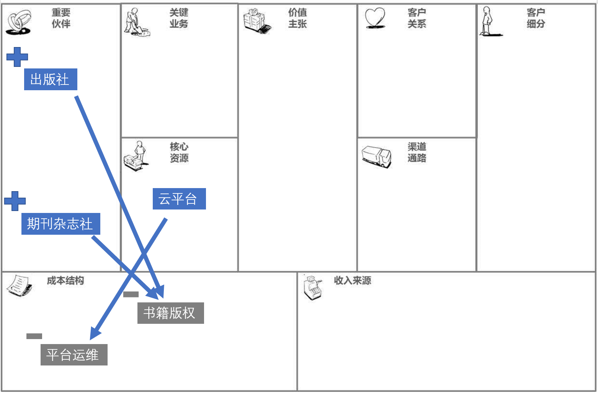
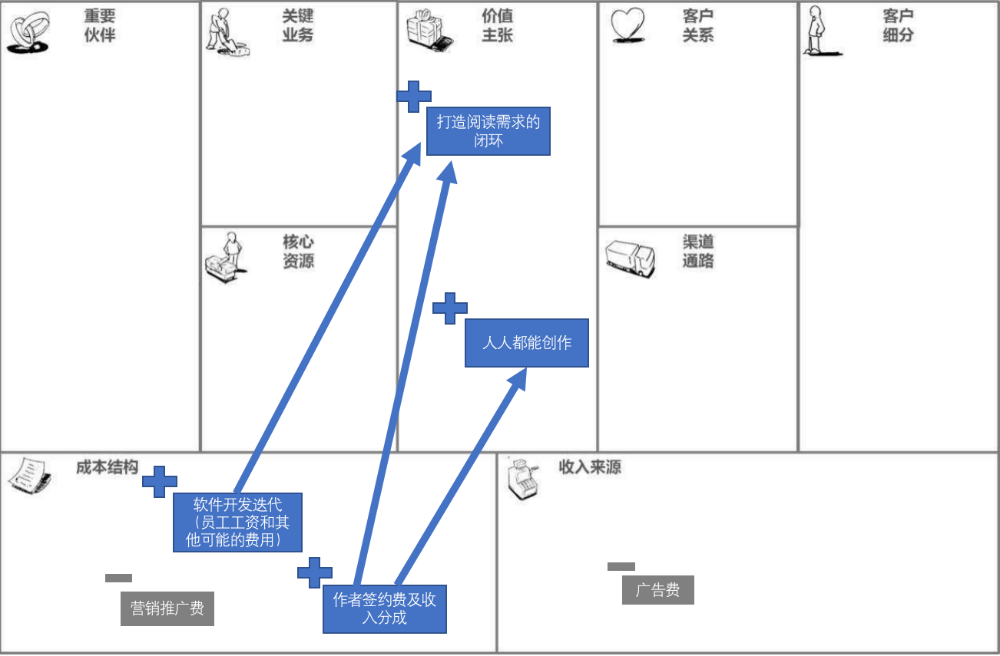
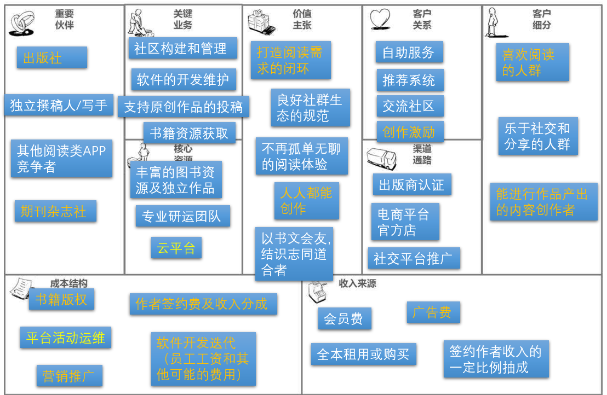

## 商业模式评估

### 1. 组员信息

|  姓名  |   学号    |
| :----: | :-------: |
| 浦隽轩 | 181250115 |
| 陶志豪 | 181250130 |
| 黄成东 | 181840090 |
| 李沛洋 | 181840123 |

### 2. 度量数值

合计20篇调研报告及新闻报道

### 3. 商业模式环境

#### 3.1 市场影响力

##### 3.1.1 市场问题

* 主要问题：从客户和供给的角度识别出驱动和改变你的市场的关键问题。

* 在我们设计的商业模式中可具体化为如下问题：目前的阅读平台是否能满足用户的需求？

* > 2010年，随着汉王地毯式轰炸般的营销广告，电子书元年被烙印在了中国图书行业的历史之中。
  >
  > 在此之后，亚马逊的Kindle在2013年正式进入中国市场，2015年，下载量常年处于第一梯队的掌阅也发布了自己首台电纸书阅读器。截止现在，小米也喊出“年轻人第一部电纸书”的口号积极布局电纸书市场。
  >
  > 根据中国新闻出版研究院发布的第十四次全国国民阅读调查结果显示，2016年我国成年国民数字化阅读方式的接触率连续八年上升。艾瑞咨询发布的《2016年中国数字阅读行业报告》也显示，2016年我国数字阅读行业PC端用户规模约2.17亿人，移动端用户规模约2.65亿人。
  >
  > 根据2013-2018年图书行业零售市场规模与线上图书销售市场规模对比情况分析，截止到2018年，线上图书市场规模已经占据图书市场份额的37%。如果考虑到线上图书的价格优势，按照相对值——销售书籍的数量来说，线上图书的市场份额可能要远远高于这个数字。

* 目前来看，无论是线上图书销售还是电子书阅读，两者市场的需求极大。根据新闻可以看出，在互联网大发展的环境下，电子书阅读逐渐成为一个蓝海市场，存在广阔的发展空间。这非常契合和我们的市场定位。随着全民阅读氛围的日渐浓厚，可以相信网络阅读市场还处在蓬勃发展阶段，有巨大的上升空间。

* >当然，并不是所有人对读书平台都抱有高度欣赏的态度。此项调查发现，有三种类型的人更倾向于给予读书平台更高的评价：
  >认为本地媒体与社区联系密切的人。他们和不同意此种说法的人之间，存在着巨大的口碑差异，例如，认为读书平台与社交连接紧密的人，有83%赞同读书的内容是有趣的，而不这么认为的人中，有52%同意前者，低出前者31个百分点。在其他几项核心职能中，也呈现出类似的分差。

* 毫无疑问，在阅读这项独立性较强的活动中，用户依然渴望与人的交互。然而如今不少平台的运营对于社交氛围的塑造上不够重视，这势必会影响用户的黏性。“跃独”平台主打的“让阅读不再孤单”的口号，可以说完美契合了用户在阅读时的社交需求

##### 3.1.2 市场分类

* 主要问题：识别主要的市场群体，描述他们的兴趣点，尝试发现新的群体。

* > 阅读的书籍：人根据微信读书的2020年9月16日总榜前200（实际上只有194本）进行分析，得出以下结论：小说类书籍共占比51.0%，经典小说占比38.1%，网络小说占比12.9%。社会人文心理学类书籍占比26.8%，人物传记与历史类书籍占比12.3%，技术科普类书籍占比5.2%，金融理财类书籍占比4.6%。
  >
  > 例如，番茄小说的人气排行榜中绝大多数是网文小说，这些小说绝大部分没有纸质版本；而在微信读书总榜中，小说占比只有51.0%，并且这些小说有相当一部分是名著。而根据阅读书籍类别的分布，可以把微信读书的用户分成以下几种情况：
  >
  > 1. 通过微信读书来看小说**打发时间**
  > 2. 通过微信读书来学习更多的知识，**提高自身修养**
  > 3. 通过微信读书来学习专业知识，**来获得职业发展或提升生活品质**

* 不同读书平台的侧重点不同，微信读书的受众更偏严肃，番茄小说更偏网文受众。而我们立志于打造综合性的读书平台，因此我们一方面要在热门分类上下功夫，抓住受众最大的那一批受众群体。另外不能忽视其它用户的小众诉求。这些用户往往有着自己独特的需求，他们可能是刚刚进入工作领域的开发者，也有可能是在某个小众领域有着非常狂热的爱，想进一步了解相关内容的爱好者。要满足这些用户的需求，需要我们对于整体平台的书籍方向有整体的考量，做到综合门类，兼容并蓄。尽可能吸引和挖掘更多的潜在客户。

##### 3.1.3 需求和诉求

* 主要问题：列举市场需求并分析这些需求被满足的程度。
* 在我们设计的商业模式中可具体化为如下问题：用户对阅读的需求是否被满足了？还有潜在的需求没被满足或者等待挖掘吗？
* 我们调研的结论是：目前的阅读平台不能很好的满足多样的用户需求，例如根据上文中报告内所说的不同阅读平台受众，可以看到，各项阅读平台，并没能很好的契合小众用户对阅读的多样化需求。众多的网络平台依托于热门书籍排行榜购买版权，而这些书籍尽管能满足大多数人的需求，但仍然需要倾听小众用户的诉求。
* 更重要的是，不能忽视用户在读书以外的其它方面诉求。我们跃独平台构建时，除了要满足用户读书的需求，更要响应“让阅读不再孤单”的口号，致力于平台的构建和发展。

##### 3.1.4 切换和成本

* 主要问题：客户一旦转投竞争对手，哪些方面需要改变。
* 在我们设计的商业模式中可具体化为如下问题：用户是否容易脱离我们的平台，转向使用其他的阅读平台？
* 就我们平台而言，我们认为我们平台的用户粘性较高。理由是首先我们有针对大众用户购买的热门电子书籍，而对于小众书籍的受众来说，我们平台也提供了丰富的资源，这些资源在其他网站上很难获得。而且即使其他网站也购买了同样的书籍，因为书籍内容的高度重合，他们能吸引到的新客户数量也是有限的。
* 其次，我们优质的社交平台让我们可以吸引来大量的阅读讨论者和内容产出者，而大量的社区用户又可以吸引来更多的读书爱好者。因此平台本身会形成良性循环。
* 最后，由于我们平台对于内容产出者具有扶持政策，对于数据优秀的独立创作者，我们会予以金钱上的奖励和进一步出版的策略，这对于用户的吸引力也是非常大的。

##### 3.1.5 收入和吸引力

* 主要问题：识别与收入吸引力和定价能力相关的因素。
* 在我们设计的商业模式中可具体化为如下问题：平台如何获取收益？如何将阅读资源转为平台收入？是否可以从实体书分销平台中获取收入？
* 首先阅读平台的核心资源就是书籍本身，我们平台可以通过实行会员制，从购买阅读时长的用户中获得收入。另外面向对特定书感兴趣的用户，我们则推出了全本购买服务，可以让用户以远低于实体书的价格买下全本电子书资源。
* 其次我们也提供有实体书销售的平台，通过电子书引流到实体书平台，让有心于收藏的读书爱好者实现对书籍的收藏。而跃独平台的会员对于书籍的购买同样享有折扣优势。
* 为此我们平台专门提供了明星有声读书服务，这种付费服务定价较高，也是平台的收入之一。，资源可以吸引来很多流量，而流量本身也可以变现。例如我们可以投放一些广告，或是为我们平台自身的网课来投放广告，这也可以提升我们的收入。

#### 3.2 行业影响力

##### 3.2.1 竞争对手

* 主要问题：发现当前的竞争对手和它们的相对优势。

* 我们所提出的商业模式所涉及的领域不少，在不同方面所遇到的有微信阅读平台，起点中文网平台，豆瓣读书等平台。

* > 微信读书一开始是“严肃的”，以喜欢看文学类、阅读类和学习类书籍的人为目标用户，后来为了扩大自己的用户基数，先后主推听书、引入优质公众号和引入热门连载漫画，兼顾“严肃”和“娱乐”。
  >
  > 经过4年半的发展与扩张，通过精心打磨的阅读体验、和好友发现优质好书、和好友讨论交流碰撞、和好友比拼阅读时长四大优势，使得微信读书在周围对读书/听书/看漫画/看公众号有需求的智能手机用户中迅速流行起来。

  1. 微信读书属于读书平台的领军平台。其优势在于依托阅文平台和微信，在书籍版权上和用户交互上有很大的优势。其劣势在于用户留存率不高，对于社区的建设不够，所维护的社区风气存在问题；缺乏对内容产出者的扶持。目标客户细分群体主要是有喜欢看文学类、阅读类和学习类书籍的人，对于喜欢娱乐性书籍的用户来说吸引力不高。
     成本结构：人员成本，包括了开发人员、平台维护人员、市场人员、运营人员；实物成本，有包括书籍版权购买，工作场所，租赁的服务器等物理资源；还有前期开发成本，维护成本 
  2. 起点中文网平台是我们的产品在网文阅读方面的竞争对手。其优势在于已经与非常多的网络写手建立合作关系，因而网络小说资源非常之多，并且通过即时评论等功能，让用户在阅读之余有着非常高的社交满足感，激发了用户的阅读付费欲望，有大量的用户群体。而劣势是，网络小说单章阅读成本较高，过去用户养成了看盗版网络小说的习惯，难以让用户养成付费的习惯，利润的赚取相对较难。
     成本结构：人包括了开发人员、平台维护人员、市场人员、运营人员。实物成本，有包括工作场所，租赁的服务器等物理资源；还有前期开发成本，维护成本 

##### 3.2.2 行业新进入者

* 主要问题：发现新的、崛起的行业对手，判断它们是否利用不同于你的商业模式与你竞争

* > 近日，北京新浪阅读信息技术有限公司（以下简称「新浪阅读」）完成4000万天使轮融资，由华府智慧、团队创始人等投资，翔御资本担任独家财务顾问。「新浪阅读」是一个互联网出版平台，项目最初依托于“新浪读书”展开，从2019年开始独立出来开展出版业务，去年的营收在千万级。
  >
  > 在上游的内容生产和印刷环节，「新浪阅读」建立了一个出版任务投资平台：一是微博大V想出书，可以把需求录入平台，平台会为作者匹配最佳编辑；二是一些资金不足的小出版公司，可以自带选题「新浪阅读」为其提供印刷和销售服务。平台组建了编辑室，有上百位编辑，除了公司内部的编辑外，还有外部入驻的上千位编辑。
  >
  > 在中游的宣传和发行环节，公司用丰富的移动互联网运营经验来换取发行渠道的支持。当当网、京东和阅文集团推荐「新浪阅读」发行的书，相应地，它们能够获得公司给它们带来的流量，增加用户量。
  >
  > **吕廷斌表示，相较于传统出版社的“编印发”环节，「新浪阅读」优化了“编”和“发”的环节。用互联网模式做图书的宣发和营销，能促进图书出版行业的发展。**
  >
  > 在运营的过程中，「新浪阅读」还在微博发起积分制的作家联盟，各个大V之间交叉推荐书籍。根据文章的阅读量，支付或者获得相应的贡献值，把作家之间模糊的人情关系变为可定量的数据营销平台。

* 从36氪最近的新闻可以看出，新浪阅读是一条新进入网络阅读的一条鲶鱼。它借助背靠新浪这艘巨轮的优势，用互联网模式来升级出版行业的传统产业链，完善作者和编辑的匹配机制和扩大产能。本质上，新浪阅读虽然依托于互联网，但依然是面向传统出版业的模式。在实体书籍的销售上会有更大的平台优势和宣传优势。但作为电子阅读的新晋玩家，新浪阅读对于市场的不熟悉以及对于渠道商的缺乏了解，会成为新浪阅读发展的阻碍。

* 市场准入壁垒：在已经有很多类型在线阅读平台流行后，进入市场分一杯羹比较困难。面向客群细分群体：希望进行实体书产出和出版的人。成本结构：书籍宣传成本，平台的开发和维护成本，公司实体资源。对我们的商业模式的影响：可能会抢走我们一部分用户，进而收入来源和利润率产生一定负面影响，但因为我们的阅读更偏向电子阅读，和新浪阅读侧重点不同，加上平台有更好的社交功能，负面影响有限。

##### 3.2.3 替代性产品与服务

* 主要问题：描述你公司的产品和服务的潜在替代品——包括其他市场和行业的产品和服务
* 在不同领域有豆瓣读书、蜗牛阅读等电子阅读APP，以及一些盗版阅读平台都可以部分代替我们的服务。但我们平台对于内容产生者的付出和对社区的构建上是其它正规平台上没有的。与我们的服务相比，就阅读上来说，普通的书籍阅读没有区别，但在内容产出和讨论交流上，用户多半不能得到及时响应。就客户转移上，如果使用了我们的服务，再转向其他替代品后，会额外地消耗会员费，这会降低用户转移的意愿。
* 值得关注的是，盗版阅读资源在网络流传相当之广。要付费资源与免费资源竞争，我们要做的是努力提升自身的服务，让用户觉得物有所值，在阅读体验上与缺少校对和交流的盗版阅读拉开差距。

##### 3.2.4 供应商和其他价值链参与者

* 主要问题：在你公司所在的市场中，描述出目前关键的价值链参与者，并发现新崛起的参与者。

* 价值链上的参与者有：实体书籍提供商，电子书版权提供商，独立创作者，以及平台所依赖技术的相关公司或人员，如 社区平台的搭建和APP日常的维护等。价值链上的参与者都很关键，也都是我们平台所依存的。没有电子书版权提供商，会使图书资源变得匮乏，无法吸引和留住用户；APP开发技术的提升与突破，与用户在平台上的使用体验密切相关，甚至可能会改变平台的服务和价值主张。在参与者上，新崛起的可能有实体书店等合作者。在收益上，电子书渠道厂商获得的收益是稳定的，并且会随着平台规模的扩大而增加；独立创作者参与进我们平台的运行后，会获得收入分成收益，这部分参与者与我们平台的联系最紧密，当平台收益大的时候他们的收益也是相当可观的。

* > 尽管兴盛优选的诞生是基于消费者需求的，但难点在于如何有效地转化为商业模式。在这个过程中，岳立华四处碰壁，接连遇到获客、成本、库存、配送的几大难题。
  >
  > 早期，兴盛优选由老板亲自配送；此后又设置前臵仓、配送团队；把大仓转为小仓、配送站。直到2016年，岳立华决定将此前的模式套进电商体系，通过门店老板在微信群发布消息，让周边居民在群内下单，最后自提。
  >
  > 在选取供应商时，兴盛优选会以“淘汰机制”进行筛选。那些服务周到的供应商会最终留下来。就这样，兴盛优选以 “社群预售+门店自提”走出湖南益阳，向全国蔓延。
  >
  > 经过几年的验证，以兴盛优选为代表的社区团购逐渐成为一股势力。2017年~2019年，其GMV由0.36亿元一跃升至100 亿元；2020年9月，兴盛优选的日单量达到800万单，较2019年同期提升将近1倍，客单更是从10元左右提升至15~20元。

* 从兴盛优选的兴起可以看出，好的供应商和参与者的选择，是成功的基础。对于读书平台，最重要的阅读资源一定要分外重视。

##### 3.2.5 利益相关者

* 主要问题：确认哪些参与者可能会影响你的公司和商业模式。

* 当平台获得投资之后，毫无疑问投资者的意向或者要求会显著地影响我们的公司和商业模式，也许要求增加利润率，使平台的服务或者价值主张发生转变，增加价格之类。另外一方面，合作方 (出版社，其它读书APP) 也会影响我们的公司和商业模式，如果有较多的投资者对当前的运营模式不满意，公司会考虑改革模式，塑造更良好的阅读体验。

* > 一位投资人对深燃分析，巨头游戏里，大家相信的是规模、速度、增长，相信大而不倒，大到能够制定游戏规则，由此造成了风口现象。
  >
  > 大部分有垄断倾向的巨头都是“平台型”企业，比如美团、滴滴、阿里、拼多多、京东、蚂蚁、携程、贝壳。平台经济具有天然的网络效应，一旦形成规模，便可能进入强者恒强、赢者通吃的阶段，这为未来的垄断提供了土壤。
  >
  > 与此同时，资本也在其中起着推波助澜的作用。
  >
  > 最典型的是滴滴。滴滴是“平台经济”的代表，它在短短几年时间里融资数百亿美金，不同背景的投资人疯狂下注，将它推上风口浪尖。但滴滴对中国网约车市场的掌控，是通过两起并购实现的，而非业务层面的扩张。2015年滴滴快的合并后，易到用车转身就向商务部和国家发改委进行了举报，称“两家公司并非技术创新，而是资本融合形成的垄断”。
  >
  > 很多人不会忘记几年前的共享单车大战，但却不一定了解资本和巨头是如何影响这场战争走向的。
  >
  > 美团收购摩拜时，坐在谈判桌上最有分量的人，不是摩拜管理层，而是以腾讯为代表占多数股份的巨头，以及以红杉资本为代表各怀心思的风险资本。杀死ofo的，不是残酷的竞争对手，也不是激烈的竞争环境，而是巨头和资本争执不下的一票否决权。
  >
  > 在资本面前，创业者变成了博弈的筹码，变成了牌桌上的工具人。

* 需要注意的是，如何在投资人的压力下，坚持自身的初心和战略目标，是从严酷的竞争市场中杀出重围的重要因素。

#### 3.3 关键趋势

##### 3.3.1 技术趋势

* 主要问题：服务器承载能力需要稳定，利用大数据分析+算法推荐系统+多终端，给用户完整的阅读体验。

* > 算法推荐，通过一些数学算法，推测出用户的兴趣爱好，然后自动给用户推荐其感兴趣的内容。基于大数据分析，算法推荐可以快速为用户精准匹配其感兴趣的内容，大大提高了用户获取信息的效率，为人们的生活带来便利。据了解，今日头条客户端较早地运用算法推荐，会聪明地分析用户的兴趣爱好，自动为用户推荐喜欢的内容，并且越用越懂用户。目前，很多客户端都加载了算法推荐功能。据不完全统计，当前基于算法的个性化内容推送已占整个互联网信息内容分发的70%左右。
  >
  > 算法推荐凭借其独特的优势，满足了用户的个性化、定制化需求。算法推荐会根据用户的浏览记录、阅读习惯，精准为用户画出“用户画像”。现在，很多网络平台通过算法推荐，能够分析用户的个性化特征，包括用户的兴趣点、使用时间、地理位置、职业等。画出“用户画像”后，算法推荐就可以把关联信息精准推送给用户。同样的客户端，在不同用户的使用下，变得“千人千面”。运用算法推荐的客户端以用户为核心，推送定制化的内容，为用户“开小灶”。
  > 算法推荐应用越来越广泛，在信息传播、广告营销等多个领域都派上了用场。算法推荐不仅仅停留在大数据分析层面，还能通过机器学习，优化推荐。当用户收到个性化推荐后，算法还能够根据用户的停留时长、屏蔽、转发、评论等使用痕迹，“揣摩”用户的“心理”，更加全面地勾勒出用户的消费画像。一旦用户的兴趣等发生改变，算法推荐也能动态掌握用户的最新“画像”。

* 中国经济网的这则报道介绍了当今推荐算法的概况。推荐算法很早就已经存在，例如音乐APP的推荐，但是因为技术原因，精确度一直不尽人意。但是从近些年来人工智能热潮兴起，字节跳动旗下的今日头条和抖音之类的快餐式应用通过大数据分析+精确的推荐算法而大获成功，让越来越多企业重视起推荐算法的应用。我们也紧跟技术潮流，运用我们APP内部的海量数据和精准的推荐算法，将算法率先应用至阅读之中，让用户能够发现更多自己阅读的兴趣爱好，能够彻底摆脱“书荒”。

##### 3.3.2 行业管理趋势

* 主要问题：图书质量内容良莠不齐，监管部门对于不良内容审核要求趋于严格。

* > 上海市网信办等部门约谈阅文集团，起点中文网部分栏目暂停更新。
  >
  > 5月20日，上海市网信办联合市“扫黄打非”办、市新闻出版局，针对阅文集团旗下起点中文网对用户发布违法违规信息未尽到管理义务，传播导向错误、低俗色情小说等问题约谈运营企业负责人，责令其立即自查自纠，全面深入整改。整改期间，起点中文网“都市”频道“异术超能”栏目、“女生网”频道“N次元”栏目暂停更新7天，时间从5月21日15时至5月28日15时。
  >
  > 阅文集团负责人表示，将深刻检讨，认真反思，根据管理部门要求，开展全面自查清理工作，加强内容审核管理，确保合法合规运营。

* 从新浪财经这则报道可以看出，行业巨头阅文集团在体量规模膨胀以后，很多时候对部分导向错误、低俗色情的书籍没有很好的做到内容审查与即时的过滤筛除。当然也与监管部门现在对于违规书籍的审查力度加强有管。 
  对于我们而言，我们除了运用算法对于书中关键词进行搜索筛查，运用人工对于疑似违规书籍进行审查以外，也充分利用用户的力量，完善我们对于书籍的反馈与举报机制，客服进行及时跟进，来确保我们书籍的良好质量。此外，我们也会积极与监管部门进行对接，即时了解最新的政策与要求，来确保我们平台内容合规合法。

##### 3.3.3 社会和文化趋势

* 主要问题：当今社会的阅读越发趋向碎片化，我们的软件在针对主流人群的碎片化阅读进行满足的同时，也需要照顾满足小众阅读人群需求。

* > 碎片化阅读，从其出现之时起，便一直伴随着争议。争议主要是围绕碎片化阅读给阅读者带来的利益和弊端而展开，可谓众说纷纭、莫衷一是。那么，碎片化阅读到底是读者的福祉还是灾难，这值得每位阅读者和阅读研究者深长思之。所以从阅读者情况、神经科学研究和管理学原理的层面，透视和考量碎片化阅读的利弊，进而提出应对策略，无论是对厘清阅读认识的逻辑，还是促进阅读实践的深化，都有着重要的价值和意义。
  >
  > 所谓碎片化阅读，是指阅读碎片化阅读材料的阅读行为和阅读状态，其典型表现是利用零碎的时间阅读零碎的文本。目前由于手机、阅读器等电子阅读工具的普及，碎片化阅读这一活动和现象日益引发人们的关注和争议，使不少人误以为碎片化阅读只是最近时段特有的产物。事实上，真相并非如此。如果我们从历史发展的眼光来看，在电子阅读尚未流行的时期，人们阅读纸质的报纸和期刊，在某种程度上也都属于碎片化阅读。在纸媒为王的时代，有些读者喜爱快速浏览大量的纸质报刊，而有些读者则是“一张报纸看半天”，虽然两者的阅读行为和阅读状态存在差异，但都是碎片化阅读的表现。假如将两者都称为体系化阅读，显然也是不够妥当的。因此，从阅读媒介嬗变的角度来说，碎片化阅读可谓渊源有自，并不值得人们大惊小怪。

* 如今的网文其实就是一种碎片化阅读，网文的本体就是连载，每天更新，每次的篇幅适中，并且阅读起来轻松愉快，而断断续续的阅读也不会影响对于内容的理解。我们平台庞大的网文资源就可以满足主流用户对碎片化阅读的需求。与此同时，论坛也是一个承载碎片化阅读的区域，论坛中往往会有对剧情的讨论，对于书籍的评价，很多都是非常简短有趣的，这也满足了用户在碎片化时间进行娱乐的需求。而我们软件并没有因此忽视深度阅读用户，我们专门引入大量传统书籍，并且将其放置于软件中，对于深度阅读的用户，也能更好符合当今的社会节奏，能够随时随地享受到自己的阅读。

##### 3.3.4 社会经济趋势

* 主要问题：中国社会经济高速发展，普通人收入有了可观的增加，让越来越多普通用户养成了对于文化娱乐产品付费的习惯。

* > 近六成用户愿意为网络上的内容付费，这是易观在2019年1月《中国网民内容付费生态调研》中所显示出的。
  >
  > 当然，这个问题的前提条件是“如果内容质量让人满意”，其实这与如今已经较为成熟的内容打赏模式是同一个概念。尽管多年前互联网凭借从分享衍生出的免费概念深入人心，但在经过了时间的发酵后，人们为喜爱的内容花钱的意愿已经越来越明显。
  >
  > 在网络文学领域，哪怕是不知名的作者也可以因为作品好收到大量读者的打赏，至于在手游等电子游戏中投入上万元的人也比比皆是， 如今，用户可以为喜爱的事物消费，自然离不开中国整体经济发展向好以及全民教育整体提升的大背景，易观的数据显示，本科以上学历人群以及家庭月花费高于1万元人群中，愿意为内容付费的比例分别为71%和75%，而这可能也预示着，在未来更多新的年轻人出现后，为数字内容付费的用户意愿会更强。

* 从搜狐新闻这则报道，我们可以看到当今社会对于文化付费的接受度已经比较高。我们产品通过更好的阅读界面、良好的社区环境、友善的评论互动和庞大的书籍资源来支撑我们的付费体系。我们通过多种选择方案，VIP、书籍单本购买、观看广告等方式，给了用户自主选择权，尊重用户的同时，我们产品通过自身的优点，吸引越来越多用户为阅读进行付费。

#### 3.4 宏观经济影响

##### 3.4.1 全球市场情况

*主要问题：全球市场经济速度放缓，疫情影响下，中国提出内外双循环，减轻对于出口产业依赖，注重三驾马车中消费的的发展。

* > 今年以来，疫情的外生冲击和逆全球化结构性压力叠加，全球贸易在低位继续坠落，其中受人员往来被动停滞、社交隔离等措施影响，服务贸易更是面临全面挑战。在此背景下，以服务贸易逆差收缩为先导、以内生潜在需求为依托的“内卷式”消费回流有望成为中国经济的新亮点。从体量看，仅以旅游服务为例，作为全球最大的国际旅游输出国，若中国旅游服务逆差能够转化为内需，则有望每年多贡献约1.15万亿产值，直接创造约490万个就业岗位。从趋势看，新冠疫情发生后全球经济正面临大萧条以来首次新兴市场和发达经济体全面衰退的极端情形，考虑到疫情二次暴发的灰犀牛风险将继续抑制经济复苏的速度和幅度，稳健的内需已经成为全球稀缺的增长动力

* 中新经纬的新闻让我们看到疫情对如今全球市场情况，对于中国市场情况的影响。对于扩大内需，扩大消费占经济比重而言，文化产业消费是非常重要的一环。而在文化产业中，书籍是非常重要的一部分，我们通过在线阅读平台，拉动了用户的付费阅读，也能够让消费者购书，从而加大用户的文化消费。

##### 3.4.2 资本市场

* 主要问题：2020年疫情下，用户使用电子产品时间大幅增加。全球货币量化宽松，资本市场资金充足，热捧互联网企业，腾讯、阿里、美团等股价均创新高。

* > 在美国新冠确诊病例突破300万例之际，美国纳斯达克指数却屡创新高，资本市场在疫情期间对美国几大科技巨头股票的偏爱表现得尤为明显。在中国，腾讯、阿里、京东等互联网企业股价也同时强势反弹。有分析认为，全球性的货币宽松和疫情导致的生活习惯改变对此起到重要作用。

* 从环球网的新闻可以看出，2020年资本市场又开始对互联网企业热捧，加上我们阅读平台正是疫情期间用户所常用的文化产品，这能让我们企业收获更多的投资。更多的资金也有助于我们完善我们的书籍资源，增强我们平台的性能，优化我们用户体验，从而让我们的平台更有竞争力。

##### 3.4.3 大宗商品和其他资源

* 主要问题：人力成本不断上升，市场程序员起薪逐年稳步增加。

* 近10年来，程序员的薪资一直不断上升，互联网巨头2020年应届生起薪已经达到了30w左右，而目前的趋势是国家不断大力投入互联网，并且将信息科技定为最重要的发展方向之一。资本市场看好中国互联网，大量资金不断投入，企业竞争激烈。因此可见的未来，互联网员工起薪仍然会不断增加。对于我们平台而言，要争取到更加有实力的程序员，需要开出比互联网巨头更高的薪酬，甚至达到40w以上的水平才能有吸引力。我们平台如何平衡对于人才建设投入的成本与收益是至关重要的。

##### 3.4.4 基础经济设施

* 主要问题：中国拥有世界上最多的4G基站，正在大力推进5G的推广，国家重视信息基础设施的建设，大力发展新基建。

* 现在中国，无论是大城市还是偏远的山区，都能拥有良好的网络环境，这为我们产品普及带来了良好的条件，让我们用户覆盖数量越来越多。而地铁、高铁等区域的网络覆盖，让人们在通行途中更多的可以选择网络阅读，让用户在我们平台的停留时间可以延长。

### 4. 评估商业模式

#### 4.1 总体评估

加分项：关键业务、客户关系、核心资源、价值主张、重要伙伴

减分项：重要合作伙伴、收入来源、客户细分、渠道通路、成本结构、收入来源

##### 4.1.1 优劣分析

我们设计的商业模式总体上是一个电子书阅读的平台，因此我们对重要合作伙伴和客户有着较高的依赖度。但是在平台成立的初期，我们的合作伙伴和客户的获取都有着较大难度和成本。其他网络阅读平台或app已经拥有了大量的资源和客户群体，同时也有一套成熟的写手挖掘体系，对于那些优质写手或推书者而言，他们已经在这些平台上积累了大量的人气和人脉，切换平台的难度很大。这是我们平台的一个劣势。

收入来源方面，虽然我们有较丰富的形式，但作为阅读app行业的后来者，我们的会员费、全本租用或购买费以及我方在分成费用的占比都不会设置的很高。这是我们当下的主要劣势，这需要等到平台的客户群体和人气都有一定规模且能稳定提升之后才可能适当调高。

在成本和核心资源方面，图书和独立作品资源的积累是主要的前期成本，且这些前期成本的份额也很大。这是我们的不足之处，但这种暂时的不足可以转化为我们的优势，知识性资源的积累可以吸引更多的用户，更多的用户也可以带来更多的有创作能力的人群。这也对应到我们关键业务的书籍资源获取和支持原创作品投稿上。为了节约成本，我们拟采用docker配合云来实现产品部署和运维，以降低前期的开发成本。

在关键业务和客户关系上，我们期望形成用户共同创造的良好的社区氛围，鼓励用户之间的互相交流和共同阅读，这种交流和共同阅读的模式可以增进社区中人与人的关系，进一步促成良好的社区环境，同时在不断交流中客户的整体质量也会提高。这种良好的阅读氛围与高质量的社区环境可以吸引优质合作者，也可以培养或吸引想追求质量优秀写手。这应该是我们的优势。

在渠道上，前期基本上是靠熟人或第一批用户在社交平台上的推广，等有一定规模和合作以后应该会依靠自身品牌的宣传或通过合作的出版商进行宣传。在手段上会比较单一。

##### 4.1.2 展望

在重要伙伴方面，我们还需要加大投资力度，通过更具竞争力的薪资或独特的创新思路来吸引优秀的创作者；在核心资源方面，不仅要保护我们的图书和原创作品资源，也要在研运团队上加大力度，保障用户能够完美享受到我们价值主张中的阅读体验。在收入上，初期可以在部分费用上做一些让步，如部分付费书籍的租用购买费用可以减少或者暂时免费，以吸引更多客户，作者收入的提成也是可以做暂时让步的一项。

#### 4.2 SWOT

| 问题                                         | 评分(-5~5) | 打分理由                                                     |
| -------------------------------------------- | ---------- | ------------------------------------------------------------ |
| 我们的价值主张与客户需求一致                 | 3          | 我们追求良好社区生态和不孤单无聊、可以以书会友的阅读体验的价值主张与用户在移动阅读阅读上的趣味性需求是一致的。（关于趣味性的描述可以参考[移动阅读用户需求满意度研究](http://qikan.cqvip.com/Qikan/Article/ReadIndex?id=668023163&info=wifhoa7OL8T7xu/2MlL8JLTHdIyybsHOtvabtyGhGGPc0StVySi7tw==)），不过对于碎片化和微阅读的需求上可能匹配的不是很完美。 |
| 我们的价值主张具有很强的网络效应             | 3          | 在该平台在我们可以通过构建良好的社区生态来帮助客户间形成不孤单无聊、能以书文会友的阅读体验，并进一步促进社区生态的良好规范。 |
| 在我们的产品和服务之间有很强的协同效应       | 5          | 我们拥有服务包括各种书籍和文章的提供阅读、创作服务，因而可以为用户提供阅读平台、创作平台。 |
| 我们的客户非常满意                           | 5          | 我们能提供符合用户需求的业务，且拥有较好的服务水平，这使得我们的客户非常满意。 |
| 我们有较高的利润率                           | -1         | 根据[2019年中国移动阅读行业市场现状及发展趋势分析 布局全场景流量已成为行业共识](https://bg.qianzhan.com/report/detail/458/190417-d8d0e5e5.html)，市场资源被阅文、掌阅、阿里占据近7成，作为后来者想要拿下这个市场的一部分份额，我们的价格不可能超过他们，可以说在初期我们很难制定较高的利润。 |
| 我们的收益是可预测的                         | 2          | 我们的收入结构是相对固定的，但考虑到用户使用平台的频率难以预测，在租用或购买费、会员费上会有波动。广告费相对而言会好预测一些，但依旧有一定难度。在签约费上同样需要考虑到能发掘到的写手水平，这也是一个波动较大的因素。 |
| 我们有很多经常性收入，有很多回头客           | 4          | 我们的平台提供的良好社区环境和阅读氛围可以留住顾客。         |
| 我们的收入来源是多样化的                     | 5          | 我们的收益来源包括签约作者的收入分成、广告费、会员费、书籍或文章的租用或购买费用，来源多样。 |
| 我们的收入来源是可持续的                     | 4          | 考虑到我们客户具有很强的黏性，他们可以持续的在平台上进行消费，或进行创作并与平台进行收入分成。这是可持续的。 |
| 我们在支出成本之前就有收入进账               | -5         | 搭建平台的工作以及书籍资源的获取就需要花费成本，在此之前我们并没有收入来源。 |
| 客户真正想买的就是我们提供的                 | 5          | 我们清楚地了解用户需求，可以给他们提供良好的阅读体验。我们的会员特权也以加强用户的阅读体验（包括阅读数量和阅读质量）为主。 |
| 我们的定价机制可以抓住客户全部的购买意愿     | 4          | 相比同类型的平台我们的价格整体偏低，且能提供不亚于其他平台的阅读体验，能让用户在性价比层面上选择我们。 |
| 我们的成本是可预测的                         | 4          | 我们的成本结构是固定的，包括服务器的购买及平台的开发维护成本，还有合作费用、签字费、宣传费等，都是易于预测的。 |
| 我们的成本结构与商业模式是完全匹配的         | 4          | 我们通过花费一定成本购买正版电子书、签约作者进行文字创作，来给客户提供阅读资料，同时将不同的用户聚集起来一起沟通交流，构建良好的社区氛围环境。 |
| 我们的运营低成本、高效率                     | 2          | 我们的前期成本较高，初期的经济效益也难说明显。但运营时的费用一般只需定期维护平台和服务器，同时寻找优质写手签约创作。 |
| 我们受益于规模效应                           | 4          | 当我们扩大平台的规模即增加更多的服务器，这样能够承载更多的用户，有更多的用户使用平台，进行消费。这时我们的平台就会获得更多收益。 |
| 竞争对手很难复制我们的核心资源               | -1         | 图书资源拥有较强的可复制性，开发团队由于平台类型的相似性也有一定程度的可复制性。而平台写手所创作的文章以及其他用户创造的资源（书籍分享、观点讨论等）这类由用户创造的知识性资源则是无法复制的。 |
| 我们的资源需求是可预测的                     | 5          | 我们可以根据用户使用平台的流畅程度来预测是否需要更多的服务器资源，平台开发维护的人力资源。对于图书资源，我们也可以利用大数据来分析预测多数用户期望阅读的书籍类型清单。 |
| 我们在恰当的时间合理的调配核心资源           | 3          | 虽然[每天读点故事APP产品分析报告](https://www.sohu.com/a/241418073_114819)提到，数字用户的集中度在不断提高，增长率也趋于平稳，然而数字阅读市场依旧有一定的空间供我们占据。 |
| 我们高效的执行了关键业务                     | 4          | 我们的平台功能与关键业务都是一一对应的。                     |
| 我们的关键业务很难被复制                     | -3         | 应该说我们的关键业务——“社区构建管理”、“软件开发维护”、“原创作品投稿”、“书籍资源获取”单个都是可复制的，但能集成这四点的平台并不多。 |
| 我们的执行质量很高                           | 3          | 我们有专业的开发维护团队，让用户在平台阅读时有很好的体验，同时我们也有很好的平台管理团队来为用户社交提供良好的氛围。 |
| 我们很好的平衡了自主业务和外包业务           | 5          | 外包方面，我们鼓励用户自主创作文章并进行上传，以丰富我们平台的阅读资料。自主业务上，我们平台也会定期购买符合大部分平台客户需求的正版书籍供客户进行阅读。 |
| 我们专心致志，并且在必要的时候与合作伙伴合作 | 4          | 我们能与很多出版商、期刊杂志进行合作推广我们平台，也可以与很多写手合作来构建我们的平台，同时也会与同类型竞争app一起攻克一些开发维护方面的技术难题。 |
| 我们和重要合作伙伴的工作关系十分融洽         | 3          | 与竞争的阅读app关系很难有持久的融洽度，但是写手和合作出版商、期刊杂志之间可以构建融洽关系。 |
| 我们的客户的流失率很低                       | 5          | 优秀的社区构建使得我们的客户有较强的黏性，流失率低。         |
| 我们很好的细分了客户群体                     | 3          | 我们的客户被划分为喜欢阅读的人群、乐于社交和分享的人群、创作者，随着用户群体的进一步扩大可能会根据现实情况做更进一步的细分。 |
| 我们不断的获得新的客户                       | 4          | 我们的客户会通过社交媒体或现实交往将我们的app分享出去，带给我们新的客户。 |
| 我们的渠道通路很有效率                       | 3          | 我们的初期渠道只有通过第一批客户的分享，效率较低。客户群扩大之后可以通过合作方相关渠道进行宣传，比如签约的作者出版时做广告，出版商宣传等 |
| 我们的渠道通路设置合理                       | 4          | 出版商和签约的出书作者本人的宣传能有很好的广告效果，为我们带来新的用户 |
| 我们的渠道通路与客户群是强接触的             | 4          | 与我们合作的出版商、期刊杂志、作者与潜在客户都有着密切接触。 |
| 我们的客户很容易就能看到我们的渠道通路       | 1          | 喜欢阅读的人一般能接触到多个不同出版商的作品，他们有可能通过出版商渠道发现我们的产品，或者是通过熟人推荐，但是效率显然不佳。 |
| 我们的渠道通路被高度整合                     | 2          | 出版商和期刊杂志是整合度比较高的渠道。                       |
| 我们的渠道通路创造出了范围效应               | 5          | 在扩展渠道通路的同时，可以获得更多用户，从而得到更大的收益。 |
| 我们的渠道通路很好的匹配了客户群体           | 4          | 出版商渠道匹配了创作者和喜欢阅读者客户群体，社交平台推广匹配了喜欢社交和分享的客户群体。 |
| 我们有良好的客户关系                         | 5          | 我们有构建良好、规范的社区，维护了用户之间的关系。           |
| 我们的客户关系品质与客户群体相匹配           | 4          | 我们的自助服务中也有提供用户与平台进行及时人与人间沟通的接口，可以确保用户得到满意的解答，提高用户和平台之间的关系质量。 |
| 客户切换的成本很高，客户与我们绑定了关系     | 3          | 平台成型且有相当热度后，切换到其他软件的用户会有一定程度的不适应，除非我们平台签约的创作者大规模跳槽，或者其他平台的社区的阅读氛围比我们更加优秀。 |
| 我们的品牌很强                               | 2          | 在前期品牌并不是我们的一个优势，但当用户群体和合作渠道得到稳定扩展后我们有能力构建较强的品牌。 |

#### 4.3 机会评估

##### 4.3.1 价值主张中的机会

| 问题                                     | 评分(1~5) | 打分理由                                                     |
| ---------------------------------------- | --------- | ------------------------------------------------------------ |
| 能通过把产品转化为服务而产生重复收入吗？ | 4         | 我们的平台本身就是偏服务导向的。对于在线的阅读资源，用户除享受免费的基础服务外，通过开通会员（重复性收入）可获得更完善的增值服务，如免广告、无限制畅读权、租书购书优惠等；对于旗下自出版或者出版社合作分销渠道的纸质图书，可收取相应费用（重复性收入）提供增值售后保障。 |
| 我们能更优地整合我们的产品或服务吗？     | 2         | 我们的平台提供多种服务：资源、功能丰富的阅读器；书籍的推荐和出售；作品发表；读作者交流互动社区等等，已经能较好地满足目标用户多元化的需求。但仍然需要考虑在不同服务间建立更强的联系，提高服务质量和效率，如推荐系统可结合用户的社区好友进行用户协同过滤推荐。 |
| 我们还能满足客户的哪些额外需求？         | 1         | 客户的多种需求基本都能得到满足。                             |
| 我们的价值主张还可能做哪些补充和外延？   | 2         | 在技术、用户体验和内容质量方面要加大重视。                   |
| 我们还能为客户做哪些工作？               | 2         | 可以考虑设立平台客服，总结反馈用户的意见与建议，帮助用户解决问题或根据反馈改进平台。 |

##### 4.3.2 成本/收入中的机会

| 问题                                               | 评分(1~5) | 打分理由                                                     |
| -------------------------------------------------- | --------- | ------------------------------------------------------------ |
| 我们能将一次性交易收入改为重复性收入吗？           | 2         | 对于在线书籍资源客户既可以选择全篇全本购买（一次性收入），也可以选择按期租用或者开通会员畅读（重复性收入）。 |
| 客户还愿意为哪些元素买单？                         | 4         | 读者用户对具体作品或作者进行打赏表达自己喜好；创作者用户可能希望在新人出道期或新作发布期在我们的平台支付相应的推广费进行曝光。 |
| 我们有内部交叉销售或者和合作伙伴交叉销售的机会吗？ | 1         | 基本没有。也许可以和视频平台、漫画或其他跨界平台合作推出联合会员，但在别的方面很难有其他合作，不太能算是合作伙伴。 |
| 我们还能增加或者创造哪些其他的收益来源？           | 1         | 可以参考[客户还愿意为哪些元素买单？]条目，但我们的最主要收入来源还是在于会员费、资源按本按篇或包年月付费、广告费，再增加过多的收费项目可能会引起客户的反感而造成客户流失和口碑下降。 |
| 我们能提价吗？                                     | 2         | 根据前瞻经济学人的[2018年移动阅读市场竞争分析](https://www.qianzhan.com/analyst/detail/220/180801-a14da97c.html)，像阅文、掌阅等行业龙头已经有了庞大的资源积累和稳定的用户群体，我们的价格肯定不能高过他们，首先考虑的应该是如何生存。可以通过低价吸引客户，当用户基数达到一定规模、平台逐渐做大做强后，可在经过严密分析和讨论后适当提价。 |
| 我们能在哪里削减成本？                             | 2         | 对于平台运维中平台不时举办的活动（如征文比赛、限时折扣等）的可能开支可以适当削减。 |

##### 4.3.3 基础设施中的机会

| 问题                                               | 评分(1~5) | 打分理由                                                     |
| -------------------------------------------------- | --------- | ------------------------------------------------------------ |
| 我们能使用成本更低廉的资源获得同样的效果吗？       | 1         | 较丰富的书籍和原创作品资源本身就是平台存在和发展的一个基础，采用低廉成本会直接影响我们客户的获取。 |
| 哪些核心资源适合转移给合作伙伴？                   | 1         | 任何一个核心资源转移后我们平台的竞争力都会锐减，互惠互利是种更好的说法。 |
| 哪些核心资源开发不足？                             | 2         | 图书资源和作品可以进一步丰富；研运团队可以继续扩充。         |
| 我们有没有哪些没有使用的知识资产对别人是有价值的？ | 1         | 我们的知识资产（如人力资源、技术、顾客资料等）都已在平台上有充分使用。 |
| 我们能将某些关键业务标准化吗？                     | 4         | 对于社区的构建和管理，要制定基本的社区规则引导和规范用户行为，并采用员工审核或众包监督等方法维护良好的社区秩序；对于软件的开发维护，可以确定产品版本更新迭代的一个周期并严格工程化执行。 |
| 我们能提升整体效率吗？                             | 3         | 通过明确部门与职责划分以及沟通的规范，提高运行效率。         |
| IT能够提升效率吗？                                 | 1         | 我们本身就是一款在线的软件产品，建立在IT技术的基础上。       |
| 有外包的机会吗？                                   | 2         | 如果自身团队的能力不足，平台早期的部分功能开发可以外包给专业的软件开发公司，我们公司则专注于与合作伙伴的协商获取相关资源。 |
| 与合作伙伴扩大合作能够帮助我们聚焦核心业务吗？     | 5         | 与出版社、期刊杂志社、优秀写手的合作可以获取到丰富的、高质量的书籍及作品资源提供给用户，聚焦我们的阅读核心业务。 |
| 有与合作伙伴交叉销售的机会吗？                     | 3         | 与其他阅读类app存在定位重合，联合会员不太可能；但可能与出版社或期刊杂志社有相应交叉销售：我们提供渠道售卖他们的图书杂志，他们可以提供我们平台优质内容的出版或刊载。 |
| 合作伙伴的渠道能够帮助我们更好地连接客户吗？       | 4         | 合作的出版社和期刊杂志的认证宣传可以帮我们提升平台知名度，其提供的优质、丰富的版权资源也能吸引来不少用户，帮助我们更好地连接客户。 |
| 合作伙伴能够补充我们的价值主张吗？                 | 1         | 我们是依据价值主张和核心业务来寻找的合作伙伴，不太能够补充我们的价值主张。 |

##### 4.3.4 客户界面中的机会

| 问题                                                     | 评分(1~5) | 打分理由                                                     |
| -------------------------------------------------------- | --------- | ------------------------------------------------------------ |
| 我们如何能从一个增长的市场中获益？                       | 4         | 在稳定、丰富内容的基础上不断完善我们平台的功能，并结合市场发展的浪潮作出创新。 |
| 我们能服务新的客户群体吗？                               | 1         | 在目前的框架下，很难再有新的客户群体。                       |
| 我们能够通过更加细致地给客户分类来更好地服务客户吗？     | 4         | 我们目前对于客户的分类是按照需求的不同来的，每一类涵盖的范围都略广，因此可以更进一步地比如按年龄段、性别等方向细分客户，提供更具针对性的服务。 |
| 我们如何能提升渠道的效率和效益？                         | 3         | 通过市场营销、社交平台广告推广宣传等方法扩大用户群体。       |
| 我们能更好地整合渠道吗？                                 | 1         | 目前的渠道已经很清晰分明，基本无法再进行整合。               |
| 我们能够找到补充性的新渠道伙伴吗？                       | 1         | 目前不需要再补充。                                           |
| 我们能够通过直接服务客户来提升利润吗？                   | 1         | 我们本身就是以从版权方拿到的资源和自身的一套平台架构直接服务客户的。 |
| 我们能够更好地匹配渠道和客户群体吗？                     | 3         | 可以通过市场调研来了解客户和渠道的实际情况并作出相应调整，更好地使两者间匹配。 |
| 有可能提升客户跟进的效果吗？                             | 4         | 可以根据用户的使用数据（如时长、互动频率、付费意愿）以及客服收到的反馈来了解他对于我们产品的满意度、忠诚度等进行跟进。 |
| 如何能让我们与客户的关系更加紧密？                       | 3         | 通过维护良好活跃的社区氛围、开发完善平台界面功能、优化用户使用体验来提高用户粘性。 |
| 我们能够在定制化上面做改进吗？                           | 4         | 基于用户偏好和相似群体的个性化内容推荐系统还可以不断进行改进，降低用户搜寻资源的成本。其他层面的定制化则有限。 |
| 我们如何能够提升客户的切换成本？                         | 4         | 根据[锁定客户的六大策略：教你如何将切换成本嵌入商业模式](https://blog.csdn.net/zhubaitian/article/details/47321527)，可以采取“数据陷阱”和“服务陷阱”方法，利用平台数据、活动记录的不可迁移和不可替代的服务优势增大客户的转移成本。 |
| 我们识别并“炒掉”了没有利润的客户了吗？如果没有，为什么？ | 1         | 没有。免费客户客观上也能够帮助我们宣传推广平台，同时他们也是潜在付费用户，可以通过符合其口味的优质内容等将其中一部分转化为付费用户。 |
| 我们需要让某些客户关系变得可以自动维护吗？               | 3         | 交流社区的良性互动氛围逐步形成后，可以考虑对发布内容采取众包监督，类似B站小黑屋制度，将社区管理下放自治，鼓励用户自发举报不良用户内容，增加用户对于社区建设的参与感，降低员工的审核成本。 |

#### 4.4 威胁评估

##### 4.4.1 价值主张中的威胁

| 问题                                                   | 评分(1~5) | 打分理由                                                     |
| ------------------------------------------------------ | --------- | ------------------------------------------------------------ |
| 存在可替代的产品和服务吗？                             | 4         | 我们的大部分功能在其他平台也有体现，比如在线阅读器、读作者交流社区、个人原创作品发表，但将这三者结合集成得比较好的目前市面上不多。 |
| 竞争对手会报出更有竞争力的价格，或者提供更好的价值吗？ | 4         | 他们可能已经有一定规模和一套成熟的体系，会有更好的渠道、更庞大的资源库。 |

##### 4.4.2 成本/收入中的威胁

| 问题                                                 | 评分(1~5) | 打分理由                                                     |
| ---------------------------------------------------- | --------- | ------------------------------------------------------------ |
| 我们的利润受到竞争对手的威胁吗？是技术原因造成的吗？ | 3         | 竞争对手会分流走一部分客户，里面有技术的原因，但不是主要原因，主要原因还是内容丰度、质量以及用户体验。 |
| 我们过多地依赖某一项或多项收益来源吗？               | 4         | 我们的收入来源主要依赖会员费（最主要）、资源按本按篇或包年月付费、广告费。 |
| 未来有哪些收益来源会消失？                           | 2         | 我们的收益来源大部分和平台功能息息相关。只要平台仍然保持相应功能，会员费，资源按本按篇或包年月的购买费、签约作者收入的一定比例抽成费不会消失。但如果平台经过不断发展，有了自身的强渠道，可以考虑撤除广告提升用户体验，广告费可能会消失。 |
| 哪几项成本会变得无法预测？                           | 3         | 平台前期的营销推广费、获取版权资源的费用以及可能会难以预测。 |
| 哪些成本的增加会快过它们所支撑的收入？               | 2         | 如果平台引进了一些过于小众的阅读资源或者签约了名气不大、上升空间不高的作者，可能会使得入不敷出。 |

##### 4.4.3 基础设施中的威胁

| 问题                                   | 评分(1~5) | 打分理由                                                     |
| -------------------------------------- | --------- | ------------------------------------------------------------ |
| 我们会面临某些资源的供应短缺吗？       | 3         | 很多出版社或期刊杂志社可能已经与其他竞争平台达成了独家合作，阅读资源的获取会有难度；平台可能一段时间内产出的优秀作品量较少。 |
| 资源的质量能够保证吗？                 | 2         | 为了保证资源质量，我们会在引入前事先充分调研分析，避免低质、同质化。 |
| 那些关键业务会被打扰？                 | 2         | 社区的构建和管理中，有可能会被一些奇怪的营销号、灌水内容打扰。 |
| 我们的活动质量会受到威胁吗？           | 1         | 不会，有严格的质量把控环节和相应技术保障                     |
| 我们有可能会失去那些合作伙伴？         | 2         | 可能失去与其他阅读类app竞争者的合作。                        |
| 我们的合作伙伴有可能和竞争对手合作吗？ | 4         | 非常可能。与我们合作的出版社、期刊杂志社、写手可能与其他竞争平台也有资源或作品的授权。 |
| 我们是不是过分依赖某些合作伙伴了？     | 4         | 我们的核心资源十分依赖出版社、期刊杂志社、写手的合作来获取。 |

##### 4.4.4 客户界面中的威胁

| 问题                                   | 评分(1~5) | 打分理由                                                     |
| -------------------------------------- | --------- | ------------------------------------------------------------ |
| 我们的市场很快会饱和吗？               | 1         | 不会。从张毅君在第五届中国数字阅读大会上发布的[2018年度中国数字阅读白皮书](http://www.199it.com/archives/864410.html)来看，数字阅读市场仍然在稳步发展，且大众阅读占比逾九成，处于较快增长期，随着产业的不断成熟规模会进一步扩大，离饱和还比较远。 |
| 有竞争对手在威胁我们的市场份额吗？     | 4         | 有。根据易观分析的[中国移动阅读市场年度综合分析2020](https://www.analysys.cn/article/detail/20019738)，2019年行业内TOP3企业收入总和占整体数字阅读市场的60%，不过相比前两年的70%有所下降，主要归因于免费阅读模式的日趋成熟，使入场平台大幅增加，抢走了头部企业一部分市场份额。 |
| 客户转投竞争对手的可能性有多高？       | 3         | 可能会有一部分客户会选择使用更老牌、资源积累更丰富的平台，我们只能不断尽量打磨资源质量、用户体验，营造优质社区氛围吸引并留住客户。 |
| 我们市场中的竞争多快会变得白热化？     | 3         | 不会很快。头部企业专注点更偏向IP产业链的打造和新用户场景的挖掘，免费阅读平台则拉取下沉用户，存在一部分功能相似，但并不是完全对立的。随着用户、知名度的累积和规模的扩大，会产生较强的竞争。 |
| 竞争对手会威胁我们的渠道吗？           | 3         | 竞争对手可能会开出更加有吸引力的价格威胁甚至抢走我们的一部分合作方渠道。 |
| 我们的渠道有变得和客户不相关的危险吗？ | 1         | 没有，都和客户关联较紧密。                                   |
| 我们的客户关系有可能恶化吗？           | 2         | 如果平台运营和管理不当，或者对客户的反馈视而不见，客户关系毋庸置疑会发生恶化。但良好社区生态的规范和对用户体验的重视也是我们一条关键的价值主张，会持续关注和落实。 |

### 5. 蓝海战略

#### 5.1 从对成本的影响方面

- **删除**：无
- **削减**：平台运维成本、版权费
- **增加**：与出版社的合作、与期刊杂志社的合作
- **创造**：云平台

我们平台的初期成本过高，为此我们考虑利用云服务资源。考虑到一个有自己的服务器的平台的维护费用包括了机房场地占用、维护费和内部计算机的维护费。同时为了保障全国各地用户的流畅访问，机房很可能要布置到多个地区。而当迁移到云端后，我们便只需要按需支付云服务使用费。这相比自己准备机房并部署能节约下不少成本，并且可以根据客户数量调整云服务的购买量也减少了一笔闲置服务器的维护费。

同时，考虑到我们的主要成本是来自书籍及文章的电子版版权的购买，我们考虑加强与出版社和期刊杂志社的合作。通过推荐我们的优质作者优先以及长时间在合作的出版社、期刊杂志进行出版，同时鼓励创作者将文章投稿至出版社、期刊杂志，为他们增加优质文章进行出版来增加他们的收入。这样的合作应该能在一定程度上争取我们的购买版权的优惠。

#### 5.2 从对客户的影响方面

- **删除**：无
- **削减**：广告费，营销推广费
- **增加**：内容创作者，创作激励，作者签约费及收入分成，喜欢阅读的人群（包含多种细分群体，下面分析中会讲到）
- **创造**：平台活动运维

我们的平台聚焦于满足用户多样的阅读需求以及与人交互的社交需求。如前文对于商业模式环境的分析，目前的阅读平台要么资源品类、质量存在一定缺口，要么对于社区氛围建设的重视不够，低归属感认同感使得用户留存率和粘性也比较低，要么缺乏对于优秀内容创作者的挖掘和扶持。因此如何较好地整合以上几者是我们平台需要不断深入的主要方向。

对于阅读这种需要专注、沉浸的心流体验来说，用户对于广告是十分敏感的。如果频繁地出现广告，尤其是在用户阅读过程中弹出时，会直接中断、破坏用户好不容易建立起的心流状态，使得用户体验大幅下降，甚至引起反感。因此我们打算削减在章节之间植入的广告，尽量减小对用户体验的影响。可能的解决方案有更换广告形式（社区信息流广告、开屏广告等），个性化广告，甚至在广告收入占比很低时考虑直接删除这一项收入来源。

为了平台的持久发展，加强在内容产出方面的活力十分重要。基于这种考量，我们相应增加了创作激励以及作者签约费及收入分成的成本，吸引更多的内容创作者入驻我们的平台，一方面他们提供的优质原创内容可进一步转化丰富我们的核心资源，另一方面这些作品积累的名气可以为我们带来更多的其他用户，不仅对于平台规模的发展有益，也能形成一个较好的社区底子。

除此之外，我们创造了平台活动运维这一成本，通过定期推出限时免费、明星领读、征文比赛、话题专题讨论等活动，其一可以挖掘民间优秀的创作者，其二可以在喜欢阅读的人群这个大群体中发掘更多更细分的潜在用户，例如阅读作为娱乐消遣的用户、严肃/小众文学爱好者、希望基于相似的读书兴趣结识同好的用户等等。创造这一项成本结构一方面可以提升用户的参与度和留存率，另一方面也能逐步打响平台的口碑和品牌知名度。

由于已经通过平台活动运维进行了变相的渠道推广宣传，加之基于铺天盖地的轰炸式广告宣传可能会招致反效果的考虑，我们适当降低了向社交平台广告宣传的费用，而更希望用少量的推广以及用户的口口相传就能让更多的人了解并接触我们的产品。

#### 5.3 从价值主张的影响方面

- **删除**：无
- **削减**：广告费，营销推广费
- **增加**：作者签约费及收入分成，软件开发迭代（员工工资和其他可能的费用），打造阅读需求的闭环，人人都能创作
- **创造**：无

我们平台的价值主张有五点，打造阅读需求的闭环、良好社群生态的规范、不再孤单无聊的阅读体验、人人都能创作与以书文会友、结识志同道合者。在这其中，我认为我们平台想要区别于其他平台，在竞争激烈的平台中跻身而出，贯彻打造阅读需求的闭环与人人都能创作的价值主张是至关重要的。

对于我们平台而言，在初期大量营销推广以后，已经拥有了相当数量的用户后，用户自发性的推荐已经有相当规模，更重要的是要保证我们产品有口皆碑。与此同时，过多的广告将会破坏我们用户的观感，让用户远离我们，无法实现我们打造阅读需求闭环的价值主张。因此，我们需要适量削减营销推广费用与广告费，来增强我们平台更重要的部分。

用户数量越来越多，服务器负载越来越大，书籍资源越来越多，网购需要处理的订单也越来越多，为了增强产品的独特性，贯彻我们打造阅读需求的闭环，我们需要增加软件开发迭代的成本，需要投入更多，实现技术驱动，让产品中的各个功能都能有全领域最佳的体验，强化我们闭环的生态。

另一方面，一个平台最重要资产的还是他的独创性，我们需要增加投入作者签约费及收入分成，贯彻我们人人都能创作的价值主张。外部版权以及合作渠道有可能发生变化，为了以不变应万变，加强平台自身实力，充分激发平台用户的积极性，拥有一批自己独有的内容创作者，这样才有利于我们平台长远发展。而当我们平台拥有越来越多创作者之后，加上我们平台完善的社区机制，图书售卖机制，用户会对平台越来越有依赖感，留下来的用户越来越多，然后其中部分用户又会加入到创作者的行列，这样平台也会源源不断有新的创作者产生，如此往复的良性循环，也更有利于我们打造阅读需求的闭环。

### 6.画布更新

#### 6.1 整体描述

* 整体来说，根据对于价值主张的进一步深化讨论。我们在画布的一些板块上进行了一些调整。结合先前的分析，我们认为图书阅读市场目前竞争激烈，为了从这片激烈的市场中杀出重围，我们的调整主要面向两个方面：开源节流和做出差异化
* 作为一个新生的平台，背后没有相应的巨头企业的庇荫和扶持，如何对手上的钱进行分配，又如何根据我们的运营方向调整我们的收入来源，是需要考虑的问题。在初期，因为对于平台的建设投入极大。docker 的广泛使用有利于降低我们平台初期投入的成本，这一部分主要体现在平台的运维成本上。而在经历了初期的营销推广以后，平台已经吸引了大量的读书爱好者，此时过多的宣传反而起到反面效果。因此平台的方向以内部的运营为主，削减营销推广的费用，增加平台运维和社区构建的活动运营成本，是平台稳定运营时的主要方向。平台版权主要来自于出版社和报刊杂志社，如何有选择性地购买阅读资源，是运营成员必须考虑的问题。另外，为了自身的长久口碑打造，广告的投放会尽可能投放到社区中，而避免在阅读中破坏用户的观感。
* 另外必须围绕我们的价值主张，和市场上的产品做出差异化，对产品的发展方向进行调整。面向阅读爱好者，为了打造阅读需求的闭环，平台必须加大对于软件迭代开发的投入，让用户在阅读和交流时有舒适的体验。围绕“人人都能创作”的价值主张，我们需要吸引到足够多的内容产出者，就更要对作者签约费用和收入的分成进行讨论，尽可能提供吸引创作者的土壤环境。

#### 6.2 画布更新

* 

* 黄色代表为新加项，橙色代表修改项，红色代表删除项。

#### 6.3 商业画布详情

最后，我们的商业模式画布如下

* 关键业务：平台主打业务为阅读相关，具体分为阅读书籍和社区讨论两个核心，另外追求原创作品的投稿。喜欢阅读的爱好者是我们的主要用户群体，平台需要尽可能地重视获取书籍版权的业务。此外，为了“阅读不再孤单”的体验，我们必须在软件中营造一种讨论的社区氛围，因此社区的构建和管理是必不可少的。除此以外，支持原创作品的投稿是吸引优秀的内容产出者的必备条件。而我们需要将为了吸引更多的用户群体，不断迭代更新的软件开发是必不可少的。
* 价值主张：平台与读书、社交相关，因此价值主张围绕读书和社交展开，为了满足这个要求。我们要努力打造阅读需求的闭环，让用户在阅读时体验不再孤单。在这个运营过程中，少不了持之以恒地社区规范。而为了吸引创作者投稿，我们另外也提倡人人都能创作的主张和以文会友的交流体验。
* 客户关系：顺应我们的价值主张，需要维护社区，呵护用户共同创造的交流氛围。为了提升用户在读书和社交时的体验，需要开发自助服务，覆盖到用户可能遇到问题的方方面面。同时需要开发进化软件的智能推荐算法，努力让用户看到自己感兴趣的内容。除此以外还有面向用户的创作激励计划，对在社区产出内容和写作的用户给予物质上的奖励。
* 客户细分：我们的核心业务决定了平台主要的用户。一类是喜欢阅读的爱好者，他们从平台中可以获取到想要阅读的书籍，进行线上阅读和实体收藏。另一类是乐于社交和分享的人群，这类用户可以在平台构建的社区中进行相应书籍的分享和讨论。这类用户的活跃能够提高用户黏性和平台热度，也是对平台进行自发宣传的重要角色。最后还有内容创作者，他们能够给产品带来源源不断的优质内容，与此同时，还能够在论坛与读书人群进行交流，形成正向反馈，促进产品的生命力。
* 渠道通路：对应我们的客户群体，我们需要在读书群体内部和网络平台加强宣传，为了打通和阅读爱好者之间的联系，我们积极扩展我们的合作项目，同时加强熟人宣传，进行频繁刷脸；通过出版商认证并打造品牌形象，来提升平台在用户中的口碑，以此来开拓渠道。同时，我们平台也通过在社交平台上进行推广来不断吸引对阅读、讨论和产出有兴趣的潜在用户。
* 核心资源：因为我们平台主要是读书平台，各种类型的图书版权仍然是我们的主要资源，同时内容产出者的独立作品同样是需要孵化重视的平台资源。这些阅读资源是我们用户留存和吸引流量的重要资源。同时，我们平台大量使用 docker技术，因为对于平台的建设投入极大。docker 的广泛使用有利于降低我们平台初期投入的成本。此外，默默付出的专业运营团队也是平台不可或缺的核心资源。
* 成本结构：我们的业务和资源决定了我们平台的成本有一下图书资源相关成本和运营相关成本两类。首先软件上线后应当通过相应渠道，购买足量电子书的版权。在用户内容产出的过程中，可挑选其中优秀的产品，签约相关创作者。在软件起步阶段，需要通过不同的平台进行广告植入，或者通过发放福利邀请用户免费体验进行营销推广。软件开发过程需要专业研发团队的支持。在软件上线以后，需要进行长期的平台运营和维护。为了打造有温度有氛围的社区，我们还需要持久的社区活动策划项目。
* 收入来源：对应我们的核心业务，阅读时，用户可选择充值享受VIP服务或全本购买进行阅读。非会员用户可以从中收取投放广告所得费用。除此以外，通过签约作者，平台可以从其书籍的订阅和相应IP的孵化中收获一定比例的抽成。
* 重要合作：我们的渠道通路和客户细分决定了我们的重要合作，主要来自于能提供图书资源的相关人员。出版社是本产品的正版书籍的主要来源之一；与我们签约的撰稿人可以不断给本产品带来优质内容；与期刊杂志的合作可以给本产品的优秀写手提供更多的平台来刊载其产出的内容。另外我们可能会在某些技术点，比如如何构建和谐、具有可持续性的阅读社区等共同存在的问题与竞争公司进行探讨合作，实现部分的资源互惠共享
