# 词云-需求获取文档

[TOC]

### 组员信息

|  姓名  |   学号    |
| :----: | :-------: |
| 浦隽轩 | 181250115 |
| 陶志豪 | 181250130 |
| 黄成东 | 181840090 |
| 李沛洋 | 181840123 |

### 度量数值

总计进行3次会议，覆盖甲方商业模式36/41个要点（xx%）

## 正文

### 1. 需求获取安排计划书

#### 1.1 第一次面谈安排

- **客户：** 蒋沂霄、李一洲、周祺祯

- **约定会面日期：** 2020.12.17  20:30

- **约定会面地点：** 线上腾讯会议

- **面谈目的：** 讨论并确定产品的前景、业务目标及机遇、主要板块划分等等。

- **问题清单**

   1.主要业务背单词的具体流程(简洁高效体现在? )，
   
   2.本产品相较于其他竞品有没有什么优势或差异化的地方?
   
   3.广告投放位置
   
   4.如何鼓励用户的内容创作
   
   5.主体业务中最看重什么
   
   6.软件具体的目标
   
   7.产品主要给用户提供了哪些功能和服务?
   
   8.软件上线可能遭遇哪些风险

 

#### 1.2 第二次面谈安排

- **客户：** 蒋沂霄、李一洲、周祺祯

- **约定会面日期：** 2020.12.18  16:00

- **约定会面地点：** 线上腾讯会议

- **面谈目的：** 对于平台的细节进行进一步的确认，并敲定基本的原型图框架

- **问题清单**

   1.付款方式是否接入第三方?
   2.对于原型图的设计有哪些要求？
   
   3.如何规范社区氛围
   
   4.在线课程类别
   
   5.怎么推荐课程给用户
   
   6.会员可以享受什么额外的服务?提到的定制化具体指什么，要怎么实现

#### 1.3 第三次面谈安排

- **客户：** 蒋沂霄、李一洲、周祺祯

- **约定会面日期：** 2020.12.25 20:00

- **约定会面地点：** 线上腾讯会议

- **面谈目的：** 讨论在书写文档的过程中遇到的问题，进行最后的修改。将绘制的原型图交付甲方寻求反馈

- **问题清单**

  1.功能点的实现是否有优先级，还是第一版就包括背单词、社区、课程、商城等完整功能?
  
  2.背单词有没有生词本、笔记、词根记忆、派生联想等功能
  
  3.产品前景是如何规划的
  
  4.悬赏区的具体佣金抽成规则是怎样的?
  
  5.悬赏区如何避免含有版权问题的情况出现?
  
  6.应用内是否有相应地方收集用户对于软件使用体验的评价和反馈?是否实时回应或处理?
  
  7.社区是否存在盈利导向的功能？

### 2. 目标模型分析

#### 2.1 帮助用户记忆单词
##### 2.1.1 目标精化
对于“帮助用户记忆单词”这一高层次的目标，分析其AND关系下的子目标，可以分为三个方面：一方面是自动化单词书推荐，一方面是生成每日词汇列表，另一方面是确定复习形式。

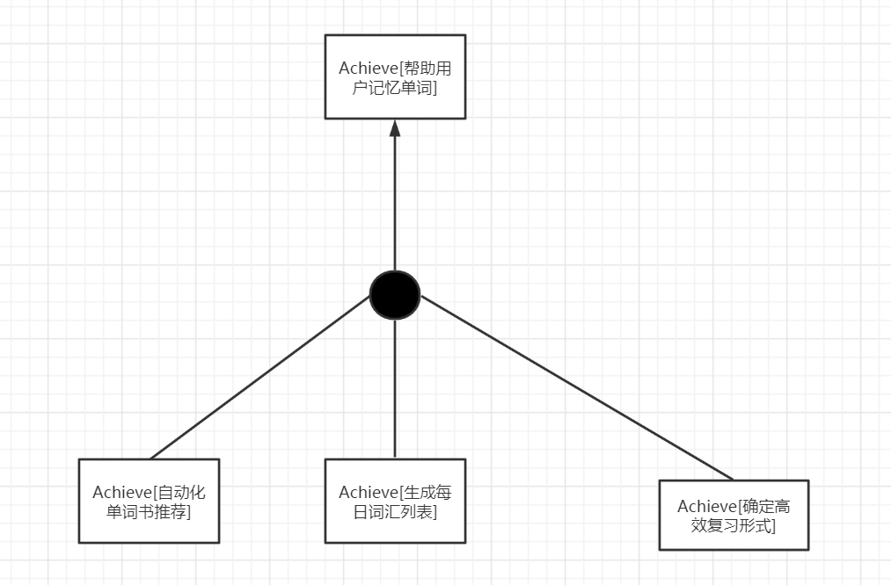

进一步的说，自动化单词书推荐可以根据用户的年龄段、词汇量等英语水平信息进行推荐。对于生成词汇列表，首先用户已经确定了词汇书以及每日新旧词汇的比例，在这个基础之上我们可以通过由每日都易到难的形式生成词汇列表，也可以直接按字母排序生成词汇列表；而在复习形式上，可以有图文联想、看中文选英文等形式。

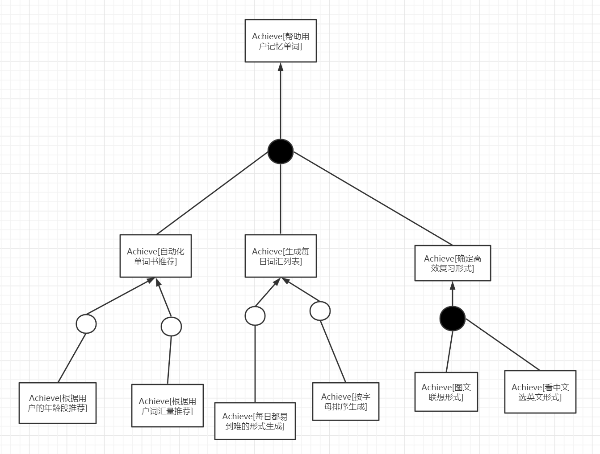

##### 2.1.2 目标冲突与协作
在进一步分析的过程中，我们可以识别出一个新目标，即提供简洁高效的背词过程。它符合该商业模式的价值主张，显然地，当我们对单词书进行自动化推荐时，用户可以省去对单词书进行挑选的过程。他们之间的协作关系如下图示：

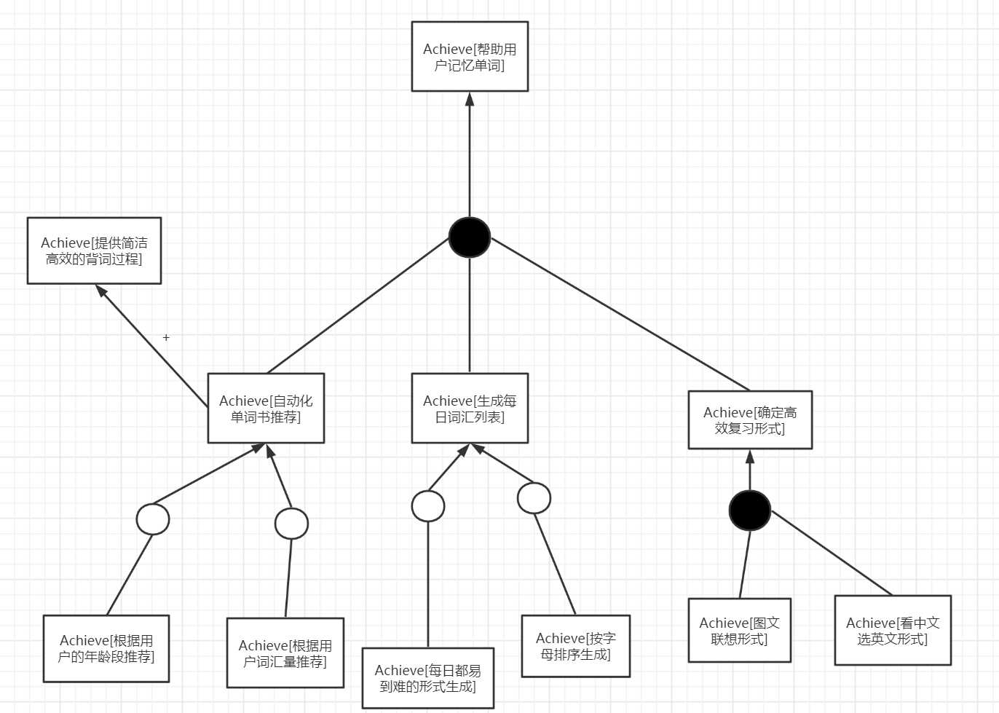

##### 2.1.3 目标实现
将底层目标分配给主体，结果如下图所示。对于单词书的自动化推荐而言，需要让用户系统的信息以及系统开发人员的算法设计；对于生成每日词汇列表而言，需要系统开发人员进行分配；对于确定高效复习形式而言，也需要系统开发人员的技术支持。

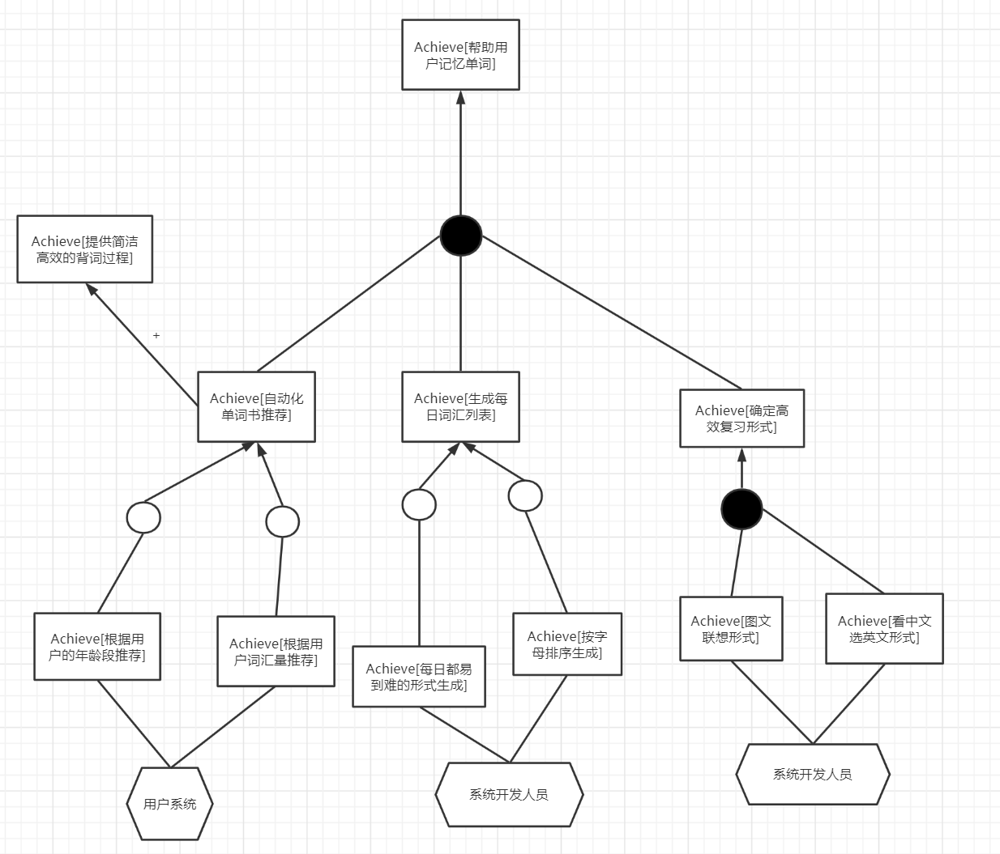

类似的，可以将底层目标分配给不同操作，具体如图示。

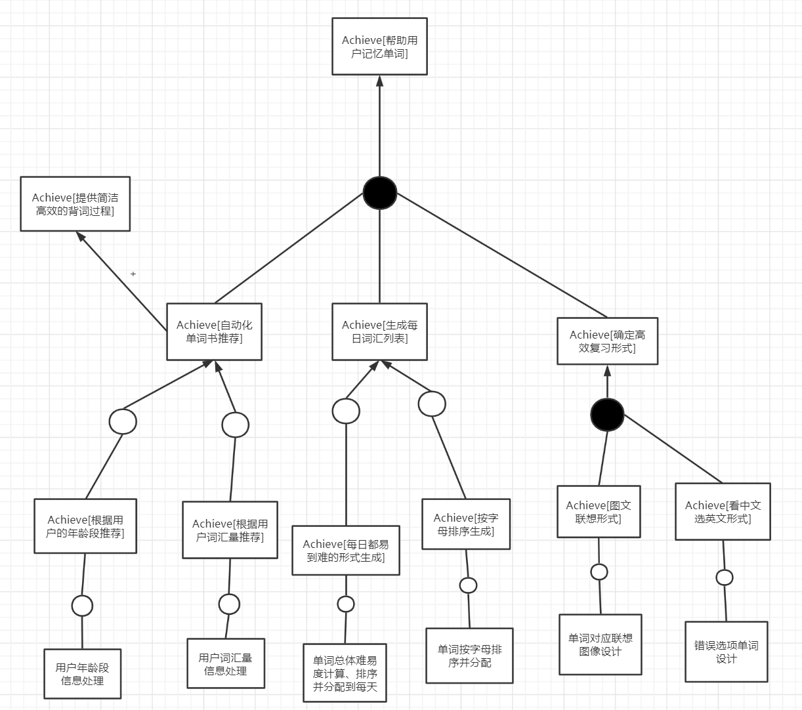

#### 2.2 帮助用户练习口语能力

##### 2.2.1 目标精化

要实现“帮助用户练习听说能力”这一高层次的目标，可以从分析其AND关系下的子目标入手。经过初步思考，可以提取出两个方面，其一是要获取用户的部分详细信息，便于我们划分层次进行匹配；其二是为用户提供用英语进行相互语音交流的功能。

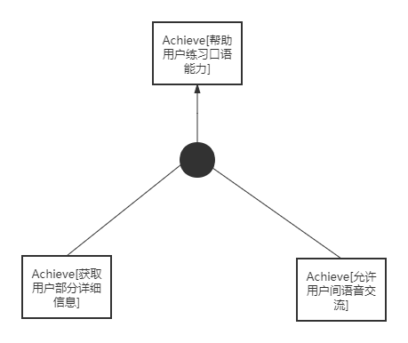

进一步细化，对于用户信息这一块，我们需要获取用户目前的年龄段、词汇量、已具备的英语口语技能（发音、流畅性、语法准确性...）等信息进行分析和区分。在运行用户间语音交流方面，我们需要建设并维护一个语音聊天平台，由若干个大小可变的聊天室组成；另外对于用户拥有的好友，可以私信发送语音。对于该语音聊天平台，一方面需要鼓励用户与匹配的伙伴进行口语交流，另一方面要避免无关、不良内容的出现。

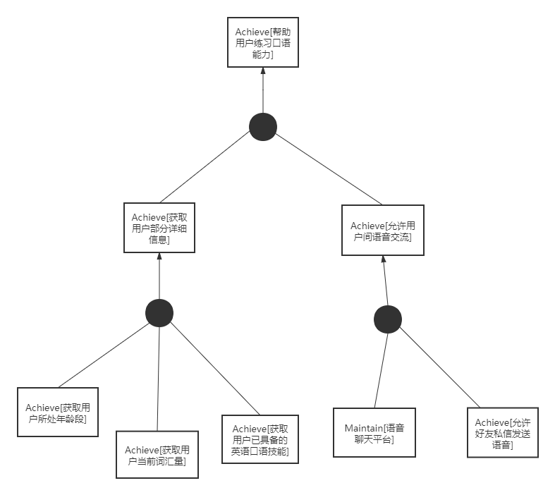

##### 2.2.2 目标冲突与协作

进一步分析，不难发现通过构建语音聊天室及增加好友间交流的语音通话维度，对于促进用户间交流这一目标有着正向积极的作用，彼此可以收获更好的学习效果和体验。

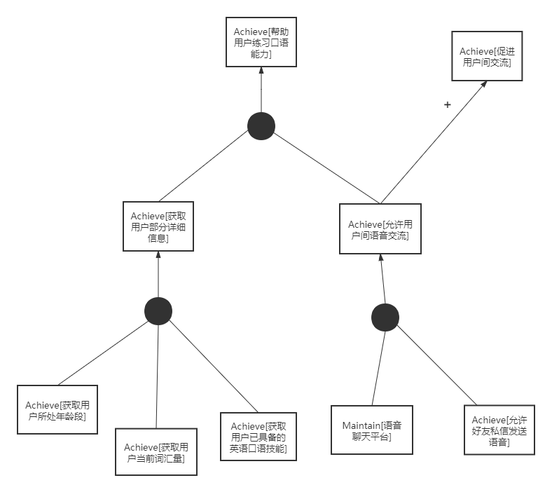

##### 2.2.3 目标实现

实现阶段，将底层目标分配给不同主体，结果如下。首先需要用户系统收集用户相关信息作为语音聊天室分层匹配的基础；其次为了维护语音聊天平台，需要开发人员和管理员分别在技术和管理上提供支持。对于私聊语音通话功能，需要开发人员进行相应功能开发。

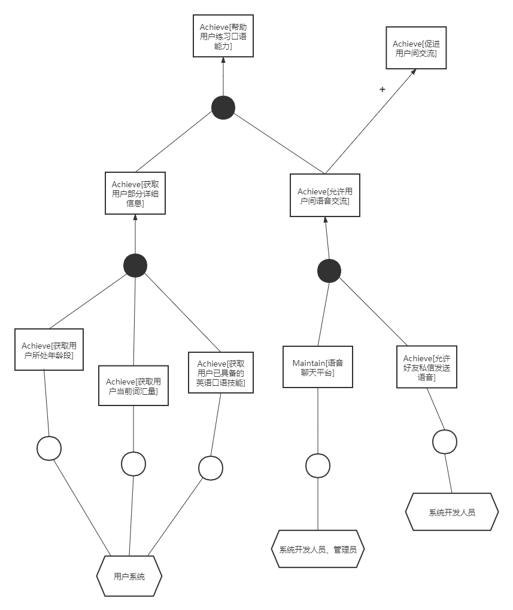

同样地，将底层目标分配给不同操作，具体如图示。

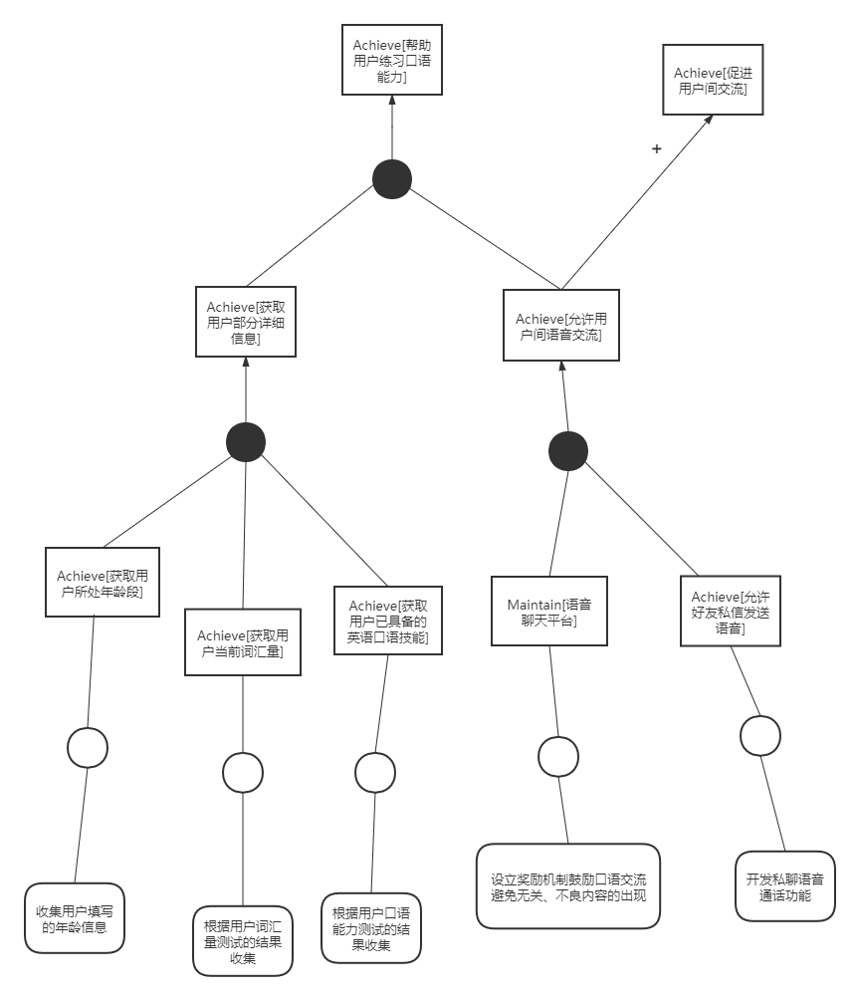

#### 2.3 智能推荐课程

##### 2.3.1 目标精化

要实现“智能推荐课程”这一高层次的目标，可以从分析其AND关系下的子目标入手。经过初步思考，可以提取出三个方面，其一是要对不同课程进行分析归类，方便用户进行课程进行查找了解；其二是推荐课程，使用推荐算法实现对课程的精准推荐；其三是要获取用户的部分详细信息，便于我们划分层次进行课程匹配。

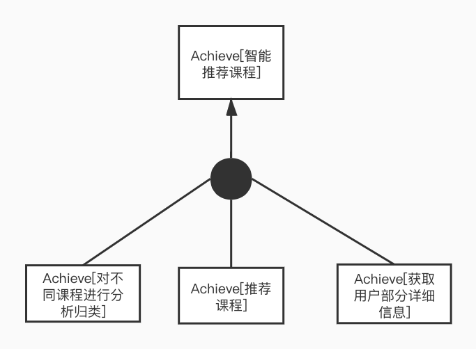

进一步细化，对于对课程分析归类这一块，我们需要通过平台教师团队给出每一门课程的课程类别与简介，并且收集众多用户的购买评价，从而方便用户在短时间内对课程有一个全面充分的了解。对于推荐课程这一方面，我们使用了推荐算法。另外关于用户信息方面，我们也需要获取用户当前已经具备的英语技能（阅读技能、口语技能、听力技能...）、词汇量与用户初始选择课程意向，这些可以帮助我们通过推荐算法进行更精准的课程推荐。

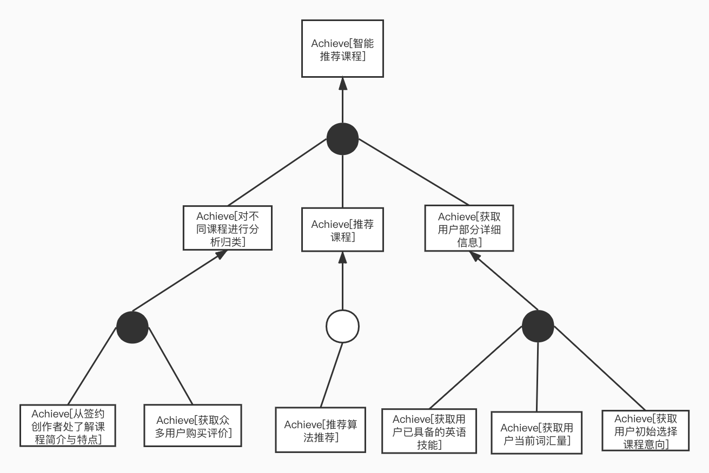

##### 2.3.2 目标冲突与协作

进一步分析，不难发现通过对不同课程进行分析归类，对于帮助用户筛选检索各类课程这一目标有着正向积极的作用，可以让用户收获更好的学习效果和体验。

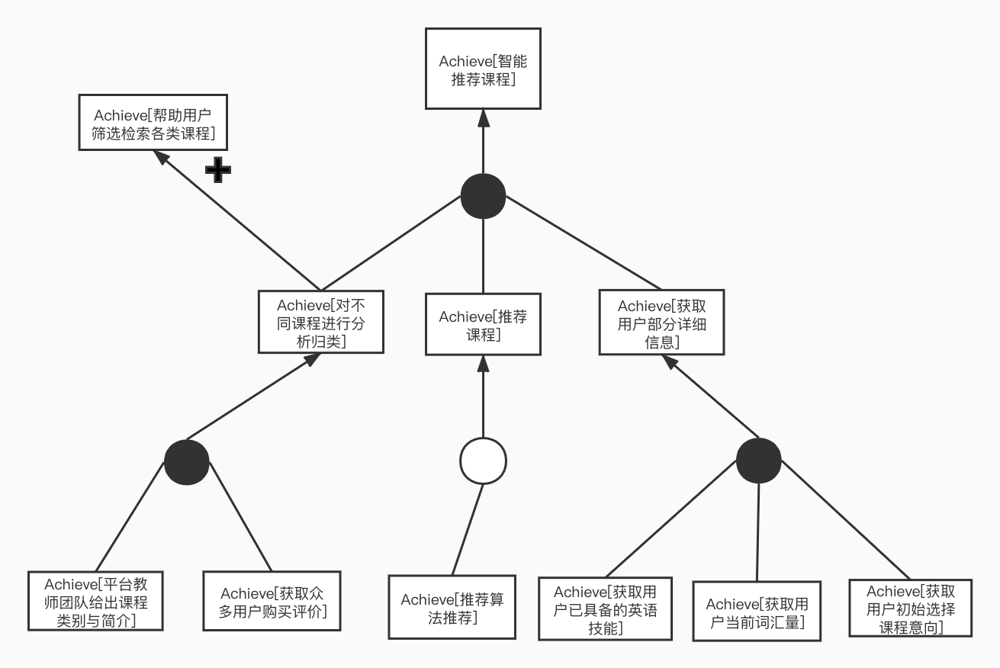

##### 2.3.3 目标实现

实现阶段，将底层目标分配给不同主体，结果如下。首先需要公司教师团队在课程类别与简介上提供支持。其次为了维护与优化推荐算法，需要系统开发人员在技术上提供支持。最后，我们也需要用户系统收集课程的用户购买评价与用户相关信息来为推荐系统提供基础数据支持。

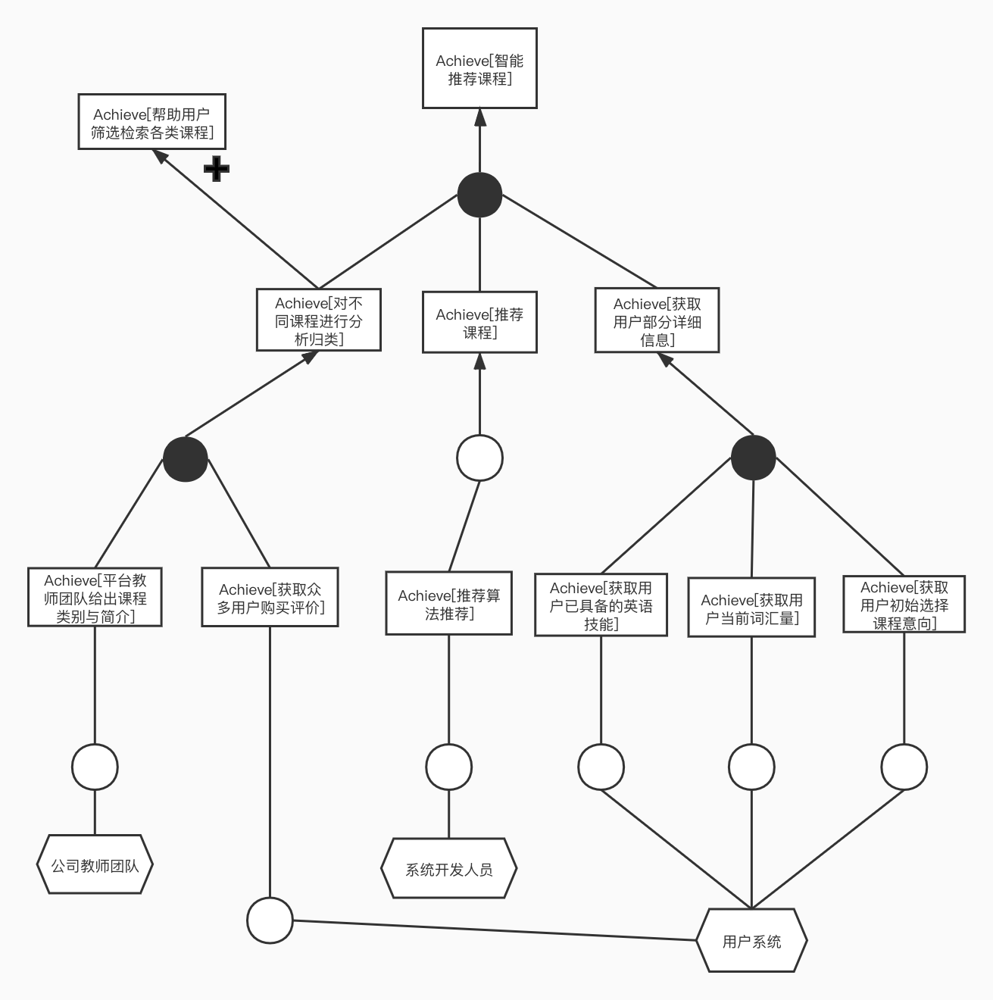

同样地，将底层目标分配给不同操作，具体如图示。

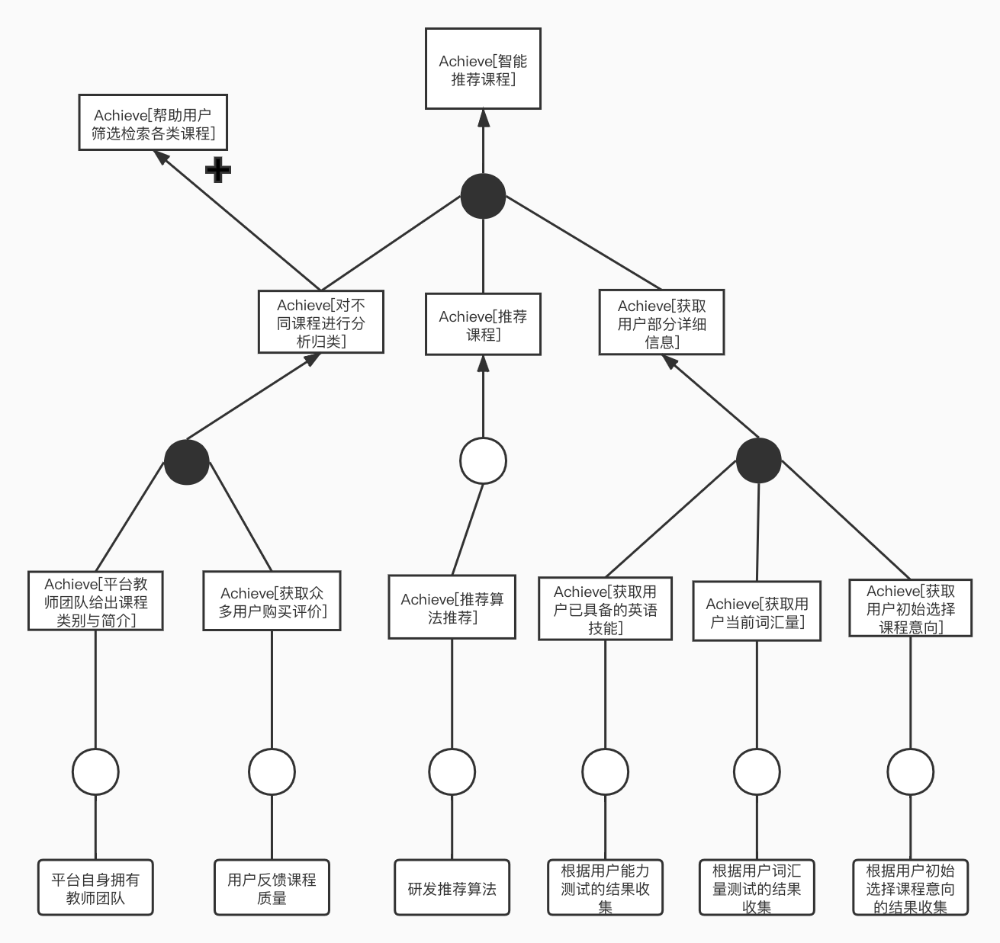

#### 2.4 方便用户交流

##### 2.4.1 目标精化

方便用户交流，也就是提升用户的交流效率，从而促进用户在英语水平上的提高，提升用户的黏性。对于这一高层目标，可以细分为与平台的交流以及客户之间的交流，与平台的交流可申请成为平台签约用户，了解平台的相关信息等；用户间的交流可以交换所学习的知识，是用户另一种可靠的信息源。的在这两个方面上，都需要达成提升交流效率的目标，进而精化为 AND 关系下的子目标。

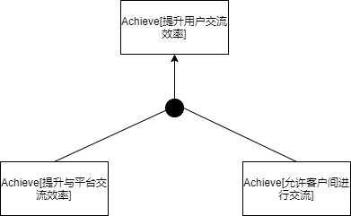

再细分后，而对于提升用户之间的交流效率来说，主要可以分为两个目标，一个是我们的词云平台帮助建设一个用户交流的社区，在其中用户询问或者分享有关英语学习的信息。另一方面平台的工作人员对其中的信息进行甄选和推荐，让用户能浏览到别的用户分享的与其自身相关的一些学习的信息，增加信息分享曝光率。提升与平台的交流效率，主要目标就是有一个用户可以与平台相关工作人员实时沟通的渠道，通过成为签约用户，能更多更方便地分享内容。

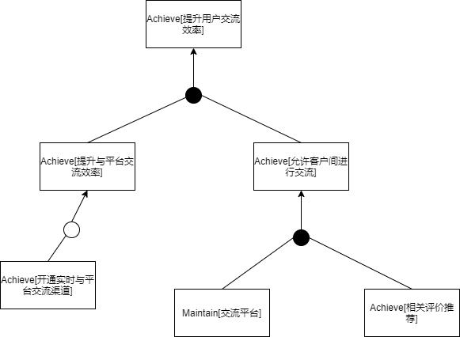

##### 2.4.2 目标冲突与协作

在商业模式的价值服务中，增强用户之间的连接是其中一个目标，搭建一个良好的沟通平台，会对该目标有促进作用，并且最终对该平台的建立目标之一——帮助用户挑选适合自己的课程与学习产品作出贡献。

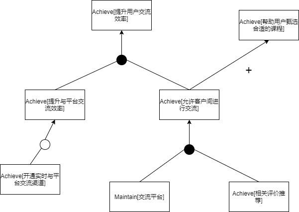

##### 2.4.3 目标实现

最后将最底层精细的目标分配给不同的主体，结果如下。为了保证用户与平台之间的沟通渠道实时并畅通，需要有客服来维护渠道，及时响应。为了维持交流社区，需要在开发人员和管理员分别在技术和管理上提供支持。为了能让用户看到适合自己的有用的信息，需要管理员筛选，平台系统推荐，协作完成。

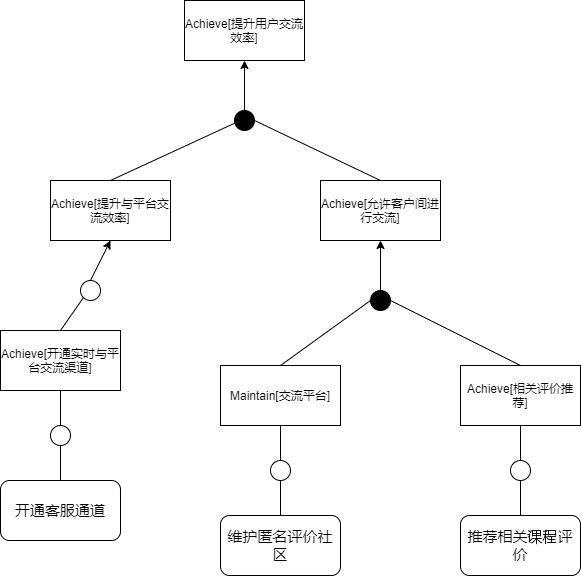

同样把底层目标分配给不同操作。实时的与平台交流渠道具体来说就是开通客服通道，用户与客服进行联系。交流社区进一步细化为匿名的评价社区，由专人进行维护。相关信息具体为与用户相关的课程评价信息等，平台会进行推荐。

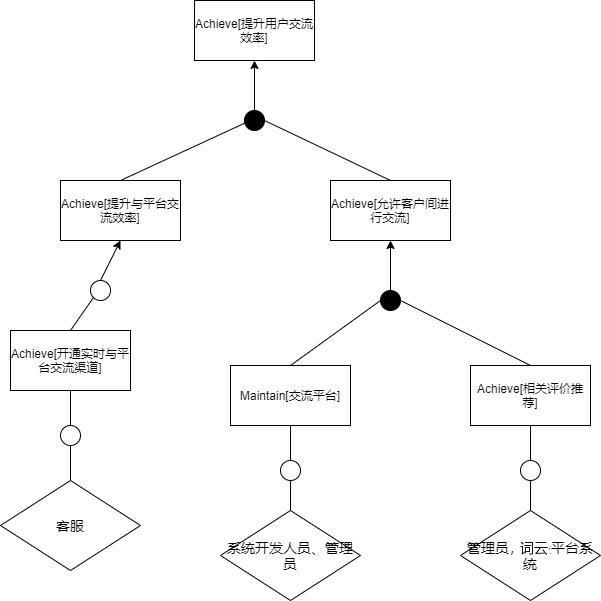

### 3. 项目前景和范围

#### 3.1 业务需求
##### 3.1.1 项目背景
随着全球化的逐步推进，个人与世界的联系将愈发紧密，因此掌握英语这样一门全球性的语言就成为了一项重要技能。学生有中高考托福雅思四六级等英语考试需求，上班族也有对英语沟通能力的要求。不少人会选择报名参加英语补习班，但有时候高额的课程费用以及需要一段长而连续的时间去上课也可能导致劝退，因此大部分人也希望利用一些零碎的空余时间学习英语。

##### 3.1.2 业务机遇
国内人均可支配收入的不断增长以及国际经济交流的不断加强，使得留学生的规模持续扩大，企业在全球范围内的合作也会持续增加，再加上现在随着移动应用的发展，人们的英语学习也逐渐从纸质转向线上，可以带来市场上的机遇。同时，现有的类似app如百词斩、扇贝、小站等，相比“词云”并没有很好的整合背单词与线上课程的功能，也没有提供足够完善的英文交流社区供这些大多陌生的学习者之间进行交流互动，用户可能在学习过程中需要来回切换app，并且不同app间数据并不互通也给用户的学习带来了一定的不便，因此该平台有较为开朗的前景。

##### 3.1.3 业务目标
- **BO-1：** 在第一版应用之后的3个月内，用户量增长10万。
- **SC-1：** 在第一版应用之后的6 个月内，用户对在本系统中学习的好评率达到85。

##### 3.1.4 业务风险
- **RI-1：** 互联网上已经有类似的产品，因此产品可能会在宣传推广和抢占市场上受阻，导致在初期用户数量偏少。可能性为0.8，影响为6。
- **RI-2：** 课程开发成本高于预期，可能导致课程定价偏高，难以吸引客户。可能性为0.5，影响为8。

#### 3.2 项目前景

##### 3.2.1 前景概述

“词云”是一款英语学习类移动应用，亮点在于简洁高效的背单词设计与高交互性、实用性的用户社区的结合（社区业务相较而言其实更重要）。就前者来说，主页面仅有背单词、快速搜词、刷题备考功能，没有繁杂的按钮和干扰的图文、广告，用户打开应用就能直接进行英语学习；并且针对中学生或大学生这种有着明确考试/出国目标的人群，以及职业道路对语言能力有要求的白领阶层，本应用可引导用户根据自身情况、具体实际需求（充实词汇量、应试技巧、提高日常英语能力等）和空闲时间制定个性化的学习计划。对于后者，平台维护一个PUGC的用户社区，社区内用户可以分享英语学习动态或发表英语学习心得、专栏等，相互之间可以关注和转赞评；基于社区的悬赏板块用户可以发布悬赏任务，以众包的方式求助资源或者文章的翻译、批改、润色等，发掘社区的潜力，提升用户粘性；社区内还增设语音聊天区块，每个聊天室按照年龄及英语水平随机匹配几位partner，用户在其中可以练习口语。平台也会定期邀请合作伙伴教育机构的一些专家、教师开放聊天室演讲，分享英语技巧、趣闻等。

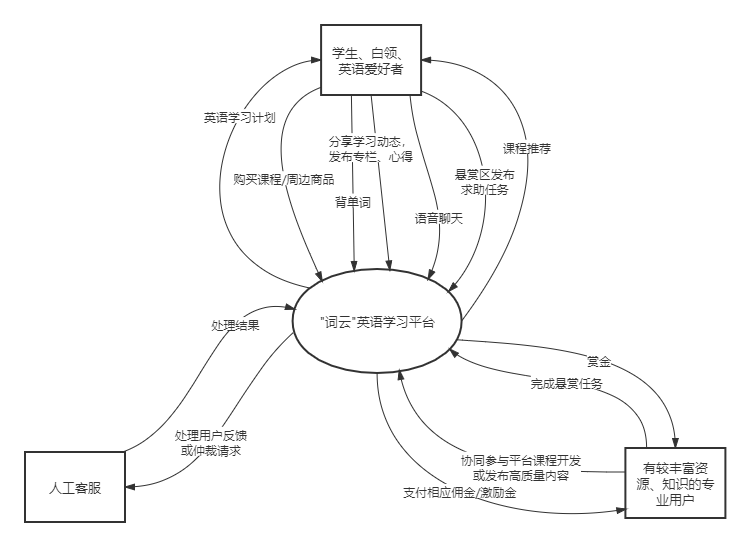

##### 3.2.2 主要特性

经过第一次面谈的讨论，我们保留了目标商业模式的大部分要点，总体划分为背单词、浏览信息、社区互动三大板块，并提取出以下主要特性（主语均为用户）：

- **FE-1：** 根据自身情况和具体需求提供合适的个人英语学习计划。
- **FE-2：** 背单词、刷题备考（位于app打开主页，简洁醒目）。
- **FE-3：** 在社区分享学习动态、参与话题交流、结交学习伙伴、发表自制文章视频。
- **FE-4：** 试用、购买课程。
- **FE-5：** 购买商城商品。
- **FE-6：** 通过社区语音聊天室与随机匹配的伙伴练习口语、交流经验。
- **FE-7：** 悬赏区发布求助任务or通过完成他人发布的悬赏任务获得赏金。
- **FE-8：** 通过发布高质量创作内容（形式文章、视频均可，英语学习相关），获得平台相应打赏。
- **FE-9：** 开通会员享受更多免费课程、课程购买优惠、可阅读会员专栏等增值服务。
- **FE-10：** 高积极性、创作经验丰富的用户可成为平台特约用户，发布内容可获得更多曝光并能够参与课程开发。
- **FE-11：** 对于软件使用的疑问或者意见和建议可以在帮助与反馈栏中找到常见问题的统一解答，如果对解答不满意或者有其他问题可以转人工客服得到较为实时的回答和处理。
- **FE-12：** 悬赏区针对发布者在任务完成后恶意不确认的情况可提起仲裁，交由仲裁员进一步处理。

##### 3.2.3 假设与依赖

- **AS-1：** 用户在悬赏区上传的相应资源需自行声明转载或原创，引起的相关版权追责问题由用户自行负责。
- **AS-2：** 系统会定期（例如1-2个月）弹出窗口请用户为应用打分or提出对平台发展的意见或建议（可选），作为内部的一个参考数据（与应用商店内的不相通）帮助我们做得更好。
- **AS-3：** 较大一部分用户愿意在平台上分享、创作。
- **DE-1：** 需要和第三方支付平台（微信、支付宝、银联）接入集成。
- **DE-2：** 需要与出版社合作获取单词书等相应版权资源。

#### 3.3 项目范围

##### 3.3.1 版本范围

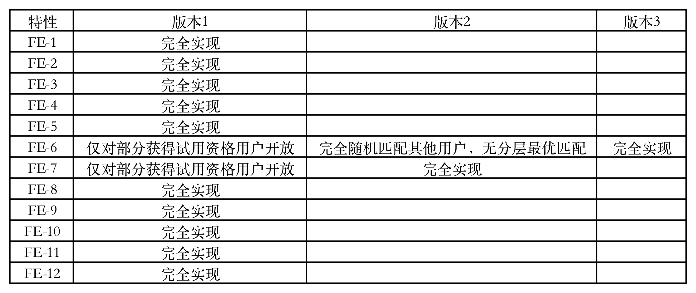

##### 3.3.2 限制与排除

- **LI-1：** 本平台只为中国大陆地区的用户提供服务。
- **LI-2：** 本平台只接受人民币作为支付货币。

##### 3.3.3 用例图

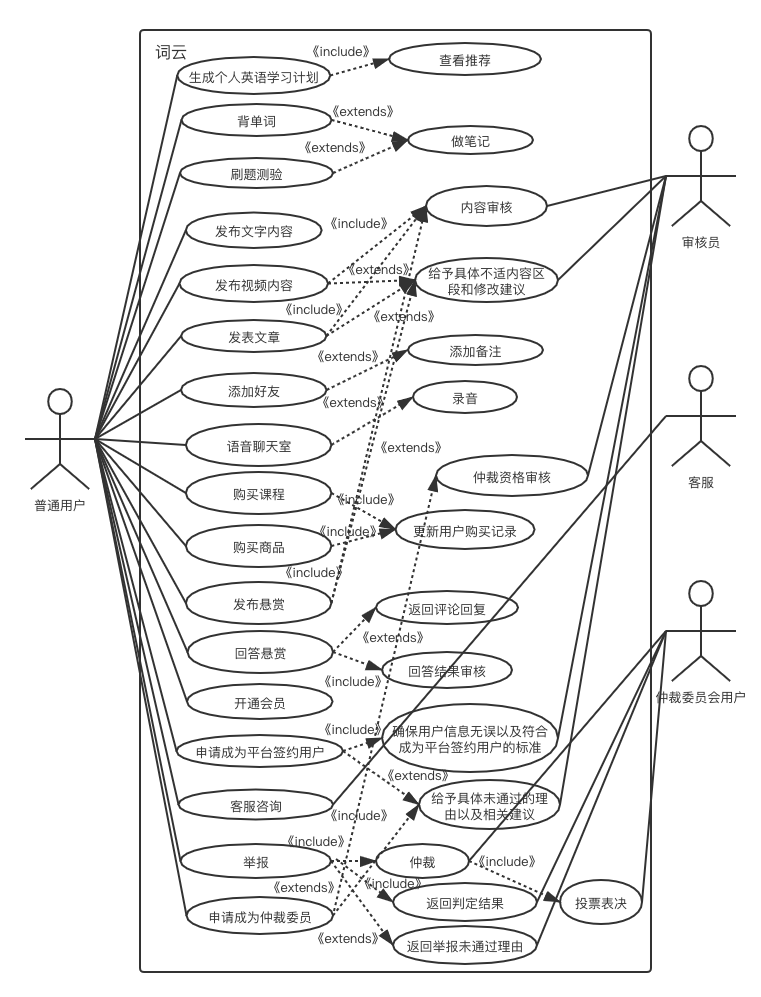

#### 3.4 项目环境

##### 3.4.1 操作环境

* ENV-1: 用户来自全国各地。
* ENV-2: 由于本平台需要处理课程购买信息，而用户发生意外事件的时间是不可预测的，我们必须保证服务的可靠性，即使短时间的服务中断都会对客户体验造成极大的影响。
* ENV-3: 本平台涉及用户个人隐私信息，需要建立完善的数据分级制度，确保用户数据安全。
* ENV-4: 本平台的课程均由各课程平台提供，平台需对其可靠性进行甄别。

##### 3.4.2 项目属性
| 属性 | 驱动因素    | 约束因素             | 可调整因素 |
| :------: | ------------- | ------------ | ------------ |
|  进度  |  | 调整文档模板格式，完成目录和1，2节 |      |
|  特性  |  | 第一版中要求实现的特性必须完全可操作。 |      |
|  质量  |  | 所有合作的课程平台必须通过一定的资质审查，用户信息的保密级别必须达到行业标准。 | 系统可靠性尽量达到 99.99%以上，最低不低于 99.9%。 |
|  人员  | 团队应包含一名经理，一名信息主管，至少一名文书员，至少 3名理赔代办员，至少 5 人以上的开发、测试团队。 |                                                              | 在产品正式推出时，应与 10 家左右的课程平台进行合作，代理100 门左右的产品。 |
|  费用  |  |                                                              |                                                              |

##### 3.4.3 涉众

**涉众识别**	总的来说，该系统的涉众有：用户、客户（平台工作人员）、总经理（负责市场调研和管理人员）、开发者（开发平台和推荐算法）、领域专家（顾问和咨询）。

进一步，用户可以分为两类：一类是只用词云进行单词学习活动，对于论坛创作和课程学习并没有过多意愿；另一类是除了背单词以外，愿意与其他用户进行交流分享知识，也愿意为英语学习的进步进行消费，他们的疑虑在于这些互动和消费对自身的提升是否有意义。客户主要指的是平台的客服人员和后台管理员，这类涉众是系统的管理者，他们负责平台日常的运维、解答一些用户在平台使用上的疑问。总经理分为两类：一类是负责业务的，主要工作是市场调研，收集当前市场信息；另一类是管理人员。开发者主要是负责开发平台和推荐算法部分。领域专家负责开设课程，这类专家有着丰富的教学英语的从业经验。

上述的涉众中，负责人力资源管理的总经理和开发人员并不是系统的关键涉众，因此后续不再继续讨论。

**涉众描述**
涉众描述 针对上一小节涉众识别的结果，对每一类涉众描述如下：
*  明确参与背单词以外活动的用户：这类用户最大的特征是除了背单词以外，有明确的英语交流学习欲望。他们大多有长期的社区活跃度，其中部分用户或许已经相当数量的网课学习经历，部分用户可能是第一次购买英语学习周边和网课。对于他们来说，选择一门合适的课程是当务之急。在以往的学习经历中，他们可能已经有了一定的经验和判断，他们使用平台的目的是希望结合平台的数据分析或是专业人士来为自己提供更好的选择。
*  尚未明确参与背单词以外活动的用户：部分用户还在犹豫除了背单词以外，是否需要词云平台的其他活动，他们对于其它活动的作用心存疑惑，不理解社区对于自己的收益，或者对于平台课程不了解，因此难以判断自己是否需要购入课程。这类用户可能是从自己的朋友那了解到该平台或是背单词有关事宜，因此使用该平台希望获得学习英语相关的知识，或是专业人士的建议。
*  平台工作人员和管理员：工作人员和管理员是平台的管理者，他们负责解答普通用户对于平台使用的问题，或是反馈 bug。他们中的部分是人工客服，和用户直接接触，他们或许有工作经历，但是对于平台的使用还需要培训，因为这可能是他们第一次接触类似平台的运维。
*  负责市场部分的总经理：分管市场的总经理主要负责英语平台市场信息的收集，包括和英语周边公司的合作事宜和接洽等。他们往往对于英语平台市场有一定的经验，或是人脉丰富，能够收集各类的信息，并且对于当前市场上主流的营销策略有深入的调研和理解。
*  领域专家：这类专家有着丰富的英语教学的知识，对于课程的分类、适合的人群、针对的领域、教学流程、各大英语课程平台的战略和种类都有着非常深刻的认识。他们可能专精于一类课程，也可能善于为用户推荐合适的课程种类。他们有着丰富的专业知识和行业经验。

**涉众评估**

| 涉众 | 主要目标    | 态度             | 主要关注点 |约束条件|
| :------: | ------------- | ------------ | ------------ | ------------ |
|  明确参与背单词以外活动的用户  | 选择最合适自己的英语学习活动 | 非常愿意进行英语学习，因为已经有了一定的英语学习经验，希望能参与更多的英语学习活动，得到更专业的指导。 | 希望能对购买的课程周边有更加清晰的认识 | 联网 |
|  尚未明确参与背单词以外活动的用户  | 明确除了背单词以外是否需要参与其它活动 | 愿意使用平台进行英语相关学习，但比较谨慎 | 明确是否需要社区活动和购买课程、周边 | 联网 |
|  平台工作人员和管理员  | 平台运维，解答用户使用过程中的问题 | 平台工作人员，主要面向用户，同时对系统的使用尚不熟练，需要培训。 | 解答用户疑惑，平台要易于使用 | 需要培训 |
|  负责市场部分的总经理  | 收 集 各 类 市场信息，和英语平台保持合作 | 对自己的工作有热情，对市场有理解，但是可能不太习惯于使用该系统。 | 易于使用                                          | 无 |
|  领域专家  | 顾问，提供专业知识的支持 | 对自己的工作有热情，对市场有理解，但是可能不太习惯于使用该系统。                		| 保证工作 |薪资有要求|
**涉众评估**

| 用户群体 | 任务                                                     | 群体数量                                                  |优先级                                                   |
| :--: | ------------------------------------------------------------ | ------------------------------------------------------------ | ------------------------------------------------------------ |
| 明确参与背单词以外活动的用户 | 选择最合适自己的英语学习活动 | 多，预计能达到万人以上                | 4 |
| 尚未明确参与背单词以外活动的用户 | 明确除了背单词以外是否需要参与其它活动 | 多，预计能达到万人以上            | 4 |
| 平台工作人员和管理员 | 平台运维，解答用户使用过程中的问题 | 50-100 人 | 1           |
| 负责市场部分的总经理 | 收 集 各 类 市场信息，和英语平台保持合作 | 3-5 人 | 2 |
| 领域专家 | 顾问，提供专业知识的支持 | 20-50 人 | 3 |

* 参与者：明确购买课程、周边的用户、领域专家，这两类用户直接参与和系统的使用，需要和平台有具体和频繁的交互。用户可以提交学习信息和自己的课程购买经历，这类用户可以直接影响到系统
* 环境设定者：平台工作人员和管理员、负责市场部分的总经理，平台的管理者和经理维护了平台的环境，提供了具体的内容，他们影响着参与者的使用环境
* 被影响者：明确购买课程的用户和尚未明确购买课程的用户是潜在的被影响者，他们虽然参与到系统的使用中，也可能仍然处于观望阶段，但是其中的大部分人都很少有影响系统的决策
*  观众：尚未明确购买课程的用户，这类用户仍处在观望阶段，其中一部分是系统的使用者，另一部分
可能只是观众

**风险评估**

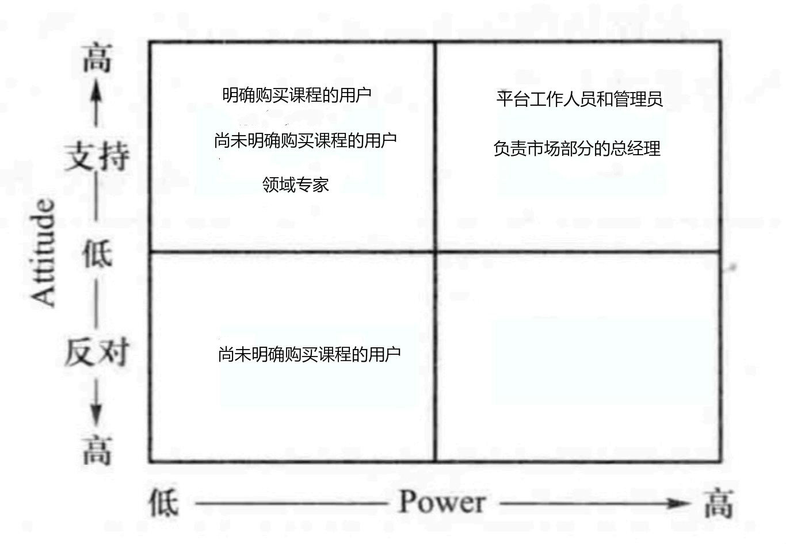

* 平台的强支持者包括了平台的工作人员、总经理，他们是平台的管理者和高层人员，支持着平台的运维和发展。
* 平台的弱支持者包括两类用户和领域专家。用户对于平台可能并不是非常信任，领域专家主要面向领域知识，对平台也无强烈的依赖关系，他们只是平台的一般使用者。

**共赢分析**

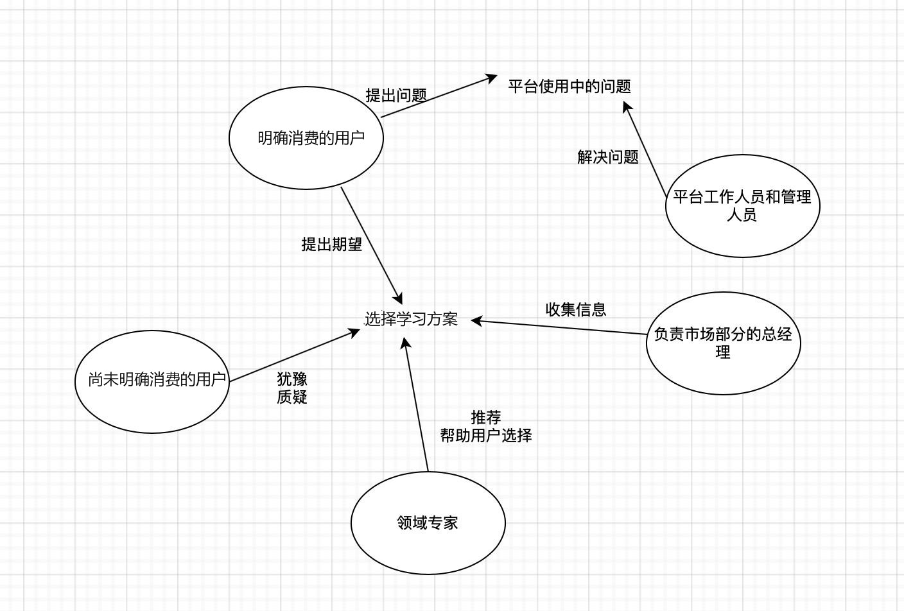

​	五类关键涉众所关注的问题和各自的态度如上所示。用户提出购买合适课程的期望，领域专家负责以专业知识为基础提供建议，负责市场部分的总经理为用户收集和提供信息。另外有一些尚未明确消费的用户可能会提出质疑，或是仍在观望和犹豫状态。这类用户有可能有提出质疑和反对，和平台的关键业务和价值主张有一定程度上的冲突，需要重点关注这类用户的使用体验，促使他们向消费的方向进行转化，以达到解决冲突和共赢的目的。
​	另外在用户使用的过程中，可能会有一些日常运维的问题，需要平台的工作人员和管理人员来进行处理和解决。

**涉众代表选择**

我们将涉众分为了 5 个不同的类别，明确消费的用户、尚未明确消费的用户、平台工作人员和管理员、负责市场部分的总经理和领域专家。明确消费的用户、尚未明确消费的用户、平台
工作人员和管理员、领域专家这 4 类涉众群体的人数较多（10 人以上），我们需要进行采样的方法，在每个涉众群体中分别选择一部分较少的人，尽量可以准确代表群体中的所有人。我们要保证完整采样，即这三种涉众群体都有自己的代表；涉众群体的代表应保持积极的态度向我们提供需求；每个涉众群
体代表的数量适中，约为 5-10 个，要保证体现出整个涉众群体的共同看法同时也要保证效率；涉众代表中也要有明显的个人特征，比如选择不同年龄层，不同职业的消费用户；非常熟悉业务细节的工作人员和仅有普通工作能力的工作人员；精通不同类别课程的领域专家。在负责市场部分的总经理这个群体中，群体人数比较少，应考虑让这个涉众群体的所有人都参与到需求的开发中来，都是本类别的代表。

**涉众参与策略制定** SA 表示明确消费的用户；SB 表示尚未明确消费的用户；SC 表示平台工作人员和管理员；SD 表示负责市场部分的总经理；SE 表示领域专家。

明确消费的用户和尚未明确消费的用户以及平台的工作人员和管理员是平台的主要使用者，消费用户需要平台提供指导推荐的服务，而平台工作人员和管理员作为平台的主要运营，需要平台简洁易用。他们在计算机方面的知识可能比较欠缺就不需要参与系统的实现设计中来，只需要在实现后进行试用评估即可。负责市场部分的总经理主要负责市场信息的搜集，不用过多依赖于系统的使用，可以把他们当作顾问，了解他们搜集市场信息过程中的一些流程，由于市场部分的经理大多不了解计算机，所以也无需参与实现的过程。领域专家精通英语教学和市场知识，并且会通过系统和用户进行交流推荐课程产品和学习相关周边，所以应该与他们密切合作，保证系统及体现出专业性，又易于使用。

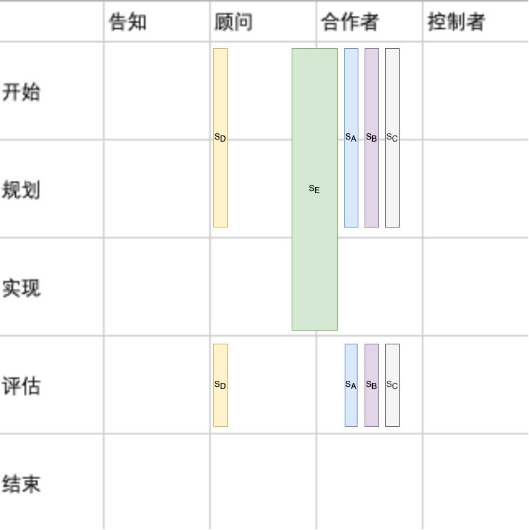

**使用目标模型进行涉众分析**

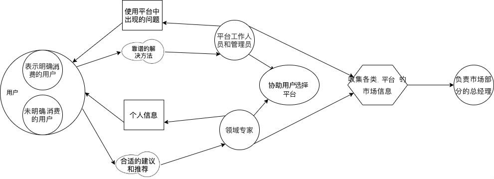

基于目标模型描述及评估涉众使得目标模型能够有效深入的描述目标，策略信息。下图是拥有者的目标模型示例：

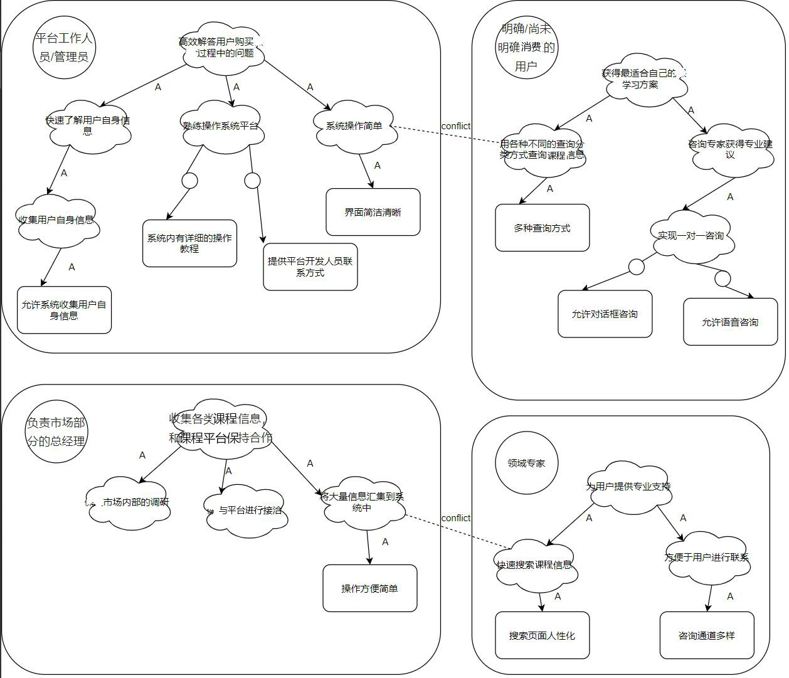

### 4. 面谈报告

#### 4.1 第一次面谈报告

- **客户：** 蒋沂霄、李一洲、周祺祯

- **约定会面日期：** 2020.12.17  20:30-22:02

- **约定会面地点：** 线上腾讯会议

- **面谈目的：** 讨论并确定产品的前景、业务目标及机遇、主要板块划分等等。

- **问题清单**

**面谈概要 **

|                     面谈要点                      |                         被会见者回答                         |
| :-----------------------------------------------: | :----------------------------------------------------------: |
|             主要业务背单词的具体流程              | 打开APP，主页有背单词按钮，第一页进入背单词这个按钮，不会防止商品/词汇量/图文之类的内容占满视线 |
| 本产品相较于其他竞品有没有什么优势或差异化的地方? | 背单词业务差不多、专业课程团队。主要区别是用户社区，可以有视频、动态、帖子（类似百度贴吧） |
|                   广告投放位置                    |              广告只放在商城，用户社区中也有视频              |
|              如何鼓励用户的内容创作               |                     类似b站up主鼓励计划                      |
|              主体业务中最看重什么？               |  社区比单词业务更重要，需要丰富社区资源多样性，提高用户粘性  |
|                  软件具体的目标                   |             上线1年后，月活10w+，并实现产品盈利              |
|       产品主要给用户提供了哪些功能和服务？        |  背单词、周边商城、课程、用户社区（发帖区、悬赏区、语音区）  |
|            软件上线后可能遭遇哪些风险?            |                   没有用户、课程开发成本高                   |

#### 4.2 第二次面谈报告

- **客户：** 蒋沂霄、李一洲、周祺祯
- **约定会面日期：** 2020.12.18  16:00-16:56
- **约定会面地点：** 线上腾讯会议
- **面谈目的：** 对于平台的细节进行进一步的确认，并敲定基本的原型图框架

**面谈概要 **

|                           面谈要点                           |                         被会见者回答                         |
| :----------------------------------------------------------: | :----------------------------------------------------------: |
|                   付款方式是否接入第三方?                    |                     接第三方支付宝和微信                     |
|                 对于原型图的设计有哪些要求？                 | 原型图由乙方自发设计，分成五个板块，主页（正中强调）、课程、周边、社区、我的 |
|                       如何规范社区氛围                       | 帖子发布之前机器自动审核（类似知乎的建议修改），其他用户可以举报（人工审核） |
|                         在线课程类别                         | 按学习层次分类为中高考、四六级、TOEFL、雅思、GRE。具体类别内分出小方向，如TOEFL分听力阅读口语作文 |
|                     怎么推荐课程给用户？                     | 注册后会让用户选择计划（四六级/TOEFL之类），然后在商城、用户社区推广相关课程。有需求的用户可以直接查看 |
| 会员可以享受什么额外的服务?提到的定制化具体指什么，要怎么实现 | 购买课程可以优惠，会员有更多免费课程。定制化服务面向有1对1英语学习需求的用户 |

  

#### 4.3 第三次面谈报告

- **客户：** 蒋沂霄、李一洲、周祺祯

- **约定会面日期：** 2020.12.17  20:30-21:43

- **约定会面地点：** 线上腾讯会议

- **面谈目的：** 讨论并确定产品的前景、业务目标及机遇、主要板块划分等等。

- **问题清单**

**面谈概要 **

|                           面谈要点                           |                         被会见者回答                         |
| :----------------------------------------------------------: | :----------------------------------------------------------: |
| 功能点的实现是否有优先级，还是第一版就包括背单词、社区、课程、商城等完整功能? | 第一版大部分功能都要有。社区不需要全部实现，悬赏和云聊天室都可以放一下。 |
|      背单词有没有生词本、笔记、词根记忆、派生联想等功能      | 生词本放在我的资料里面。词根记忆、派生联想在背单词下面，属于免费的功能。 |
|                           产品前景                           |        开始：背单词，之后建设学习者居多的英文交流社区        |
|              悬赏区的具体佣金抽成规则是怎样的?               |     中间存在暂存的问题，在保证任务完成了以后抽取佣金10%      |
|             悬赏区如何避免含有版权问题的情况出现             | 用户的悬赏回答只有发布者和回答者之间才看得到，所以不存在版权上的问题。通过警告提醒用户出现版权纠纷。 |
| 应用内是否有相应地方收集用户对于软件使用体验的评价和反馈?是否实时回应或处理? | 按时间进行追评。例如3个月弹出窗口进行评分。在“我的资料”里面有联系客服，可以进行反馈。打分作为打分推广的数据，和外面的应用商店是不相通的。 |
|                 社区是否具备盈利导向的功能？                 |     社区交流的存在可以帮助用户进一步选取商城里的合适课程     |

**原型图讨论**

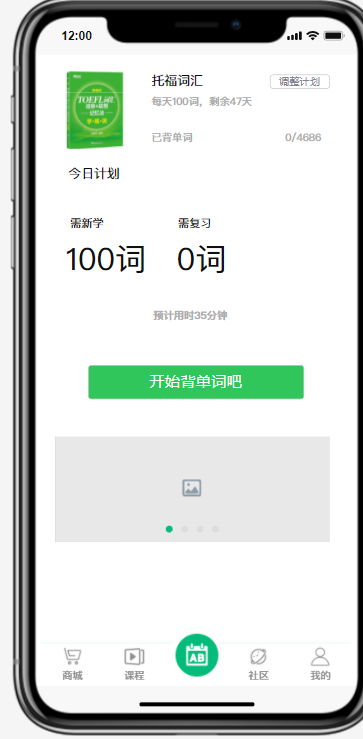

主页

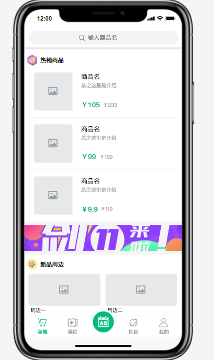

商城

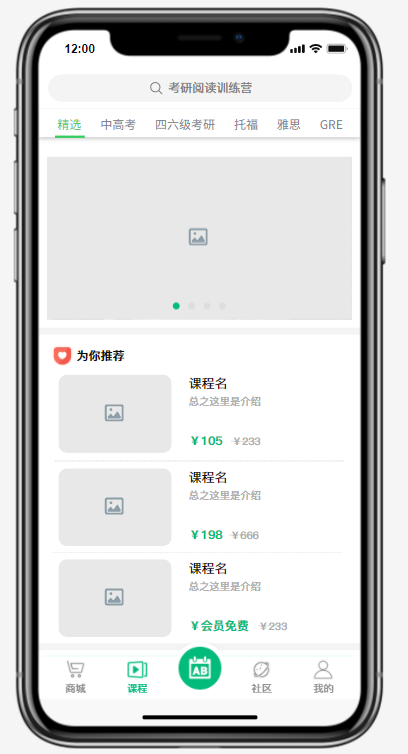

课程

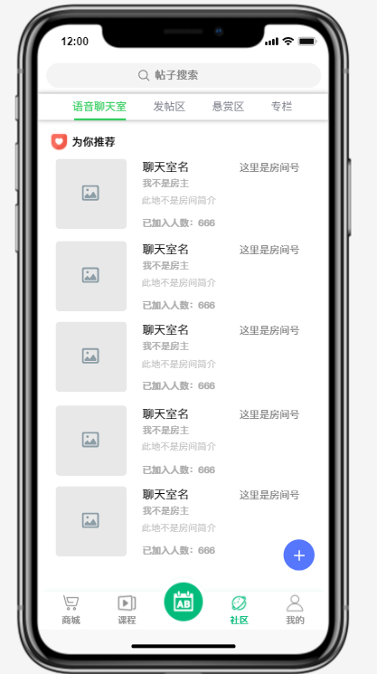

社区

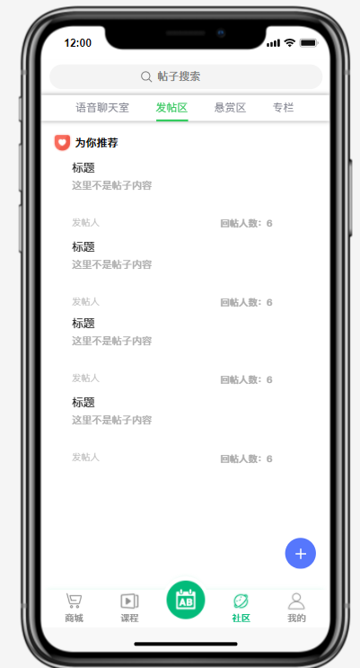

发帖区

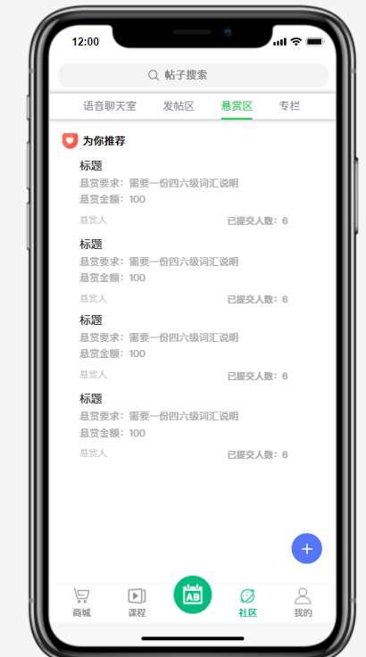

悬赏区

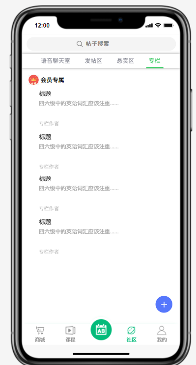

专栏

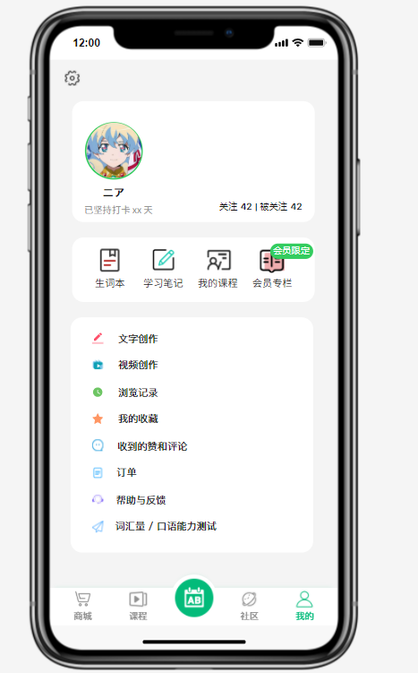

我的

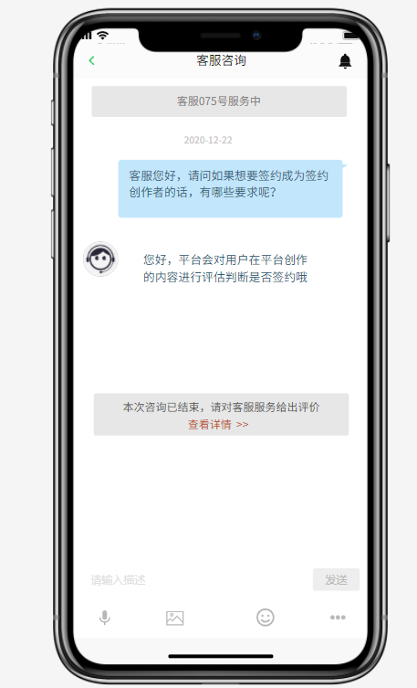

咨询

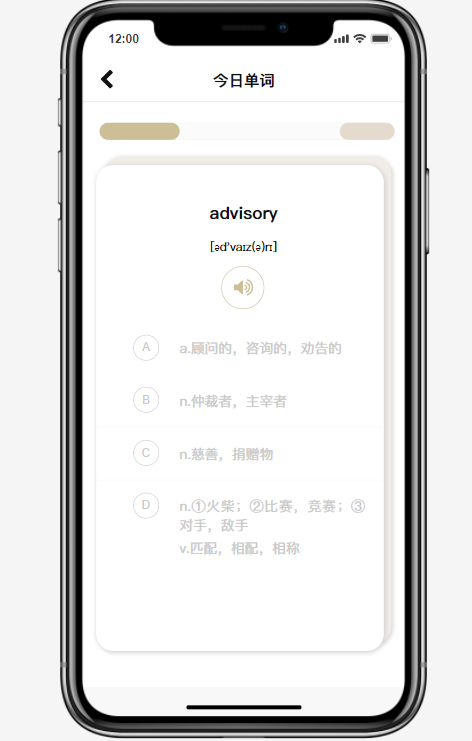

背单词

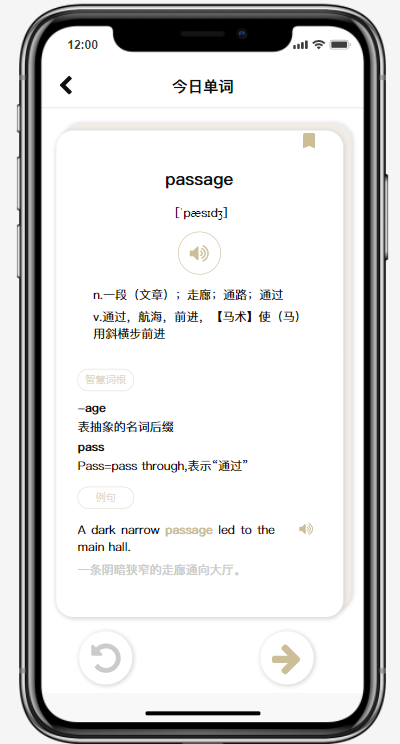

释义

* 反馈：用户比较满意。并提出了以下建议：

  1.不同组员设计的原型图组件配色不统一，希望能后期改进

  2.背单词的图标过度靠上，感觉可以往下挪一点

### 5. 用户需求文档

#### 5.1 概述

##### 5.1.1 项目背景

参考 3.1.1 小节。

##### 5.1.2 共识

参考 4. 面谈报告 小节。

#### 5.2 用户需求

##### 5.2.1 详细用例描述

###### 5.2.1.1 生成个人英语学习计划

- **ID：** 1
- **名称：**  生成个人英语学习计划
- **参与者：**  普通用户，目标是获得适合个人的英语学习计划
- **优先级：**  高
- **触发条件：**  用户首次打开应用进入引导页
- **前置条件：**  用户成功注册并已登录
- **后置条件：**  用户跟随引导完成相应选择及测试，系统记录并分析结果，生成个人英语学习计划
- **正常流程：**  
  1. 用户在已登录状态下首次打开应用转到新用户引导页
  2. 用户填写当前学历或职业（中学生、大学生、研究生、工作党等），实际需求（备考、出国、提升专项能力等），具体目标（如两个月后计划GRE首考325+），每日空闲时间等等，并进行初步的词汇量测试。
  3. 填写并测试完毕后，系统接收信息并进行分析，返回推荐单词书和背词、专项训练建议给用户。
  4. 用户确认结果，进入首页

- **扩展流程：** 

  ​	4a. 用户想修改之前的填写项

  - 1. 用户选择返回重新填写

  ​	4b. 用户对本次分析结果不满意

  - 1. 用户选择返回进一步补充提供更详细的信息，以期得到更加准确的结果

- **相关用例：** 无

- **业务规则：** 用户不能选择跳过

- **特殊需求：** 无

###### 5.2.1.2 背单词

- **ID：** 2
- **名称：**  背单词
- **参与者：**  普通用户，目标是记忆单词
- **优先级：**  高
- **触发条件：**  用户在背单词主页选择背单词
- **前置条件：**  用户成功注册并已登录，并已进入背单词主页
- **后置条件：**  系统记录更新用户学习进度
- **正常流程：**  
  1. 系统显示一个单词卡片，包括拼写、发音和备选的释义选项
  2. 用户选择一个释义选项
  3. 系统显示选择正确或错误，用户可查看单词详情
  4. 用户选择查看单词详情，包括详细释义、例句、智慧词根和派生联想等
  5. 如用户今日学习计划未完成，重复流程1-4
  6. 用户完成今日单词学习，可选择打卡分享到社区

- **扩展流程：** 

  ​	4a. 在单词详情页，用户可将该词加入生词本或为该词添加笔记

  ​	5a. 若用户中途退出，系统保存当前学习状态，用户可之后继续学习

- **相关用例：** 无

- **业务规则：** 无

- **特殊需求：** 无

###### 5.2.1.3 刷题测验

- **ID：** 3
- **名称：**  刷题测验
- **参与者：**  普通用户，目标是备考或者对自己的学习结果进行检测
- **优先级：**  中
- **触发条件：** 用户在背单词主页选择刷题测验
- **前置条件：** 用户成功注册并已登录，并已进入背单词主页
- **后置条件：** 系统存储用户做题记录
- **正常流程：**  
  1. 用户选择试卷（分专题和综合两类）
  2. 用户完成试卷并确认提交
  3. 系统对照答案进行批改，返回成绩
  4. 用户浏览对错题及相应解释，浏览完毕后退出

- **扩展流程：** 

  ​	4a. 对于错题用户可添加错题笔记

- **相关用例：** 无

- **业务规则：** 无

- **特殊需求：** 无

###### 5.2.1.4 发布文字内容

- **ID：** 4
- **名称：**  发布文字内容
- **参与者：**  普通用户，目标是在社区中发表学习动态或文章
- **优先级：**  高
- **触发条件：**  用户在社区主页选择发布文字内容
- **前置条件：**  用户成功注册并已登录，并已进入社区主页
- **后置条件：**  如果成功，系统更新社区内容
- **正常流程：**  
  1. 系统显示文字编辑页面
  2. 用户输入标题和正文，选择发布，系统显示发布结果

- **扩展流程：** 

  ​	2a. 用户想要放弃本次发布

  - 1. 用户选择放弃发布，系统退出编辑状态
    2. 主流程结束

- **相关用例：** 无

- **业务规则：** 发布内容不能为空，且内容要健康有意义。若出现违规和无意义内容后续将删除并对用户进行警告，严重者将受到封禁处罚

- **特殊需求：** 无

###### 5.2.1.5 发布视频内容

- **ID：** 5
- **名称：**  发布视频内容
- **参与者：**  普通用户，目标是在社区中发布视频； 审核员，目标是保证视频内容的合规
- **优先级：**  高
- **触发条件：**  用户在社区主页选择视频投稿
- **前置条件：**  用户成功注册并已登录，并已进入社区主页
- **后置条件：**  如果审核通过，系统更新社区内容
- **正常流程：**  
  1. 系统显示拍摄或上传选项
  2. 用户拍摄或上传完毕，选择提交
  3. 视频交由系统进行初步审核和平台审核员进行人工审核，用户等待审核结果
  4. 审核完毕，系统将审核结果通知给用户

- **扩展流程：** 

  ​	4a. 若审核未通过，审核员退回稿件，并可给予具体不适内容区段和修改建议

- **相关用例：** 无

- **业务规则：** 原则上视频长度不能短于10s，且内容要健康有意义。

- **特殊需求：** 无

###### 5.2.1.6 发表文章

- **ID：** 6
- **名称：**  发表文章
- **参与者：**  普通用户，目标是在社区中发表高质量文章； 审核员，目标是保证文章内容的合规
- **优先级：**  高
- **触发条件：** 用户在社区主页选择文章发表
- **前置条件：** 用户成功注册并已登录，并已进入社区主页
- **后置条件：** 如果审核通过，系统更新社区内容
- **正常流程：**  
  1. 系统显示文字编辑页面
  2. 用户完成输入，选择提交
  3. 文章交由系统进行初步审核和平台审核员进行人工审核，用户等待审核结果
  4. 审核完毕，系统将审核结果通知给用户

- **扩展流程：** 

  ​	4a. 若审核未通过，审核员退回稿件，并可给予具体不适内容区段和修改建议

- **相关用例：** 无

- **业务规则：** 原则上文章内容应该高质量，内容健康且有意义。

- **特殊需求：** 无

###### 5.2.1.7 添加好友

- **ID：** 7
- **名称：**  添加好友
- **参与者：**  普通用户，目标是添加志同道合的好友
- **优先级：**  低
- **触发条件：** 用户在我的页面选择添加好友
- **前置条件：** 用户成功注册并已登录，并已进入我的页面
- **后置条件：** 系统向被添加用户发出信息，若对方同意，则双方成为好友
- **正常流程：**  
  1. 系统显示添加好友界面
  2. 用户输入好友信息
  3. 系统向被添加用户发出信息
  4. 系统返回好友添加结果，成功或者被拒绝。

- **扩展流程：** 

  ​	2a. 添加好友时可以添加备注内容

- **相关用例：** 无

- **业务规则：** 无

- **特殊需求：** 无

###### 5.2.1.8 语音聊天室

- **ID：** 8
- **名称：**  语音聊天室
- **参与者：**  普通用户，目标是提升自己口语水平
- **优先级：**  高
- **触发条件：** 用户在用户社区选择语音聊天室
- **前置条件：** 用户成功注册并已登录，并已进入语音聊天室
- **后置条件：** 系统更新语音聊天记录
- **正常流程：**  
  1. 用户选择开始语音聊天
  2. 系统匹配完成
  3. 双方进行语音聊天
  4. 双方结束语音聊天，退回语音聊天室等待

- **扩展流程：** 

  ​	3a. 用户可以选择录音

- **相关用例：** 无

- **业务规则：** 语音聊天内容需要健康向上，系统会进行审查。若出现违规内容，后续将对用户进行警告并限制使用语音聊天室，严重者将收到封禁处罚

- **特殊需求：** 无

###### 5.2.1.9 购买课程

- **ID：** 9
- **名称：**  购买课程
- **参与者：**  普通用户，目标是购买课程提高自身英语水平
- **优先级：**  中
- **触发条件：** 用户在课程页面选择购买课程
- **前置条件：** 用户成功注册并已登录，并已进入课程页面
- **后置条件：** 系统存储用户购买记录
- **正常流程：**  
  1. 用户进入课程页面
  2. 用户选择课程并提交
  3. 用户完成支付
  4. 系统更新用户购买记录，用户可学习该课程

- **扩展流程：** 

  ​	3a.用户想要放弃本次支付
  
  - 1. 用户选择放弃支付，系统退出支付状态
    2. 主流程结束

- **相关用例：** 无

- **业务规则：** 无

- **特殊需求：** 无

##### 5.2.1.10 购买商品

- **ID：** 10
- **名称：**  购买商品
- **参与者：**  普通用户，目标是购买实体单词书、包等周边商品
- **优先级：**  中
- **触发条件：** 用户在周边商城页面选择购买商品
- **前置条件：** 用户成功注册并已登录，并已进入周边商城页面
- **后置条件：** 系统存储用户购买记录，并通知物流发货
- **正常流程：**  
  1. 用户进入周边商城页面
  2. 用户选择商品
  3. 用户完成支付
  4. 系统更新用户购买记录，并通知物流发货，用户将在一定时间内收到商品

- **扩展流程：** 

  ​	3a.用户想要放弃本次支付
  
  - 1. 用户选择放弃支付，系统退出支付状态
    2. 主流程结束

- **相关用例：** 无

- **业务规则：** 无

- **特殊需求：** 无

###### 5.2.1.11 发布悬赏

- **ID：** 11
- **名称：**  发布悬赏
- **参与者：**  普通用户，目标是获取资源； 审核员，目标是保证悬赏内容的合规
- **优先级：**  高
- **触发条件：** 用户在社区主页选择发布悬赏
- **前置条件：** 用户成功注册并已登录，并已进入社区主页
- **后置条件：** 如果审核通过，系统更新社区悬赏内容
- **正常流程：**  
  1. 系统显示悬赏发布编辑页面
  2. 用户完成悬赏要求编辑，选择发布
  3. 悬赏内容交由系统进行初步审核和平台审核员进行人工审核，用户等待审核结果
  4. 审核完毕，系统将审核结果通知给用户

- **扩展流程：** 

  ​	4a. 若审核未通过，审核员退回稿件，并可给予具体不适内容区段和修改建议

- **相关用例：** 无

- **业务规则：** 原则上悬赏内容应该与英语学习相关，且内容要健康有意义。

- **特殊需求：** 无

###### 5.2.1.12 回答悬赏

- **ID：** 12
- **名称：**  回答悬赏
- **参与者：**  普通用户，目标是发布者所悬赏的资源。
- **优先级：**  中
- **触发条件：**  用户在悬赏区主页指定悬赏任务并选择回答悬赏
- **前置条件：**  用户成功注册并已登录，并已进入悬赏区
- **后置条件：**  如果审核通过，系统更新悬赏结果为已完成，同时回答者将获得对应的悬赏奖励。
- **正常流程：**  
  1. 系统提示上传资源
  2. 用户上传完毕，选择提交
  3. 系统会提示发布者其发布的悬赏有回答，资源由悬赏者对回答结果进行审核，同时用户等待审核结果
  4. 审核完毕，系统将悬赏回答结果通知给用户

- **扩展流程：** 

  ​	4a. 若审核未通过，系统将提示回复未通过，同时返回悬赏者的对该回复的评论。

- **相关用例：** 无

- **业务规则：** 悬赏回答只有回答者与发布者才能看到。

- **特殊需求：** 无

###### 5.2.1.13 开通会员

- **ID：** 13
- **名称：**  开通会员
- **参与者：**  普通用户，目标是成为会员
- **优先级：**  高
- **触发条件：**  用户在“我的”界面中选择会员-开通会员，进入该界面
- **前置条件：**  用户成功注册并已登录，并已进入会员界面
- **后置条件：**  用户成为会员并享有会员应有的特权
- **正常流程：**  
  1. 用户选择开通会员的时长
  2. 用户选择完毕并进入支付界面
  3. 用户支付完毕，系统提示支付结果。

- **扩展流程：** 

  ​	1a. 用户选择退出开通会员界面
  ​      1. 系统退出开通会员界面

- **相关用例：** 无

- **业务规则：** ？？？

- **特殊需求：** 无

###### 5.2.1.14 申请成为平台签约用户

- **ID：** 14
- **名称：**  申请成为平台签约用户
- **参与者：**  普通用户，目标是成为平台签约用户；审核员，目标是确保用户信息无误以及符合成为平台签约用户的标准
- **优先级：**  中
- **触发条件：**  用户在社区主页选择申请成为平台签约用户
- **前置条件：**  用户成功注册并已登录，并已进入社区主页
- **后置条件：**  如果审核通过，系统更新用户界面，同时给予相应佣金
- **正常流程：**  
  1. 系统提示用户填写相应内容并显示平台签约用户相关条款
  2. 用户填写表项并提交申请
  3. 申请交由审核员进行人工审核，用户等待审核结果
  4. 审核完毕，系统将审核结果通知给用户

- **扩展流程：** 

  ​	4a. 若审核未通过，审核员退回申请，并可给予具体未通过的理由以及相关建议

- **相关用例：** 无

- **业务规则：** 无

- **特殊需求：** 无

###### 5.2.1.15 客服咨询

- **ID：** 15
- **名称：**  客服咨询
- **参与者：**  普通用户，目标是提出对软件的疑问寻求解答或提出对软件使用的反馈； 客服，目标是对用户提出的问题给予答复以及记录反馈
- **优先级：**  高
- **触发条件：**  用户进入客服咨询界面
- **前置条件：**  用户成功注册并已登录
- **后置条件：**  无
- **正常流程：**  
  1. 用户选择由系统给出的问题类型选项，或者选择其他类型问题。
  2. 系统根据用户选择的问题类型自动给出相应答复。
  3. 若用户对答复不满意，用户点击转为人工客服与人工客服进行沟通。
  4. 沟通结束，可以对此次人工客服的沟通过程进行评价

- **扩展流程：** 

    2a. 客户选择其他类型问题
        1. 系统自动转接人工客服与客户进行沟通
        2. 沟通结束，可以对此次人工客服的沟通过程进行评价
  ​ 3a. 客户对答复满意，客服咨询结束
        1. 系统退出客服咨询界面

- **相关用例：** 无

- **业务规则：** 无

- **特殊需求：** 无

###### 5.2.1.16 举报

- **ID：** 16
- **名称：**  举报
- **参与者：**  普通用户，目标是让平台删除或下架违反平台规则的内容；仲裁委员会用户，目标是删除或下架被合理举报的内容
- **优先级：**  高
- **触发条件：**  用户点击举报
- **前置条件：**  用户成功注册并已登录，并已进入举报的内容界面
- **后置条件：**  如果举报成功，系统删除或下架该内容
- **正常流程：**  
  1. 系统显示举报理由类型
  2. 用户选择类型或手动输入举报理由并提交举报信息
  3. 举报信息交由仲裁委员会进行投票表决，同时用户等待仲裁结果
  4. 表决完毕，系统将结果通知给用户

- **扩展流程：** 

  ​	2a. 用户放弃举报
  ​      1. 系统退出举报界面
    4a. 用户举报未通过，仲裁委员会可在返回结果中给出理由

- **相关用例：** 无

- **业务规则：** 原则上举报理由不能为空。

- **特殊需求：** 无

###### 5.2.1.17 仲裁

- **ID：** 17
- **名称：**  仲裁
- **参与者：**  仲裁委员，目标是保证平台内容的合规
- **优先级：**  高
- **触发条件：**  用户的举报被送到仲裁庭
- **前置条件：**  用户提交举报
- **后置条件：**  如果仲裁通过，系统删除或下架被举报的内容
- **正常流程：**  
  1. 举报信息被发布到仲裁席
  2. 仲裁委员进行投票
  3. 根据投票结果进行违规判定，判定结果及相关批注会被返回给举报用户

- **扩展流程：** 

  ​	无

- **相关用例：** 无

- **业务规则：** 原则上针对影响程度不同的问题，投票的占比和决策方式都会有所不同。

- **特殊需求：** 无

###### 5.2.1.18 申请成为仲裁委员

- **ID：** 18
- **名称：**  申请成为仲裁委员
- **参与者：**  普通用户，目标是成为仲裁委员；审核员，目标是确保用户信息无误以及符合成为仲裁委员的标准
- **优先级：**  高
- **触发条件：**  用户在社区主页选择申请成为仲裁委员
- **前置条件：**  用户成功注册并已登录，并已进入社区主页
- **后置条件：**  如果审核通过，系统更新用户界面，同时用户获得仲裁委员的相应权限
- **正常流程：**  
  1. 系统提示用户填写相应内容并显示仲裁委员相关条款
  2. 用户填写表项并提交申请
  3. 申请交由审核员进行人工审核，用户等待审核结果
  4. 审核完毕，系统将审核结果通知给用户

- **扩展流程：** 

  ​	4a. 若审核未通过，审核员退回申请，并可给予具体未通过的理由以及相关建议

- **相关用例：** 无

- **业务规则：** 无

- **特殊需求：** 无

