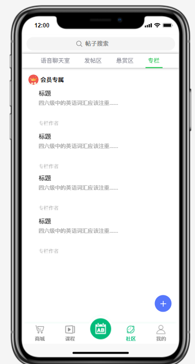
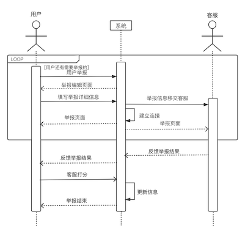
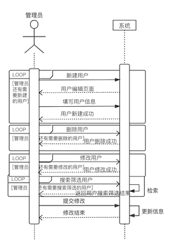

## 词云-需求规格说明文档

[TOC]

### 组员信息

|  姓名  |   学号    |
| :----: | :-------: |
| 浦隽轩 | 181250115 |
| 陶志豪 | 181250130 |
| 黄成东 | 181840090 |
| 李沛洋 | 181840123 |

### 1 引言

#### 1.1 目的

* 本文档描述了词云平台系统的功能需求和非功能需求，“词云”是一款英语学习类移动应用。后续展开开发实现与验证工作时，开发团队会以此文档为依据。

#### 1.2 范围

* 本文档要描述的是词云平台系统的需求说明，预期中的中的功能包括背单词、学习课程、练习口语、以及社区互动与其他用户交流英语知识等功能。该产品可以为用户提供一个拓展词汇量的背单词平台，也提供了英语学习的不同阶段商品和课程，同时还可以提供英语学习的交流平台，目的是全方位覆盖用户英语学习的痛点，提供相互交流渠道，同时也为课程平台拓宽销售通路。

#### 1.3 定义、首字母缩写和缩略词

##### 1.3.1 定义

* 普通用户：以提升英语为目标的系统用户。
* 客服：包括平台自身的工作人员与领域专家，回复普通用户关于平台使用或学习服务的问题。

#### 1.4 参考文献

1. IEEE 标准
2. ”词云” 需求获取文档
3. 《需求工程——软件建模与分析》

### 2 总体描述

#### 2.1 项目前景

##### 2.1.1 背景与机遇

* 随着全球化的逐步推进，个人与世界的联系将愈发紧密，因此掌握英语这样一门全球性的语言就成为了一项重要技能。学生有中高考托福雅思四六级等英语考试需求，上班族也有对英语沟通能力的要求。不少人会选择报名参加英语补习班，但有时候高额的课程费用以及需要一段长而连续的时间去上课也可能导致劝退，因此大部分人也希望利用一些零碎的空余时间学习英语。
* 国内人均可支配收入的不断增长以及国际经济交流的不断加强，使得留学生的规模持续扩大，企业在全球范围内的合作也会持续增加，再加上现在随着移动应用的发展，人们的英语学习也逐渐从纸质转向线上，可以带来市场上的机遇。同时，现有的类似app如百词斩、扇贝、小站等，相比“词云”并没有很好的整合背单词与线上课程的功能，也没有提供足够完善的英文交流社区供这些大多陌生的学习者之间进行交流互动，用户可能在学习过程中需要来回切换app，并且不同app间数据并不互通也给用户的学习带来了一定的不便，因此该平台有较为开朗的前景。
* “词云”是一款英语学习类移动应用，亮点在于简洁高效的背单词设计与高交互性、实用性的用户社区的结合（社区业务相较而言其实更重要）。就前者来说，主页面仅有背单词、快速搜词、刷题备考功能，没有繁杂的按钮和干扰的图文、广告，用户打开应用就能直接进行英语学习；并且针对中学生或大学生这种有着明确考试/出国目标的人群，以及职业道路对语言能力有要求的白领阶层，本应用可引导用户根据自身情况、具体实际需求（充实词汇量、应试技巧、提高日常英语能力等）和空闲时间制定个性化的学习计划。对于后者，平台维护一个PUGC的用户社区，社区内用户可以分享英语学习动态或发表英语学习心得、专栏等，相互之间可以关注和转赞评；基于社区的悬赏板块用户可以发布悬赏任务，以众包的方式求助资源或者文章的翻译、批改、润色等，发掘社区的潜力，提升用户粘性；社区内还增设语音聊天区块，每个聊天室按照年龄及英语水平随机匹配几位partner，用户在其中可以练习口语。平台也会定期邀请合作伙伴教育机构的一些专家、教师开放聊天室演讲，分享英语技巧、趣闻等。

##### 2.1.2 业务需求

* **BO-1：** 在第一版应用之后的3个月内，用户量增长10万。
* **BO-2：** 在第一版应用之后的12个月内，产品实现盈利。
* **SC-1：** 在第一版应用之后的6 个月内，用户对在本系统中学习的好评率达到85%。

#### 2.2 商品功能

该产品总体划分为背单词、浏览信息、社区互动三大板块，主要围绕想要提升英语水平的用户，其中英语水平提升的方式有多种。最后将其细分为以下功能：

- **FE-1：** 根据自身情况和具体需求提供合适的个人英语学习计划。
- **FE-2：** 背单词、刷题备考（位于app打开主页，简洁醒目）。
- **FE-3：** 在社区分享学习动态、参与话题交流、结交学习伙伴、发表自制文章视频。
- **FE-4：** 试用、购买课程。
- **FE-5：** 购买商城商品。
- **FE-6：** 通过社区语音聊天室与随机匹配的伙伴练习口语、交流经验。
- **FE-7：** 悬赏区发布求助任务or通过完成他人发布的悬赏任务获得赏金。
- **FE-8：** 通过发布高质量创作内容（形式文章、视频均可，英语学习相关），获得平台相应打赏。
- **FE-9：** 开通会员享受更多免费课程、课程购买优惠、可阅读会员专栏等增值服务。
- **FE-10：** 高积极性、创作经验丰富的用户可成为平台特约用户，发布内容可获得更多曝光并能够参与课程开发。
- **FE-11：** 对于软件使用的疑问或者意见和建议可以在帮助与反馈栏中找到常见问题的统一解答，如果对解答不满意或者有其他问题可以转人工客服得到较为实时的回答和处理。
- **FE-12：** 悬赏区针对发布者在任务完成后恶意不确认的情况可提起仲裁，交由仲裁员进一步处理。

#### 2.3 用户特征

##### 2.3.1 用户识别

* 总的来说，该系统的涉众有：用户、客户（平台工作人员）、总经理（负责市场调研和管理人员）、开发者（开发平台和推荐算法）、领域专家（顾问和咨询）。

* 进一步，用户可以分为两类：一类是只用词云进行单词学习活动，对于论坛创作和课程学习并没有过多意愿；另一类是除了背单词以外，愿意与其他用户进行交流分享知识，也愿意为英语学习的进步进行消费，他们的疑虑在于这些互动和消费对自身的提升是否有意义。客户主要指的是平台的客服人员和后台管理员，这类涉众是系统的管理者，他们负责平台日常的运维、解答一些用户在平台使用上的疑问。总经理分为两类：一类是负责业务的，主要工作是市场调研，收集当前市场信息；另一类是管理人员。开发者主要是负责开发平台和推荐算法部分。领域专家负责开设课程，这类专家有着丰富的教学英语的从业经验。

##### 2.3.2 用户描述

针对上一小节用户识别的结果，对每一类用户描述如下：
*  明确参与背单词以外活动的用户：这类用户最大的特征是除了背单词以外，有明确的英语交流学习欲望。他们大多有长期的社区活跃度，其中部分用户或许已经相当数量的网课学习经历，部分用户可能是第一次购买英语学习周边和网课。对于他们来说，选择一门合适的课程是当务之急。在以往的学习经历中，他们可能已经有了一定的经验和判断，他们使用平台的目的是希望结合平台的数据分析或是专业人士来为自己提供更好的选择。
*  尚未明确参与背单词以外活动的用户：部分用户还在犹豫除了背单词以外，是否需要词云平台的其他活动，他们对于其它活动的作用心存疑惑，不理解社区对于自己的收益，或者对于平台课程不了解，因此难以判断自己是否需要购入课程。这类用户可能是从自己的朋友那了解到该平台或是背单词有关事宜，因此使用该平台希望获得学习英语相关的知识，或是专业人士的建议。
*  平台工作人员和管理员：工作人员和管理员是平台的管理者，他们负责解答普通用户对于平台使用的问题，或是反馈 bug。他们中的部分是人工客服，和用户直接接触，他们或许有工作经历，但是对于平台的使用还需要培训，因为这可能是他们第一次接触类似平台的运维。
*  负责市场部分的总经理：分管市场的总经理主要负责英语平台市场信息的收集，包括和英语周边公司的合作事宜和接洽等。他们往往对于英语平台市场有一定的经验，或是人脉丰富，能够收集各类的信息，并且对于当前市场上主流的营销策略有深入的调研和理解。
*  领域专家：这类专家有着丰富的英语教学的知识，对于课程的分类、适合的人群、针对的领域、教学流程、各大英语课程平台的战略和种类都有着非常深刻的认识。他们可能专精于一类课程，也可能善于为用户推荐合适的课程种类。他们有着丰富的专业知识和行业经验。

|               涉众               | 主要目标                                 | 态度                                                         | 主要关注点                             | 约束条件   |
| :------------------------------: | ---------------------------------------- | ------------------------------------------------------------ | -------------------------------------- | ---------- |
|   明确参与背单词以外活动的用户   | 选择最合适自己的英语学习活动             | 非常愿意进行英语学习，因为已经有了一定的英语学习经验，希望能参与更多的英语学习活动，得到更专业的指导。 | 希望能对购买的课程周边有更加清晰的认识 | 联网       |
| 尚未明确参与背单词以外活动的用户 | 明确除了背单词以外是否需要参与其它活动   | 愿意使用平台进行英语相关学习，但比较谨慎                     | 明确是否需要社区活动和购买课程、周边   | 联网       |
|       平台工作人员和管理员       | 平台运维，解答用户使用过程中的问题       | 平台工作人员，主要面向用户，同时对系统的使用尚不熟练，需要培训。 | 解答用户疑惑，平台要易于使用           | 需要培训   |
|       负责市场部分的总经理       | 收 集 各 类 市场信息，和英语平台保持合作 | 对自己的工作有热情，对市场有理解，但是可能不太习惯于使用该系统。 | 易于使用                               | 无         |
|             领域专家             | 顾问，提供专业知识的支持                 | 对自己的工作有热情，对市场有理解，但是可能不太习惯于使用该系统。 | 保证工作                               | 薪资有要求 |

#### 2.4 约束

* CON1. 系统前端应基于 Web 技术，后端使用 Java 开发。
* CON2. 开发过程应使用螺旋模型。
* CON3. 代码提交前必须通过风格检查。

#### 2.5 假设和依赖

* AS-1：承载系统的服务器有较高的稳定性, 操作系统为 CentOS。
* AS-2：服务器所在的网络是安全的。
* DE-1：系统的推荐功能依赖于用户提供与课程公司提供的信息与数据。

### 3 详细需求接口

#### 3.1.1 用户界面

主页

商城

课程

社区

发帖区

悬赏区

专栏

我的

咨询

背单词

释义

#### 3.1.2 软件接口

* 平台和第三方支付平台之间通过网络双向通信，第三方支付平台用于支付，将用户支付成功与否的信息返回给平台。
* 平台和课程平台之间通过网络双向通信，用于提供用户信息，让课程平台方面实现对用户的教学

#### 3.1.3 硬件接口

* 系统采用分布式开发，部署在多台服务器上，数据库多实例应保障数据一致性。

#### 3.1.4 通信接口

* 用户浏览器、移动端 app 与后端使用基于 json 的 REST API 进行通信
* 系统和课程平台之间使用基于 json 的 REST API 进行通信

#### 3.2 功能需求

##### 3.2.1 单词背诵

**特征描述：** 单词背诵为本系统核心功能之一，目的是让用户可以进行高效的单词记忆活动。

**刺激/响应序列：** 

刺激：用户点击“开始背单词吧”

响应：系统进入背词界面并显示当前单词卡

刺激：用户点击选项

响应：系统显示选项正确或错误，如果错误则显示对应的正确选项

刺激：用户点击详情

响应：系统显示当前单词的详细释义、例句、智慧词根和派生联想等详细信息

刺激：用户点击下一个

响应：系统显示下一个单词卡

刺激：用户点击退出背词

响应：系统退出背词界面

**相关功能需求：** 

| 功能                      | 描述                                                         |
| ------------------------- | ------------------------------------------------------------ |
| Recite.start              | 系统进入背词界面并显示当前单词卡                                                     |
| Recite.nextword           | 用户选择下一个单词，系统显示下一个单词卡                |
| Recite.detail             | 系统显示单词详情                                         |
| Recite.end                | 用户点击退出背词界面，系统退出            |

##### 3.2.2 浏览论坛

**特征描述：** 用户在使用系统的过程中可以浏览论坛中其他人发布的贴子。

**刺激/响应序列：** 

刺激：用户点击论坛

响应：系统进入社区界面并分页显示所有社区中已发布的帖子列表

刺激：用户点击帖子

响应：系统显示帖子的详细内容和回复

刺激：用户输入搜索关键字

响应：系统根据条件过滤掉不符合关键字的帖子并显示新列表

**相关功能需求：** 

| 功能                      | 描述                                                         |
| ------------------------- | ------------------------------------------------------------ |
| Post.Info.Request         | 系统允许用户请求全部或根据关键词过滤后的帖子列表                                                    |
| Post.Info.Full            | 系统显示所有的帖子列表                |
| Post.Condition.Input      | 系统允许用户输入搜索关键字                                        |
| Post.Detail               | 系统显示帖子详细内容            |

##### 3.2.3 发布内容

**特征描述：** 用户在使用系统的过程中可以发布帖子、悬赏或者专栏来与其他用户互动。

**刺激/响应序列：** 

刺激：用户点击发布内容

响应：系统显示可发布的内容类型和内容编辑界面

刺激：用户编写内容后点击发布

响应：系统将审核发布内容并显示发布结果

刺激：用户点击退出

响应：系统退出编辑界面

**相关功能需求：** 

| 功能                      | 描述                                                         |
| ------------------------- | ------------------------------------------------------------ |
| Issue.new                 | 系统允许用户新建并编辑发布内容                                                  |
| Issue.submit              | 系统允许用户提交发布内容并显示发布结果                |
| Issue.check               | 系统审核用户发布的内容                                       |
| Issue.exit                | 用户退出编辑界面           |
| Issue.persist             | 系统将发布的内容持久化到数据库并更新已发布记录        |

##### 3.2.4 语音聊天

**特征描述：** 用户在使用系统的过程中可以进入语音聊天室与其他用户进行语音聊天，以实现英语口语能力的练习。

**刺激/响应序列：** 

刺激：用户点击开始语音聊天

响应：系统自动匹配语音聊天对象并创建语音聊天室

刺激：用户点击录音

响应：系统开始录音

刺激：用户点击停止录音

响应：系统停止并保存录音

刺激：用户点击退出

响应：系统退出该聊天室，如果用户正在录音则自动停止并保存录音

**相关功能需求：** 

| 功能                      | 描述                                                         |
| ------------------------- | ------------------------------------------------------------ |
| Chat.start                | 系统允许用户开始语音聊天                                                    |
| Chat.match                | 系统进行聊天用户匹配              |
| Chat.record.start         | 系统允许用户进行录音                                         |
| Chat.record.end           | 用户结束录音            |
| Chat.end                  | 用户退出语音聊天室            |

##### 3.2.5 购买课程

**特征描述：** 用户在经过浏览课程介绍或试用课程后觉得值得购买，可以购买该门课程。

**刺激/响应序列：** 

刺激：用户登录后进入某一具体课程页面，点击购买课程

响应：系统展示付款页面，包括费用详情、付款方式、可用优惠券等信息

刺激：用户点击取消购买并再次确认

响应：系统跳回课程页面

刺激：用户点击支付

响应：系统生成订单并调用第三方支付接口（支付宝、微信、银联），等待用户支付。

刺激：用户完成支付

响应：系统返回购买成功页面

刺激：用户15分钟内未完成支付

响应：系统取消订单，并显示订单已失效

**相关功能需求：** 

| 功能                      | 描述                                                         |
| ------------------------- | ------------------------------------------------------------ |
| User.Signin               | 用户登录                                                     |
| Buy.Courses.PaymentPage   | 用户进入购买页面，系统展示费用详情、付款方式、可用优惠券等信息 |
| Buy.Courses.PurchaseOrder | 用户点击支付，系统生成订单并调用第三方接口，跳转到对应支付页面，等待页面支付 |
| Buy.Course.Persist        | 系统记录订单以及订单状态的更新并持久化到数据库               |

##### 3.2.6 购买商品

**特征描述：** 用户浏览某件商品详情后感觉不错，可以购买该件商品。

**刺激/响应序列：** 

刺激：用户登录后进入某一具体商品页面，点击购买该商品

响应：系统展示付款页面，包括费用详情（含配送费）、付款方式、可用优惠券、收货地址（收货人、联系电话、所在地区）等信息

刺激：用户点击取消购买并再次确认

响应：系统跳回商品页面

刺激：用户选择收货地址后，点击支付

响应：系统生成订单并调用第三方支付接口（支付宝、微信、银联），等待用户支付。

刺激：用户完成支付

响应：系统返回购买成功页面，发货后交由第三方物流公司提供物流运输服务

刺激：用户15分钟内未完成支付

响应：系统取消订单，并显示订单已失效

**相关功能需求：** 

| 功能                          | 描述                                                         |
| ----------------------------- | ------------------------------------------------------------ |
| User.Signin                   | 用户登录                                                     |
| Buy.Goods.PaymentPage         | 用户进入购买页面，系统展示费用详情含（配送费）、付款方式、可用优惠券、收货地址等信息 |
| Buy.Goods.PurchaseOrder       | 用户点击支付，系统生成订单并调用第三方接口，跳转到对应支付页面，等待页面支付 |
| Buy.Course.Persist            | 系统记录订单、订单状态的更新、商品库存的更新                 |
| User.ViewLogisticsInformation | 用户可以查看已购买商品的实时物流信息                         |

##### 3.2.7 发布悬赏任务

**特征描述：** 用户可以在平台悬赏区发布悬赏任务，如求助资源，请求翻译文献、批改托福作文，帮忙论文降重、文章润色等，提供一定赏金作为报酬。

**刺激/响应序列：** 

刺激：用户登录后进入悬赏区页面，选择发布悬赏任务

响应：系统显示编辑界面，包括任务类型、标题、正文、附件等说明任务要求，以及赏金的选择指明任务报酬。

刺激：用户选择放弃编辑

响应：系统退出编辑界面，保存当前内容至草稿

刺激：用户选择任务类型

响应：系统显示选择结果

刺激：用户编辑文字内容

响应：系统实时显示更新编辑结果

刺激：用户选择上传附件

响应：系统显示上传成功

刺激：用户编辑完毕，选择发布

响应：系统提交任务并显示结果

**相关功能需求：** 

| 功能                                           | 描述                                                         |
| ---------------------------------------------- | ------------------------------------------------------------ |
| User.Signin                                    | 用户登录                                                     |
| RewardCommunity.PublishTask.Edit.Attachment    | 系统允许用户上传附件                                         |
| RewardCommunity.PublishTask.Edit.Content.Input | 系统允许用户输入文字内容                                     |
| RewardCommunity.PublishTask.Edit.Bounty        | 系统需要用户为悬赏任务选择赏金                               |
| RewardCommunity.PublishTask.Edit.Cancel&Save   | 系统允许用户放弃编辑； 系统保存用户当前未发布的任务内容至草稿箱 |
| RewardCommunity.PublishTask.Edit.Submit        | 系统允许用户提交悬赏任务                                     |
| RewardCommunity.PublishTask.Edit.Show          | 系统实时显示任务编辑界面                                     |
| RewardCommunity.PublishTask.Submit.Result      | 系统显示任务提交结果                                         |
| RewardCommunity.PublishTask.Accept&End         | 发布者采纳某位回答者的答案为最佳，平台将之前设置的赏金转交给该回答者，任务完结，除该二人外其他人不可见 |

##### 3.2.8 完成悬赏任务

**特征描述：** 用户可以在平台悬赏区完成他人发布的悬赏任务，获得赏金奖励，可按一定比例提现。

**刺激/响应序列：** 

刺激：用户登录后进入悬赏区某一具体任务页面，选择回答

响应：系统进入编辑页面，包括内容、附件等域

刺激：用户选择放弃编辑

响应：系统退出编辑界面，保存当前内容至草稿

刺激：用户选择上传附件

响应：系统显示上传成功

刺激：用户编辑完毕，选择回答

响应：系统提交回答并显示结果

**相关功能需求：** 

| 功能                                     | 描述                                                         |
| ---------------------------------------- | ------------------------------------------------------------ |
| User.Signin                              | 用户登录                                                     |
| RewardCommunity.Reply.Edit.Attachment    | 系统允许用户上传附件                                         |
| RewardCommunity.Reply.Edit.Content.Input | 系统允许用户输入文字内容                                     |
| RewardCommunity.Reply.ReceiveReward      | 发布者选择用户的回答为最佳，获得赏金                         |
| RewardCommunity.Reply.Edit.Cancel&Save   | 系统允许用户放弃编辑； 系统保存用户当前未发布的回答内容至草稿箱 |
| RewardCommunity.Reply.Edit.Submit        | 系统允许用户提交任务回答                                     |
| RewardCommunity.Reply.Edit.Show          | 系统实时显示回答编辑界面                                     |
| RewardCommunity.Reply.Submit.Result      | 系统显示回答提交结果                                         |

##### 3.2.9 用户咨询

**特征描述：** 用户在使用APP的过程中，如果产生疑问，可以咨询客服。

**刺激/响应序列：** 

刺激：用户发起提问

响应：系统展示常见问题列表

刺激：用户选择查看某个常见问题详情

响应：系统展示某个常见问题详情

刺激：用户提出新的问题

响应：系统展示供用户输入问题的入口

刺激：用户描述问题并提交

响应：系统显示提交成功，并通知客服人员

刺激：客服人员和用户沟通

响应：系统提供沟通入口

**相关功能需求：** 

| 功能                                     | 描述                                                         |
| ---------------------------------------- | ------------------------------------------------------------ |
| Oncall.Usual                             | 系统展示常见问题列表                                            |
| Oncall.Upload                            | 用户新建新问题                                               |
| Oncall.Communicate                       | 用户和人工客服进行双向沟通                                    |
| Oncall.Persist                           | 系统记录此次用户咨询过程                                      |

##### 3.2.10 举报仲裁

**特征描述：** 用户在遇到不友善内容或者在悬赏中发生争议时，可以进行举报或者仲裁。

**刺激/响应序列：** 

刺激：用户进行举报

响应：系统将举报转交给客服人员

刺激：用户描述具体情况

响应：客服作出举报结果并反馈给用户

刺激：用户选择仲裁

响应：系统将仲裁转交给客服人员

刺激：用户描述具体情况

响应：客服作出仲裁结果并反馈给用户

**相关功能需求：** 

| 功能                                     | 描述                                                         |
| ---------------------------------------- | ------------------------------------------------------------ |
| User.Report                              | 用户进行举报                                                   |
| User.Arbitrate                           | 用户申请仲裁                                                  |
| Reply.Report                             | 系统返回举报结果                                              |
| Reply.Arbitrate                          | 系统返回仲裁结果                                              |

##### 3.2.11 用户管理

**特征描述：** 管理员可以利用平台管理用户。

**刺激/响应序列：** 

刺激：管理员添加用户

响应：系统在用户列表中添加用户

刺激：管理员修改用户信息

响应：系统在用户列表中修改用户信息

刺激：管理员删除用户

响应：系统在用户列表中删除用户

刺激：管理员提交修改

响应：系统将用户列表的更新同步到数据库

刺激：管理员查询筛选用户

响应：系统返回符合要求的用户

**相关功能需求：** 

| 功能                                     | 描述                                                         |
| ---------------------------------------- | ------------------------------------------------------------ |
| UserManager.Add                          | 管理员在用户列表中添加用户                                       |
| UserManager.Edit                         | 管理员在用户列表中修改用户信息                                   |
| UserManager.Delete                       | 管理员在用户列表中删除用户                                     |
| UserManager.Submit                       | 管理员提交用户列表的修改，同步到数据库                         |
| UserManager.Search                       | 管理员搜索筛选用户                                        |

##### 3.2.12 商品管理

**特征描述：** 管理员在平台上新建、编辑、删除、修改和查询商品，商品信息包括：商品名称、简要介绍、商品种类、商品价格等。

**刺激/响应序列：** 

刺激：管理员添加商品

响应：系统在商品列表中添加商品

刺激：管理员修改商品信息

响应：系统在商品列表中修改商品信息

刺激：管理员删除商品

响应：系统在商品列表中删除商品

刺激：管理员提交修改

响应：系统将商品列表的更新同步到数据库

刺激：管理员查询筛选商品

响应：系统返回符合要求的商品

**相关功能需求：** 

| 功能                                     | 描述                                                         |
| ---------------------------------------- | ------------------------------------------------------------ |
| ProductManager.Add                       | 管理员在商品列表中添加商品                                       |
| ProductManager.Edit                      | 管理员在商品列表中修改商品信息                                   |
| ProductManager.Delete                    | 管理员在商品列表中删除商品                                     |
| ProductManager.Submit                    | 管理员提交商品列表的修改，同步到数据库                         |
| ProductManager.Search                    | 管理员搜索筛选商品                                        |

#### 3.3 非功能需求

##### 3.3.1 易用性

* Usability1. 智能推荐和推送给用户相关消息。
* Usability2. 专业的使用术语有标注和解释供用户阅读和理解。
* Usability3. 初次使用系统的用户应能自行根据提示进行操作。
* Usability4. 系统应支持不同尺寸的屏幕。

##### 3.3.2 可修改性

* Modifiability1. 当课程策略发生更改时，系统管理员应能在 5 小时内完成数据更新。
* Modifiability2. 当有新的词书数据来源时，系统管理员应能在 1 日内完成数据接入。

##### 3.3.3 可靠性

* Reliability1. 系统每年不可用时间不得超过 3h。

##### 3.3.4 性能

* Performance1. 系统首页的打开时间不应超过 2s。
* Performance2. 系统每秒钟至少能处理 1000 个搜索请求。

##### 3.3.5 约束

* IC1. 保护用户个人信息，防止信息泄漏，维护用户隐私权。

#### 3.4 数据需求

* DR1 用户信息

| 属性   | 类型      | 描述                    | 默认值   |
| ------ | --------- | ----------------------- | -------- |
| id     | int(11)   | 用户 id，在全系统中唯一 |          |
| name   | char(255) | 用户名称                | 空字符串 |
| time   | int(11)   | 注册时间                | 0        |
| gender | char(255) | 性别                    | 空字符串 |
| year   | char(255) | 年龄                    | 空字符串 |
| phone  | char(255) | 电话                    | 空字符串 |

* DR2 课程信息

| 属性    | 类型      | 描述                    | 默认值   |
| ------- | --------- | ----------------------- | -------- |
| id      | int(11)   | 课程 id，在全系统中唯一 |          |
| name    | char(255) | 课程名称                | 空字符串 |
| time    | int(11)   | 上架时间                | 0        |
| teacher | char(255) | 讲师名称                | 空字符串 |
| price   | int(11)   | 价格                    | 0        |

* DR3 商品信息

| 属性    | 类型      | 描述                    | 默认值   |
| ------- | --------- | ----------------------- | -------- |
| id      | int(11)   | 商品 id，在全系统中唯一 |          |
| name    | char(255) | 商品名称                | 空字符串 |
| time    | int(11)   | 上架时间                | 0        |
| price   | int(11)   | 价格                    | 0        |

* DR4 任务信息

| 属性        | 类型      | 描述                    | 默认值   |
| ----------- | --------- | ----------------------- | -------- |
| id          | int(11)   | 任务id，在全系统中唯一 |          |
| name        | char(255) | 任务名称                | 空字符串 |
| checkInDate | int(11)   | 发布时间                | 0        |
| price       | int(11)   | 悬赏金额                | 0        |
| checkInDate | int(11)   | 截止时间                | 0        |

* DR5 词书信息
| 属性        | 类型      | 描述                    | 默认值   |
| ----------- | --------- | ----------------------- | -------- |
| id          | int(11)   | 词书id，在全系统中唯一 |          |
| name        | char(255) | 词书名称                | 空字符串 |
| time    | int(11)   | 上架时间                | 0        |

#### 3.5 其它

##### 3.5.1 安装需求

* Install1. 在安装系统时，需初始化导入一些初始化单词数据。

### 4 分析模型
#### 4.1 单词背诵

**概念类图** 

下图描述了单词背诵过程各类的关系：

该图由用户、单词卡列表、单词卡三个类共同组成。重要属性已给出，用户通过对单词卡列表发出请求获取正确选项、查看单词详情以及跳转到下一个单词。

**顺序图** 

下图描述了单词背诵过程的详细顺序：

该图展示了单词背诵的过程。用户在背词过程中先选择示意选项，并可以选择查看单词详细信息，随后在进入下一个单词的学习。当当日学习计划完成时，用户会退出背词。

**状态图** 

下图描述了购买单词背诵过程中的状态以及流转情况：

该图展示了单词背诵中出现的状态以及这些状态的转换情况。

#### 4.2 浏览帖子/发帖/回帖

**概念类图** 

下图描述了浏览帖子/发帖/回帖过程各类的关系：

该图由用户、系统、帖子、帖子列表四个类共同组成。重要属性已给出。

**顺序图** 

下图描述了浏览帖子过程的详细顺序：

该图展示了用户浏览帖子的过程。用户先向系可以可选的进行帖子搜索，并选择一条帖子进行浏览。

下图描述了发帖过程的详细顺序：

该图展示了用户发帖的过程。用户请求发帖时，系统会创建帖子并将用户编辑的内容输入进帖子，完成后进行持久化处理。

下图描述了回帖过程的详细顺序：

该图展示了用户回帖的过程。用户先向系统读取已持久化的帖子，随后再编辑信息。

**状态图** 

下图描述了浏览帖子/回帖过程中的状态以及流转情况：

该图展示了用户浏览帖子/回帖过程中出现的状态以及这些状态的转换情况。需要注意的是编辑回帖内容的状态需要经过查看帖子内容状态。

下图描述了发帖过程中的状态以及流转情况：

该图展示了用户发帖过程中出现的状态以及这些状态的转换情况。在编辑结束后，由编辑界面状态转为提交结果状态，进而结束发帖流程。

#### 4.3 语音聊天

**概念类图** 

下图描述了语音聊天过程各类的关系：

该图由用户、系统、语音聊天室三个类共同组成。重要属性已给出。用户需要录音时，需要向系统请求录音。

**顺序图** 

下图描述了语音聊天过程的详细顺序：

该图展示了语音聊天的过程。用户选择语音聊天时，系统会先创建语音聊天室并自动匹配，匹配完成后用户方可进行语音聊天。

**状态图** 

下图描述了购买语音聊天过程中的状态以及流转情况：

该图展示了语音聊天中出现的状态以及这些状态的转换情况。比较简单，以用户结束语音聊天作为结束。

#### 4.4 购买课程/商品

**概念类图** 

下图描述了购买课程/商品过程各类的关系：

该图由用户、商品、课程、第三方支付接口四个类共同组成。重要属性已给出，支付功能转交第三方支付平台（微信、银联、支付宝等）完成。

**顺序图** 

下图描述了购买课程/商品过程的详细顺序（以课程为例）：

该图展示了用户购买课程的过程。购买商品与之类似，只是多了一步库存的检查和相应更新以及用户在付款页面对收货地址的选择。平台根据第三方支付接口返回的结果判断此次购买结果，并做相应的持久化记录/更新。

**状态图** 

下图描述了购买课程/商品过程中的状态以及流转情况：

该图展示了用户购买课程/商品过程中出现的状态以及这些状态的转换情况。需要注意的是要从第三方支付接口获得支付是否成功的消息。

#### 4.5 发布/回答悬赏任务

**概念类图** 

下图描述了发布/回答悬赏任务相关的类实体的属性及其交互：

该图由用户、悬赏任务、悬赏任务列表3个类共同组成，用户可以浏览列表或单个任务，并可以进行发布、回答。

**顺序图** 

下图描述了发布悬赏任务过程中实体间的交互顺序：

该图展示了用户发布悬赏任务的过程。其中编辑内容部分用户需要选择任务类别、赏金和期限（必须），赏金会由平台保管，任务完成后赏金会转交给采纳的回答者，或期限到后仍未完成返还给用户。

下图描述了回答悬赏任务过程中实体间的交互顺序：

该图展示了用户回答悬赏任务的过程。当用户的回答被发布者采纳为最佳时，用户获得先前发布者设置的赏金，系统更新用户相应信息（持有金币、采纳回答数等）。

**状态图** 

下图描述了发布/回答悬赏任务过程中的状态及流转情况：

该图展示了用户发布/回答悬赏任务过程中出现的状态以及这些状态的转换情况。用户编辑结束选择提交后，状态转为提交，进而流程结束。

#### 4.6 客服咨询

**概念类图** 

下图描述了客服咨询过程中类间的关系：

该图由用户、人工客服、问题列表、问题4个类组成。当用户对现有问题的答复（Q&A式）不满意时可以转接人工客服来进行解答。

**顺序图** 

下图描述了客服咨询过程中各实体间的交互过程序列：

该图展示了客服咨询的过程。用户先选择或搜索已有解答的Q&A式问题，若对解答不满意，可以转接人工客服进行沟通。沟通方式为对话问答式，直到解决了用户目前问题/对答复满意为止。咨询完成后需要存储咨询记录，更新客服评分等。

**状态图** 

下图描述了客服咨询过程中的状态及流转情况：

该图展示了客服咨询过程中出现的状态以及这些状态之间的转换情况，比较简单，以用户问题的解决为结束。

#### 4.7 举报仲裁

**概念类图** 

下图描述了举报仲裁过程中类间的关系：

该图由用户、人工客服、举报、仲裁4个类组成。当用户的举报或者仲裁申请可以转交人工客服来进行处理，并给出反馈结果。

**顺序图** 

下图描述了举报过程中各实体间的交互过程序列：

该图展示了举报的过程。用户先进行举报申请，然后对举报信息进行完善，而后举报信息将转交到人工客服处，人工客服会处理给出结果，完成后将储存举报记录，更新客服评分等。

下图描述了仲裁过程中各实体间的交互过程序列：

该图展示了仲裁的过程。用户先进行仲裁申请，然后进入仲裁页面对仲裁信息进行完善，而后仲裁信息将转交到人工客服处，人工客服会处理给出结果，完成后将储存仲裁记录，更新客服评分等。

**状态图** 

下图描述了举报过程中的状态及流转情况：

该图展示了举报过程中出现的状态以及这些状态之间的转换情况，比较简单，以反馈用户举报结果为结束。

下图描述了仲裁过程中的状态及流转情况：

该图展示了仲裁过程中出现的状态以及这些状态之间的转换情况，比较简单，以反馈用户仲裁结果为结束。

#### 4.8 商品管理

**概念类图** 

下图描述了商品管理过程中类间的关系：

该图由管理员、商品列表、商品3个类组成。管理员可以新建、删除、修改商品，也可以通过商品列表对商品进行搜索筛选。

**顺序图** 

下图描述了商品管理过程中各实体间的交互过程序列：

该图展示了商品管理的过程。管理员可以新建、删除或者修改商品，也可以通过商品列表对商品进行搜索筛选，新建、删除、修改商品与对商品进行搜索筛选等步骤都是可以跳过或者循环的。

**状态图** 

下图描述了商品管理过程中的状态及流转情况：

该图展示了商品管理过程中出现的状态以及这些状态之间的转换情况，管理员可以选择进行新建、删除或者修改商品，提交后退出，也可以搜索筛选商品得到结果后退出。

#### 4.9 用户管理

**概念类图** 

下图描述了用户管理过程中类间的关系：

该图由管理员、用户列表、用户3个类组成。管理员可以新建、删除、修改用户，也可以通过用户列表对用户进行搜索筛选。

**顺序图** 

下图描述了用户管理过程中各实体间的交互过程序列：

该图展示了用户管理的过程。管理员可以新建、删除或者修改用户，也可以通过用户列表对用户进行搜索筛选，新建、删除、修改用户与对用户进行搜索筛选等步骤都是可以跳过或者循环的。

**状态图** 

下图描述了用户管理过程中的状态及流转情况：

该图展示了用户管理过程中出现的状态以及这些状态之间的转换情况，管理员可以选择进行新建、删除或者修改用户，提交后退出，也可以搜索筛选用户得到结果后退出。
